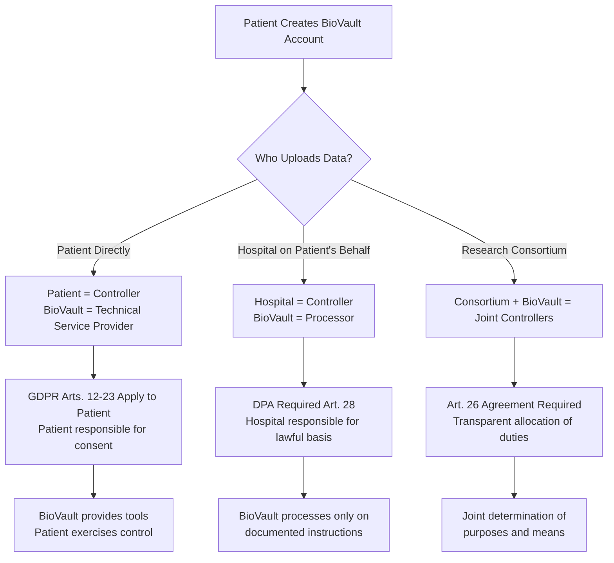
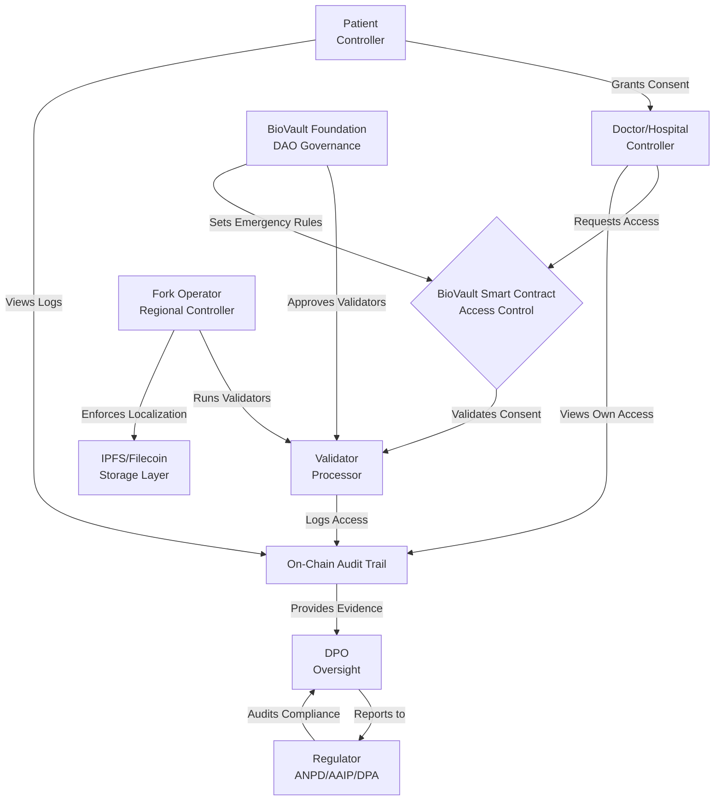
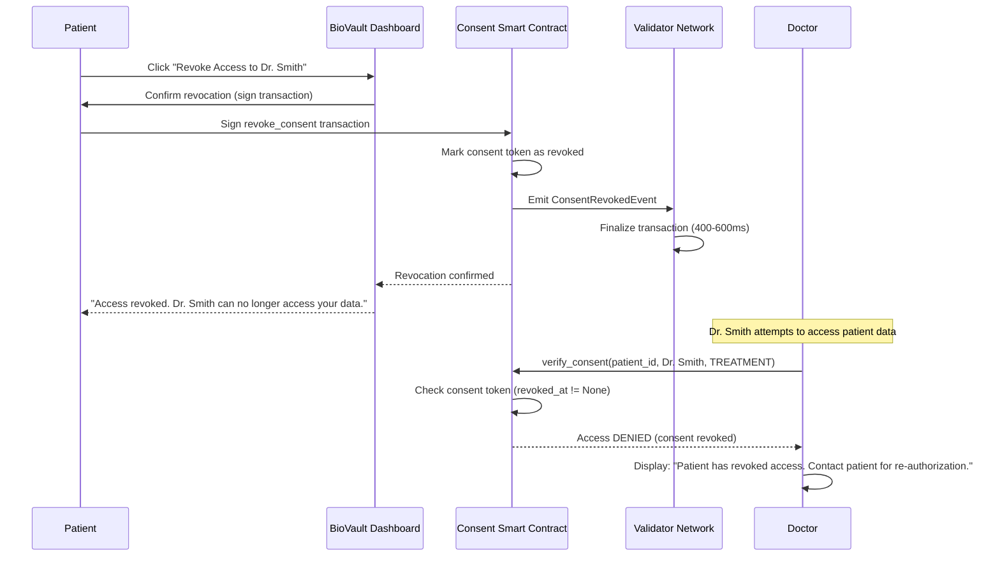
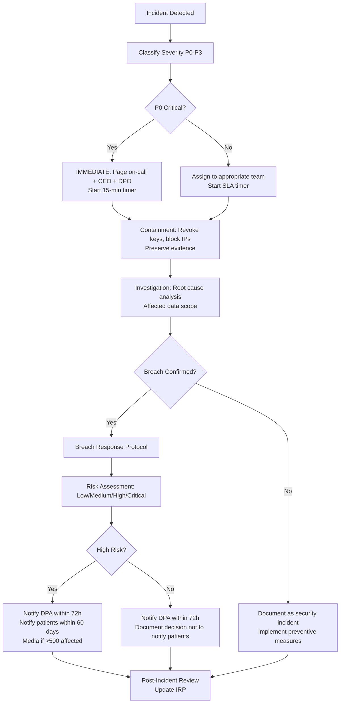
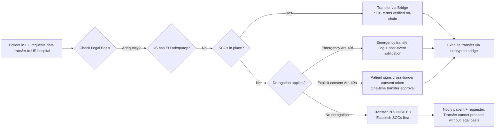

# BioVault: Legal & Compliance Framework

**A New Paradigm for Sovereign Health Data**

**Document Version:** 1.0  
**Date:** November 3, 2025  
**Classification:** Public - Investor & Regulator Facing

---

## Table of Contents

1. [Executive Summary & Interpretive Principles](#1-executive-summary--interpretive-principles)
2. [Regulatory Landscape & Scope of Application](#2-regulatory-landscape--scope-of-application)
3. [Roles, Responsibilities & Data Lifecycle (RACI)](#3-roles-responsibilities--data-lifecycle-raci)
4. [Lawful Bases for Processing & Special-Category Health Data](#4-lawful-bases-for-processing--special-category-health-data)
5. [Consent Management & Revocation (Consent-as-Code)](#5-consent-management--revocation-consent-as-code)
6. [Data Subject Rights & Operational Workflows](#6-data-subject-rights--operational-workflows)
7. [International Data Transfers & Cross-Border Federation](#7-international-data-transfers--cross-border-federation)
8. [Security by Design: Technical & Organizational Measures](#8-security-by-design-technical--organizational-measures)
9. [Logging, Auditability & Accountability](#9-logging-auditability--accountability)
10. [Retention, Erasure & Archiving](#10-retention-erasure--archiving)
11. [De-Identification, Pseudonymization & Research/Secondary Use](#11-de-identification-pseudonymization--researchsecondary-use)
12. [Children, Guardianship & Delegations](#12-children-guardianship--delegations)
13. [Emergency Access (Emergency Profile) & Vital Interests](#13-emergency-access-emergency-profile--vital-interests)
14. [Processor/Subprocessor Governance (DPAs/BAAs)](#14-processorsubprocessor-governance-dpasbaa)
15. [Compliance Automation & Policy-as-Code](#15-compliance-automation--policy-as-code)
16. [Incident Response & Breach Notification](#16-incident-response--breach-notification)
17. [Compliance Mapping Matrices](#17-compliance-mapping-matrices)
18. [Procurement & Assurance (Evidence Pack)](#18-procurement--assurance-evidence-pack)
19. [Templates & Annexes](#19-templates--annexes)
20. [References](#20-references)

---

## 1. Executive Summary & Interpretive Principles

### 1.1 Overview: BioVault as Health Data Infrastructure

BioVault is a next-generation, patient-sovereign electronic medical record (EMR) infrastructure designed to fundamentally redefine how health data is controlled, shared, and protected across jurisdictions. Unlike traditional centralized EMR systems that vest custody and control in healthcare institutions, BioVault returns ownership to patients through cryptographic sovereignty, programmable consent, and distributed architecture [1].

The global healthcare system faces a compliance crisis. According to the U.S. Department of Health and Human Services, 725 major healthcare data breaches occurred in 2023, compromising over 133 million patient records [2]. In the European Union, GDPR fines for healthcare data violations exceeded €1.2 billion between 2018 and 2023 [3]. In Latin America, the introduction of Brazil's LGPD (Lei Geral de Proteção de Dados) in 2020 and Argentina's long-standing Ley 25.326 have created a patchwork of compliance obligations that traditional systems struggle to meet [4].

BioVault addresses these systemic failures through a **compliance-by-design architecture** grounded in three pillars:

1. **Patient Sovereignty**: Every patient controls their health vault through cryptographic keys, with all access requests requiring explicit, granular, and revocable consent enforced via on-chain smart contracts.

2. **Multi-Jurisdictional Adaptability**: BioVault operates as a federated network of regional forks (e.g., Argentina, Brazil, Mexico, EU, United States), each compliant with local data protection laws, while maintaining global interoperability through secure bridge protocols.

3. **Cryptographic Accountability**: All data access events are logged immutably on a permissioned blockchain, creating tamper-proof audit trails accessible to patients, regulators, and authorized third-party auditors.

### 1.2 Core Compliance Thesis

BioVault's legal and technical architecture is designed to satisfy the most stringent data protection frameworks simultaneously:

- **EU GDPR (Regulation 2016/679)**: Compliance with principles of lawfulness, fairness, transparency (Art. 5), data minimization, purpose limitation, storage limitation, integrity, confidentiality, and accountability. Special-category health data processing is governed by Art. 9(2) conditions, including explicit consent (Art. 9(2)(a)), treatment (Art. 9(2)(h)), public health (Art. 9(2)(i)), and research (Art. 9(2)(j)) [5].

- **US HIPAA (Health Insurance Portability and Accountability Act)**: Adherence to Privacy Rule (45 CFR Part 160 and Subparts A and E of Part 164), Security Rule (45 CFR §164.308-312), and Breach Notification Rule (45 CFR §164.400-414). BioVault's architecture supports Business Associate Agreements (BAAs), minimum necessary standard, and designated record set access [6].

- **Brazil LGPD (Lei 13.709/2018)**: Compliance with legal bases for processing sensitive personal data (Art. 11), data subject rights (Arts. 17-22), international data transfer rules (Art. 33), and Data Protection Officer (DPO) requirements (Art. 41) [7].

- **Argentina Ley 25.326 and Decree 1558/2001**: Adherence to consent requirements (Art. 5), data subject rights (Arts. 14-16), cross-border transfer restrictions (Art. 12), and registration with the Agencia de Acceso a la Información Pública (AAIP) [8].

- **Mexico LFPDPPP (Ley Federal de Protección de Datos Personales en Posesión de los Particulares)**: Compliance with consent principles (Arts. 8-9), ARCO rights (access, rectification, cancellation, opposition), privacy notices, and sensitive data protections [9].

- **ISO/IEC 27001:2022 and ISO/IEC 27701:2019**: Implementation of information security management systems (ISMS) and privacy information management systems (PIMS) with controls mapped to Annex A of ISO 27001 and extensions in ISO 27701 for GDPR and other regulatory alignment [10].

### 1.3 Key Legal Mechanisms

BioVault implements compliance through five core legal-technical mechanisms:

#### 1.3.1 Consent-as-Code

Traditional consent models rely on static paper forms or electronic checkboxes that are difficult to revoke, lack granularity, and provide no real-time enforcement. BioVault implements **consent-as-code**: programmable smart contracts (written in Rust using the Anchor framework on a permissioned Solana-based blockchain) that encode:

- **Who**: Public key of the authorized accessor (doctor, hospital, researcher, family member)
- **What**: Specific data types or files (lab results, imaging, genomics, emergency profile)
- **Why**: Purpose binding (treatment, billing, research, public health, emergency)
- **When**: Time-bound validity (e.g., 48 hours for lab analysis, 30 days for specialist consultation)
- **How**: Access scope (read-only, annotate, delegate to sub-accessor)

Revocation is instant: the patient can terminate access at any time, triggering an on-chain event that immediately invalidates future access attempts. All consent grants and revocations are logged with cryptographic timestamps, satisfying GDPR Art. 7(3) (withdrawal as easy as granting) and HIPAA's authorization revocation requirements (45 CFR §164.508(b)(5)) [11].

#### 1.3.2 Emergency Access ("Break-Glass") Protocol

Healthcare emergencies present a legal and ethical paradox: a patient may be unconscious or incapacitated, unable to grant consent, yet timely access to medical history can save their life. BioVault resolves this through the **Emergency Profile** mechanism:

- **Legal Basis**: GDPR Art. 6(1)(d) (vital interests), Art. 9(2)(c) (vital interests for special-category data), Art. 9(2)(h) (treatment by health professionals), and Art. 9(2)(i) (public health emergency). Under HIPAA, this aligns with permitted disclosures for treatment (45 CFR §164.506) [12].

- **Technical Implementation**: Patients pre-configure an Emergency Profile containing minimal critical information: blood type, allergies, chronic conditions, current medications, emergency contacts. Access requires multi-signature authorization (hospital authority + authorized responder + audit oracle) and biometric or cryptographic proof of identity.

- **Accountability**: Every emergency access is logged on-chain with justification code, accessor identity, timestamp, and data accessed. Patients receive notification within 24 hours of regaining capacity, and a post-event audit is conducted within 7 days [13].

#### 1.3.3 Cross-Border Federation with Data Residency

Global health data mobility must respect local sovereignty. BioVault's architecture employs **regional forks**: independent blockchain instances operating in specific jurisdictions (e.g., BioVault Argentina, BioVault Brazil, BioVault EU), each governed by local data protection authorities and validators.

- **Data Residency**: Patient data never leaves the jurisdiction without explicit consent. Node geofencing enforces physical storage location constraints.

- **Bridge Protocols**: Authorized cross-border access (e.g., emergency treatment abroad, multi-national clinical trials) uses cryptographic bridges that validate consent via zero-knowledge proofs (ZKPs) or encrypted metadata attestations, satisfying GDPR Chapter V (international transfers) through Standard Contractual Clauses (SCCs) or adequacy decisions [14].

- **Legal Entity Structure**: Each regional fork operates under a local legal entity (e.g., BioVault Argentina S.A.) acting as data controller or processor under local law, with contractual agreements governing inter-fork data flows [15].

#### 1.3.4 Immutable Audit Trails

Accountability under GDPR Art. 5(2) requires organizations to demonstrate compliance, not merely claim it. BioVault's audit layer records every data interaction:

- **On-Chain Logs**: Metadata about access events (who, what, when, why) is stored on the blockchain with cryptographic hashes, making tampering computationally infeasible.

- **Patient Access**: Every patient can view their complete access history via a dashboard, including emergency overrides, satisfying GDPR Art. 15 (right of access) and HIPAA's accounting of disclosures (45 CFR §164.528) [16].

- **Regulator Dashboards**: Data protection authorities can be granted read-only access to anonymized aggregate logs or specific audit trails during investigations, using ZKPs to verify compliance without revealing patient identities [17].

#### 1.3.5 Cryptographic Data Sovereignty

Unlike traditional EMRs where hospitals hold master keys to patient data, BioVault implements **client-side encryption**:

- **Encryption Model**: Each medical file is encrypted with AES-256-GCM using a unique symmetric key. That key is then encrypted for each authorized accessor using their public key (Elliptic Curve Integrated Encryption Scheme, ECIES based on Ed25519 curves).

- **Key Recovery**: To prevent data loss, BioVault employs Shamir's Secret Sharing (SSS) with a 2-of-3 threshold: the patient, a government health authority, and a neutral third party (or Juicebox protocol for programmable recovery). No single party can unilaterally access patient data [18].

- **Zero-Knowledge Access**: Permissions can be granted based on cryptographic proofs (e.g., "accessor is a licensed oncologist in Argentina") without revealing the accessor's full identity, satisfying data minimization principles (GDPR Art. 5(1)(c)) [19].

### 1.4 Interpretive Principles for Legal-Technical Integration

This framework is grounded in four interpretive principles that guide the resolution of ambiguities and the evolution of BioVault's legal architecture:

#### 1.4.1 Patient-Centric Interpretation

When legal provisions are ambiguous, interpretations favor **patient autonomy and control**. For example:

- If a regulation permits either opt-in or opt-out for research use, BioVault defaults to opt-in.
- If a retention period range is specified (e.g., "6-10 years"), patients can select their preference within that range.

This aligns with the GDPR principle of "privacy by design and by default" (Art. 25) and the OECD Privacy Guidelines' Individual Participation Principle [20].

#### 1.4.2 Subsidiarity and Localization

BioVault respects **jurisdictional sovereignty**. When regulations conflict (e.g., GDPR's right to erasure vs. national medical record retention laws), the framework prioritizes compliance with local mandatory law while proposing technical solutions (e.g., "archival lock" mode: data is encrypted and key is deleted, rendering data unrecoverable but preserving ciphertext for legal record retention).

#### 1.4.3 Transparency and Auditability Over Opacity

Traditional healthcare systems often rely on **security through obscurity**: closed systems, proprietary formats, and inaccessible audit logs. BioVault inverts this model: all system logic (smart contracts, consent enforcement, audit mechanisms) is open-source and auditable. Privacy is achieved through **cryptography, not secrecy** [21].

This approach aligns with GDPR Art. 12 (transparent information) and ISO/IEC 27001 Clause 9.3 (management review and continual improvement through measurable audit trails).

#### 1.4.4 Risk-Proportionate Language

Healthcare data systems cannot claim absolute security. BioVault's legal and marketing communications employ **risk-managed language**:

- "BioVault implements industry-leading cryptographic controls designed to mitigate unauthorized access, in compliance with GDPR Art. 32 and HIPAA Security Rule."
- Not: "BioVault is 100% secure and unhackable."

This principle reflects ISO 31000 risk management standards and the reality that cybersecurity is a continuous process, not a binary state [22].

### 1.5 Scope and Audience

This Legal & Compliance Framework serves multiple audiences:

- **Regulators**: Data protection authorities (DPAs), health ministries, and national agencies responsible for oversight of health data processing.
- **Health System General Counsels**: Legal departments of hospitals, clinics, and health networks evaluating BioVault for procurement.
- **Data Protection Officers (DPOs) and Chief Privacy Officers (CPOs)**: Internal compliance leads assessing BioVault's alignment with organizational privacy programs.
- **Enterprise Procurement Teams**: Vendor risk management and compliance teams conducting due diligence.
- **Security Architects**: Technical compliance leads verifying that BioVault's controls satisfy regulatory requirements.
- **Investors and Auditors**: Stakeholders seeking assurance that BioVault's business model is legally sustainable and compliant.

### 1.6 Relationship to Technical Architecture

This document is the **legal counterpart** to the BioVault Technical Architecture whitepaper [23]. Key mappings:

| Legal Requirement          | Technical Implementation Reference                                   |
| -------------------------- | -------------------------------------------------------------------- |
| Consent-as-Code (Ch. 5)    | Technical Architecture §5.2 (Identity, Consent, Emergency Access)    |
| Security by Design (Ch. 8) | Technical Architecture §5.3 (Data Encryption), §5.6 (Security Model) |
| Audit Trails (Ch. 9)       | Technical Architecture §11 (Auditing & Observability)                |
| De-Identification (Ch. 11) | Technical Architecture §12.4 (Privacy-Preserving Data Processing)    |
| Emergency Access (Ch. 13)  | Technical Architecture §5.2, §10.7 (Emergency Access Integration)    |

Compliance is not retrofitted—it is **embedded in the protocol layer**.

### 1.7 Document Structure and Methodology

This framework follows a systematic structure:

1. **Chapters 2-4**: Establish the regulatory landscape, define roles, and map lawful bases.
2. **Chapters 5-7**: Detail consent mechanisms, data subject rights, and cross-border transfers.
3. **Chapters 8-10**: Address security, logging, and retention/erasure.
4. **Chapters 11-13**: Cover de-identification, children's data, and emergency access.
5. **Chapters 14-16**: Govern processor relationships, automation, and incident response.
6. **Chapters 17-19**: Provide compliance matrices, procurement guidance, and templates.

Each chapter includes:

- **Legal citations** (specific articles, sections, recitals)
- **Technical mechanisms** (smart contracts, encryption, audit logs)
- **Diagrams** (decision trees, sequence flows, state machines)
- **Tables** (mapping matrices, SLA specifications, RACI charts)
- **Risk analysis** (potential conflicts, [ASK] markers for ambiguous areas)

### 1.8 Limitations and Disclaimers

This framework is **not legal advice** specific to any organization or jurisdiction. Implementation of BioVault requires:

- Consultation with local legal counsel in each operational jurisdiction.
- Registration with data protection authorities (e.g., GDPR Art. 30 register of processing activities, Argentina AAIP registration).
- Ongoing monitoring of regulatory changes (e.g., EU's proposed AI Act, U.S. state-level privacy laws, LATAM regulatory updates).

BioVault's legal architecture is designed to be **adaptive**: smart contracts can be upgraded (with multi-signature governance and time-locks), consent templates can be versioned, and regional forks can implement jurisdiction-specific modules without compromising global interoperability [24].

---

## 2. Regulatory Landscape & Scope of Application

### 2.1 Introduction: Multi-Jurisdictional Health Data Governance

Health data is uniquely sensitive, attracting the strictest regulatory scrutiny globally. Unlike general personal data, health information reveals intimate details about an individual's physical and mental condition, genetic predispositions, treatment history, and behavioral patterns. Its misuse can result in discrimination, stigmatization, identity theft, and direct threats to personal safety [25].

BioVault operates at the intersection of **three regulatory regimes**:

1. **Horizontal Data Protection Laws**: Apply to all personal data across sectors (e.g., GDPR, LGPD, CCPA).
2. **Sectoral Health Laws**: Specific to healthcare (e.g., HIPAA, Argentina's health record laws under Decree 1089/2023).
3. **Technical Standards**: Security and privacy management systems (e.g., ISO/IEC 27001, ISO/IEC 27701, NIST frameworks).

This chapter maps the regulatory landscape, defines key terms, and establishes the applicability triggers for BioVault's compliance obligations.

### 2.2 Jurisdiction Priority Matrix

BioVault's initial deployment targets **Latin America** as the primary operational zone, with GDPR and HIPAA serving as global interoperability anchors.

| Jurisdiction        | Regulation                                  | Scope                                               | BioVault Compliance Priority         | Key Authority                                        |
| ------------------- | ------------------------------------------- | --------------------------------------------------- | ------------------------------------ | ---------------------------------------------------- |
| **European Union**  | GDPR (Regulation 2016/679) [26]             | Personal data of EU data subjects                   | **High** (Global standard)           | European Data Protection Board (EDPB), national DPAs |
| **United States**   | HIPAA (Privacy & Security Rules) [27]       | Protected Health Information (PHI) of U.S. patients | **High** (Global standard)           | Office for Civil Rights (OCR), HHS                   |
| **Brazil**          | LGPD (Lei 13.709/2018) [28]                 | Personal data of Brazilian data subjects            | **High** (LATAM primary)             | Autoridade Nacional de Proteção de Dados (ANPD)      |
| **Argentina**       | Ley 25.326 + Decree 1558/2001 [29]          | Personal data of Argentine data subjects            | **High** (LATAM primary)             | Agencia de Acceso a la Información Pública (AAIP)    |
| **Mexico**          | LFPDPPP [30]                                | Sensitive personal data in private sector           | **High** (LATAM primary)             | Instituto Nacional de Transparencia (INAI)           |
| **Singapore**       | PDPA (Personal Data Protection Act) [31]    | Personal data in Singapore                          | **Medium** (APAC expansion)          | Personal Data Protection Commission (PDPC)           |
| **Canada**          | PIPEDA [32]                                 | Personal information in commercial activity         | **Medium** (North America expansion) | Office of the Privacy Commissioner of Canada (OPC)   |
| **California, USA** | CCPA/CPRA [33]                              | Personal information of California residents        | **Medium** (U.S. state-level)        | California Privacy Protection Agency (CPPA)          |
| **Global**          | ISO/IEC 27001:2022, ISO/IEC 27701:2019 [34] | Information security and privacy management         | **High** (Certification)             | ISO/IEC, accredited certification bodies             |

### 2.3 Definitions: Health Data, PHI, and Sensitive Personal Data

Regulatory definitions of "health data" vary significantly, impacting compliance scope.

#### 2.3.1 GDPR: "Data Concerning Health" (Art. 4(15))

> "personal data related to the physical or mental health of a natural person, including the provision of health care services, which reveal information about his or her health status" [35]

**Scope**: Broad—includes not only clinical records but also:

- Genetic and biometric data (when used for health purposes)
- Health insurance information
- Prescription history
- Wearable device data (heart rate, sleep patterns, activity levels)
- Patient-reported outcomes

**Classification**: Special category data under Art. 9, requiring heightened protection.

#### 2.3.2 HIPAA: "Protected Health Information" (45 CFR §160.103)

> "individually identifiable health information transmitted or maintained in any form or medium by a covered entity or business associate" [36]

**Key Elements**:

1. **Identifiable**: Information that identifies an individual or could reasonably be used to identify them.
2. **Health-Related**: Relates to past, present, or future physical or mental health, provision of healthcare, or payment for healthcare.
3. **Scope Limitation**: Excludes employment records, education records under FERPA, and certain financial records.

**18 HIPAA Identifiers** (Safe Harbor Method, §164.514(b)(2)): Names, geographic subdivisions smaller than state, dates (except year), phone numbers, email addresses, Social Security numbers, medical record numbers, health plan numbers, account numbers, certificate/license numbers, vehicle identifiers, device identifiers, URLs, IP addresses, biometric identifiers, full-face photos, and any other unique identifying number/characteristic/code [37].

#### 2.3.3 LGPD: "Sensitive Personal Data" (Art. 5, II)

> "personal data on racial or ethnic origin, religious belief, political opinion, membership in a union or religious, philosophical, or political organization, data concerning health or sex life, genetic or biometric data, when linked to a natural person" [38]

**Scope**: Aligned with GDPR's special categories, requiring explicit consent (Art. 11, I) or specific legal basis.

#### 2.3.4 Argentina Ley 25.326: "Sensitive Data" (Art. 2)

> "personal data that reveals racial or ethnic origin, political opinions, religious or philosophical beliefs, union membership, and data concerning health or sex life" [39]

**Requirement**: Express consent of the data subject (Art. 7), with additional protections for automated decision-making.

#### 2.3.5 Mexico LFPDPPP: "Sensitive Personal Data" (Art. 3, VI)

> "those personal data that affect the most intimate sphere of their owner, or whose improper use may give rise to discrimination or entail a serious risk for them. In particular, data that may reveal aspects such as racial or ethnic origin, present and future health status, genetic information, religious, philosophical and moral beliefs, union affiliation, political opinions, sexual preference" [40]

**Requirement**: Explicit consent through written means, electronic means, or any unequivocal mechanism (Art. 9).

### 2.4 Comparative Table: Health Data Definitions

| Regulation               | Term                                 | Key Criteria                                    | Consent Requirement                                                           | Special Protections                                           |
| ------------------------ | ------------------------------------ | ----------------------------------------------- | ----------------------------------------------------------------------------- | ------------------------------------------------------------- |
| **GDPR**                 | Data concerning health (Art. 4(15))  | Reveals health status                           | Explicit consent (Art. 9(2)(a)) OR other Art. 9(2) conditions                 | Special category data (Art. 9); heightened security (Art. 32) |
| **HIPAA**                | Protected Health Information (PHI)   | Identifiable + health-related                   | Authorization (§164.508) for uses beyond TPO (treatment, payment, operations) | Minimum necessary (§164.502(b)); designated record set access |
| **LGPD**                 | Sensitive personal data (Art. 5, II) | Health, genetic, biometric data                 | Explicit consent (Art. 11, I) OR specific purpose                             | Enhanced security; data subject rights (Arts. 17-22)          |
| **Argentina Ley 25.326** | Sensitive data (Art. 2)              | Health, union, religion, politics               | Express consent (Art. 7)                                                      | Purpose limitation; automated decision transparency           |
| **Mexico LFPDPPP**       | Sensitive personal data (Art. 3, VI) | Affects intimate sphere, risk of discrimination | Explicit written/electronic consent (Art. 9)                                  | Privacy notice; ARCO rights; heightened sanctions for breach  |

### 2.5 Applicability Triggers: When BioVault Must Comply

BioVault's compliance obligations are triggered by three factors: **territorial scope**, **material scope**, and **entity type**.

#### 2.5.1 Territorial Scope

**GDPR Art. 2 and Art. 3 (Territorial Scope)**:

- **Art. 3(1)**: Applies to processing in the context of establishment in the EU.
- **Art. 3(2)**: Applies to processing of EU data subjects' data by controllers/processors not established in the EU, if processing relates to offering goods/services to EU data subjects or monitoring their behavior [41].

**BioVault Application**: If a patient in France uses BioVault, GDPR applies regardless of where BioVault's servers or blockchain validators are physically located.

**HIPAA Jurisdictional Scope**:

- Applies to **covered entities** (healthcare providers, health plans, healthcare clearinghouses) and their **business associates** [42].
- Extraterritorial reach is limited: applies to entities subject to U.S. law, but compliance may be required contractually (via BAAs) when foreign processors handle U.S. PHI.

**BioVault Application**: If a U.S. hospital adopts BioVault, BioVault acts as a Business Associate and must comply with HIPAA.

**LGPD Art. 3 (Scope)**:

- Applies to processing operations in Brazil, OR
- Processing of data of individuals located in Brazil, OR
- Data collected in Brazil [43].

**Argentina Ley 25.326 and Mexico LFPDPPP**: Similar territorial reach—apply to processing of data of Argentine or Mexican data subjects, regardless of processor location.

#### 2.5.2 Material Scope: What Operations Constitute "Processing"?

**GDPR Art. 4(2)**: "processing" means any operation performed on personal data, including collection, recording, organization, structuring, storage, adaptation, retrieval, consultation, use, disclosure, restriction, erasure, or destruction [44].

**BioVault Operations**: All of the following constitute processing:

- Uploading a medical record (collection, recording)
- Encrypting and storing a record on IPFS (storage, organization)
- Querying metadata on-chain (retrieval, consultation)
- Granting access to a doctor (disclosure)
- Revoking access (restriction)
- Deleting a record (erasure)

Even metadata operations (recording access logs, storing consent tokens) are processing.

#### 2.5.3 Entity Type: Controller, Processor, or Joint Controller?

**GDPR Definitions**:

- **Controller** (Art. 4(7)): Determines purposes and means of processing.
- **Processor** (Art. 4(8)): Processes on behalf of controller.
- **Joint Controllers** (Art. 26): Two or more controllers jointly determine purposes and means [45].

**BioVault Entity Analysis**:

| Scenario                                                               | BioVault Role                                                        | Legal Basis                          | Key Obligations                                                                 |
| ---------------------------------------------------------------------- | -------------------------------------------------------------------- | ------------------------------------ | ------------------------------------------------------------------------------- |
| Patient uses BioVault to store personal health records                 | **Controller** (patient determines purposes)                         | Patient sovereignty model            | GDPR Arts. 12-23 (transparency, rights); Art. 32 (security)                     |
| Hospital uploads patient data to BioVault on behalf of patient         | Hospital = **Controller**; BioVault = **Processor**                  | Data Processing Agreement (Art. 28)  | Hospital: Art. 28 processor selection; BioVault: Art. 28 processor obligations  |
| Multi-national clinical trial uses BioVault to aggregate data          | Trial sponsor + BioVault = **Joint Controllers**                     | Art. 26 joint controller arrangement | Transparent allocation of responsibilities; patient information on roles        |
| Regional fork operator (e.g., BioVault Argentina S.A.) runs validators | **Processor** (for patients) or **Controller** (for fork governance) | Depends on context                   | If processor: Art. 28 compliance; if controller: full GDPR/local law compliance |

**[ASK]**: Should BioVault Foundation (DAO governance layer) be designated as a **joint controller** for protocol-level decisions (e.g., validator selection, emergency access rules), with individual patients as controllers for their own data? This requires further legal analysis and jurisdictional structuring.

### 2.6 Sectoral Rules: Healthcare-Specific Requirements

Beyond horizontal data protection laws, BioVault must comply with healthcare-specific regulations:

#### 2.6.1 United States

- **HITECH Act (2009)**: Extends HIPAA to business associates; mandates breach notification [46].
- **21st Century Cures Act (2016)**: Prohibits information blocking; requires interoperability and patient access to electronic health information [47].
- **State Laws**: Many U.S. states have additional health privacy laws (e.g., California Confidentiality of Medical Information Act (CMIA), Texas Medical Records Privacy Act).

#### 2.6.2 European Union

- **Medical Device Regulation (MDR) 2017/745**: If BioVault's AI analytics or decision-support tools qualify as medical devices, additional regulatory approval is required [48].
- **eIDAS Regulation 910/2014**: Electronic identification and trust services for cross-border healthcare authentication [49].

#### 2.6.3 Argentina

- **Decree 1089/2023**: Establishes national electronic health record framework, requiring interoperability with government systems and RENAPER (national identity registry) integration [50].

#### 2.6.4 Brazil

- **Lei 13.787/2018**: Regulates digitization and use of health information systems, requiring informed consent and security measures [51].

### 2.7 Technical Standards and Certifications

BioVault aligns with international standards:

| Standard                        | Scope                                                                | BioVault Compliance Approach                                                                                        |
| ------------------------------- | -------------------------------------------------------------------- | ------------------------------------------------------------------------------------------------------------------- |
| **ISO/IEC 27001:2022** [52]     | Information Security Management System (ISMS)                        | Certification target for BioVault Inc. and regional fork operators; Annex A controls mapped to architecture (Ch. 8) |
| **ISO/IEC 27701:2019** [53]     | Privacy Information Management System (PIMS) extension to ISO 27001  | Privacy-specific controls for GDPR/LGPD compliance                                                                  |
| **NIST SP 800-53 Rev. 5** [54]  | Security and privacy controls for federal information systems (U.S.) | Control mappings for U.S. healthcare deployments                                                                    |
| **NIST Privacy Framework** [55] | Risk-based privacy program guidance                                  | Core functions (Identify, Govern, Control, Communicate, Protect) integrated into compliance automation (Ch. 15)     |
| **ENISA Guidelines** [56]       | European cybersecurity and privacy best practices                    | Logging, incident response, and threat modeling aligned with ENISA recommendations                                  |

### 2.8 Processor vs. Controller Scenarios

BioVault's role varies by use case:



### 2.9 Summary Table: Applicability Matrix

| Trigger                                  | GDPR                         | HIPAA                     | LGPD                        | Argentina Ley 25.326           | Mexico LFPDPPP               |
| ---------------------------------------- | ---------------------------- | ------------------------- | --------------------------- | ------------------------------ | ---------------------------- |
| **Patient in EU uses BioVault**          | [OK] Yes (Art. 3(2))         | [NO] No (unless U.S. PHI) | [NO] No                     | [NO] No                        | [NO] No                      |
| **U.S. hospital uses BioVault**          | [NO] No (unless EU patients) | [OK] Yes (BAA required)   | [NO] No                     | [NO] No                        | [NO] No                      |
| **Patient in Brazil uses BioVault**      | [NO] No                      | [NO] No                   | [OK] Yes (Art. 3)           | [NO] No                        | [NO] No                      |
| **Argentine clinic uploads to BioVault** | [NO] No (unless EU patients) | [NO] No                   | [NO] No                     | [OK] Yes                       | [NO] No                      |
| **Mexican patient opts into research**   | [NO] No                      | [NO] No                   | [NO] No                     | [NO] No                        | [OK] Yes (Art. 9 consent)    |
| **Multi-national clinical trial**        | [OK] If EU participants      | [OK] If U.S. participants | [OK] If Brazil participants | [OK] If Argentine participants | [OK] If Mexican participants |

### 2.10 Conclusion: Multi-Layered Compliance Architecture

BioVault's regulatory compliance is **not monolithic**—it is **modular and adaptive**:

- **Global Layer**: GDPR and ISO standards form the baseline for all deployments.
- **Regional Layer**: Local forks implement jurisdiction-specific modules (e.g., HIPAA for U.S. fork, LGPD for Brazil fork, Ley 25.326 for Argentina fork).
- **Entity Layer**: BioVault's role (controller, processor, joint controller) determines specific obligations.

This multi-layered approach allows BioVault to satisfy the strictest requirements while enabling global interoperability through secure bridges and consent-based data flows [57].

---

## 3. Roles, Responsibilities & Data Lifecycle (RACI)

### 3.1 Introduction: Defining Legal Roles in a Decentralized Architecture

Traditional EMR systems have clear hierarchies: hospitals control data, patients are subjects, and vendors are processors. BioVault disrupts this model by making **patients the primary controllers** of their health data, while hospitals, validators, and other actors assume context-dependent roles.

This chapter defines:

1. **Legal roles** under GDPR, HIPAA, and LATAM frameworks
2. **RACI matrix** (Responsible, Accountable, Consulted, Informed) for data lifecycle operations
3. **Obligations and evidence** for each role

### 3.2 Legal Role Definitions

#### 3.2.1 GDPR Roles

**Controller (Art. 4(7))**:

> "the natural or legal person, public authority, agency or other body which, alone or jointly with others, determines the purposes and means of the processing of personal data" [58]

**Processor (Art. 4(8))**:

> "a natural or legal person, public authority, agency or other body which processes personal data on behalf of the controller" [59]

**Joint Controllers (Art. 26)**:

> "where two or more controllers jointly determine the purposes and means of processing, they shall be joint controllers" [60]

**Data Subject (Art. 4(1))**:

> "an identified or identifiable natural person" (i.e., the patient)

#### 3.2.2 HIPAA Roles

**Covered Entity (CE) (45 CFR §160.103)**:

- Healthcare providers (hospitals, clinics, doctors)
- Health plans (insurers, HMOs)
- Healthcare clearinghouses [61]

**Business Associate (BA) (45 CFR §160.103)**:

> "a person or entity that performs certain functions or activities that involve the use or disclosure of protected health information on behalf of, or provides services to, a covered entity" [62]

**Personal Representative**:

- Individual authorized to make healthcare decisions on behalf of the patient (e.g., guardian, healthcare proxy) [63]

#### 3.2.3 LGPD Roles (Brazil)

**Controller (Controlador) (Art. 5, VI)**:

> "natural or legal person, public or private, who makes decisions regarding the processing of personal data" [64]

**Operator (Operador) (Art. 5, VII)**:

> "natural or legal person, public or private, who processes personal data on behalf of the controller" [65]

**Data Protection Officer (DPO) (Encarregado) (Art. 41)**:

- Required for both controllers and operators; serves as communication channel with ANPD and data subjects [66]

#### 3.2.4 Argentina Ley 25.326 Roles

**Data Controller (Responsable del Banco de Datos) (Art. 2)**:

- Entity that decides on the database and its processing [67]

**User (Usuario de Datos) (Art. 2)**:

- Entity authorized to use personal data from the database [68]

### 3.3 BioVault Role Mappings

| Actor                                                      | GDPR Role                                                                  | HIPAA Role                                             | LGPD Role                                          | Argentina Role                        | Primary Obligations                                                                                   |
| ---------------------------------------------------------- | -------------------------------------------------------------------------- | ------------------------------------------------------ | -------------------------------------------------- | ------------------------------------- | ----------------------------------------------------------------------------------------------------- |
| **Patient**                                                | **Controller** (for own data)                                              | **Individual** (data subject)                          | **Data Subject** (Titular)                         | **Data Subject** (Titular)            | Grants/revokes consent; exercises rights; controls access                                             |
| **BioVault Inc. (Protocol Developer)**                     | **Processor** OR **Controller** (for protocol operations)                  | **Business Associate** (when serving CEs)              | **Operator** OR **Controller** (context-dependent) | **User** (authorized accessor)        | Protocol development; validator coordination; no access to plaintext data                             |
| **BioVault Foundation (DAO)**                              | **Joint Controller** (protocol governance)                                 | N/A (not HIPAA entity)                                 | **Controller** (for governance)                    | **Controller** (for governance)       | Validator approval; emergency protocol updates; dispute resolution                                    |
| **Regional Fork Operator** (e.g., BioVault Argentina S.A.) | **Processor** OR **Controller**                                            | **Business Associate** (if U.S. fork)                  | **Operator** OR **Controller**                     | **Controller** (registered with AAIP) | Validator operation; node security; compliance with local law; DPO designation                        |
| **Hospital / Clinic**                                      | **Controller** (for patient care)                                          | **Covered Entity**                                     | **Controller**                                     | **Controller**                        | Lawful basis for uploading data; DPA with BioVault; patient authorization                             |
| **Validator Node Operator**                                | **Processor** (on behalf of fork operator)                                 | **Business Associate** (if U.S. PHI)                   | **Operator**                                       | **User**                              | Blockchain consensus; metadata logging; no access to encrypted data                                   |
| **Doctor / Healthcare Professional**                       | **Processor** (on behalf of hospital) OR **Controller** (private practice) | **Covered Entity** (if direct treatment)               | **Controller** (if determines purpose)             | **User** (with patient authorization) | Obtains patient consent; accesses only authorized data; documents clinical justification              |
| **Researcher**                                             | **Controller** (for research project)                                      | **Not CE** (unless also provider)                      | **Controller**                                     | **User**                              | Obtains ethical approval (IRB/REC); specific consent for research; de-identification                  |
| **Family Member / Guardian**                               | **Data Subject's Representative** (if legal guardian)                      | **Personal Representative**                            | **Legal Representative**                           | **Legal Representative**              | Delegated access on behalf of incapacitated patient; documented authority                             |
| **Emergency Responder**                                    | **Processor** (acting under vital interests)                               | **Covered Entity** (if hospital-based)                 | **Operator** (under legal basis)                   | **User** (under emergency law)        | Break-glass access; justification logged; post-event audit                                            |
| **Government Health Authority**                            | **Controller** (for public health)                                         | **Public Health Authority** (exempt for public health) | **Controller** (public interest)                   | **Controller** (public interest)      | Aggregate data for epidemiology; no individual-level access without consent (except legal obligation) |
| **Third-Party AI Module Provider** (e.g., IBM Watson)      | **Processor** (on behalf of patient or hospital)                           | **Business Associate** (if accessing PHI)              | **Operator**                                       | **User** (with patient consent)       | DPA/BAA required; processes only on instruction; no secondary use                                     |

### 3.4 Data Lifecycle Stages and RACI Matrix

The data lifecycle in BioVault includes six stages: **Creation**, **Storage**, **Access**, **Transfer**, **Modification**, and **Deletion**.

#### 3.4.1 RACI Key

- **R (Responsible)**: The party that performs the task.
- **A (Accountable)**: The party ultimately answerable for the task's completion and compliance.
- **C (Consulted)**: Parties whose input is sought before the task.
- **I (Informed)**: Parties notified of the task's outcome.

#### 3.4.2 RACI Matrix: Data Lifecycle Operations

| Lifecycle Stage  | Activity                                       | Patient                    | Hospital/Doctor                  | BioVault Inc. | Fork Operator       | Validator                 | DPO | Regulator                   |
| ---------------- | ---------------------------------------------- | -------------------------- | -------------------------------- | ------------- | ------------------- | ------------------------- | --- | --------------------------- |
| **Creation**     | Generate health record (diagnosis, lab result) | I                          | R/A                              | -             | -                   | -                         | C   | I (aggregate only)          |
| **Creation**     | Upload to BioVault                             | A                          | R (if on patient's behalf)       | -             | -                   | -                         | -   | -                           |
| **Storage**      | Encrypt file client-side                       | R/A                        | -                                | -             | -                   | -                         | -   | -                           |
| **Storage**      | Store encrypted file on IPFS                   | -                          | -                                | I             | R                   | -                         | -   | -                           |
| **Storage**      | Record metadata on-chain                       | R/A                        | -                                | I             | I                   | R                         | -   | -                           |
| **Access**       | Request access (doctor consultation)           | A (grants consent)         | R (requests)                     | -             | -                   | -                         | -   | -                           |
| **Access**       | Verify consent smart contract                  | -                          | C                                | I             | I                   | R/A                       | -   | -                           |
| **Access**       | Decrypt file (using granted key)               | C (approved)               | R/A                              | -             | -                   | -                         | -   | -                           |
| **Access**       | Log access event on-chain                      | I                          | I                                | I             | I                   | R/A                       | I   | I (if oversight)            |
| **Transfer**     | Cross-border transfer (e.g., treatment abroad) | A (authorizes)             | R (initiates)                    | C             | R (bridge protocol) | R (attestation)           | C   | I (if inter-jurisdictional) |
| **Transfer**     | Validate consent for transfer                  | A                          | C                                | -             | R/A                 | R                         | C   | -                           |
| **Modification** | Amend medical record (correction)              | A (requests)               | R (performs, if clinician)       | -             | -                   | -                         | C   | -                           |
| **Modification** | Version control on-chain                       | I                          | I                                | I             | I                   | R/A                       | -   | -                           |
| **Deletion**     | Request erasure (right to be forgotten)        | R/A                        | C (if medical retention applies) | I             | I                   | R (delete keys)           | C   | I (if dispute)              |
| **Deletion**     | Archive locked data (legal hold)               | A (decides, if applicable) | C                                | I             | R                   | -                         | C   | I                           |
| **Emergency**    | Break-glass access (unconscious patient)       | I (post-recovery)          | R (initiates)                    | I             | I                   | R/A (validates multi-sig) | I   | I (audit)                   |
| **Emergency**    | Post-event audit                               | A                          | C                                | C             | R                   | C                         | R/A | I                           |
| **Audit**        | Generate compliance report                     | I                          | I                                | I             | R                   | R (provides logs)         | R/A | R (reviews)                 |
| **Audit**        | Patient access to own logs                     | R/A (views)                | -                                | I             | I                   | I                         | -   | -                           |

### 3.5 Obligations by Role and Lifecycle Stage

#### 3.5.1 Patient Obligations

| Lifecycle Stage | Legal Obligation                                                                            | Evidence Produced                                                           |
| --------------- | ------------------------------------------------------------------------------------------- | --------------------------------------------------------------------------- |
| Creation        | Provide accurate health information (if self-reported)                                      | Timestamped record upload; digital signature                                |
| Access          | Grant/revoke consent with understanding of purpose                                          | Signed consent token (smart contract); revocation event (on-chain)          |
| Deletion        | Respect medical record retention laws (cannot force deletion if legally required to retain) | Erasure request (if permissible); legal hold acknowledgment (if applicable) |
| Emergency       | Designate emergency contacts and pre-configure Emergency Profile                            | Emergency Profile metadata (on-chain); contact designations                 |

**Key Right**: Under GDPR Art. 15, HIPAA §164.524, and LGPD Art. 18, patients have the right to access all data concerning them, including access logs [69].

#### 3.5.2 Hospital / Doctor Obligations

| Lifecycle Stage | Legal Obligation                                                                     | Evidence Produced                                                            |
| --------------- | ------------------------------------------------------------------------------------ | ---------------------------------------------------------------------------- |
| Creation        | Obtain lawful basis for processing (consent, treatment, legal obligation)            | Signed patient authorization; treatment documentation                        |
| Storage         | Ensure data accuracy and completeness (GDPR Art. 5(1)(d); HIPAA §164.530(d))         | Clinical record reviews; audit trails                                        |
| Access          | Minimum necessary access (HIPAA §164.502(b)); purpose limitation (GDPR Art. 5(1)(b)) | Access request with purpose code; clinical justification notes               |
| Access          | Document clinical justification for access                                           | On-chain access log with purpose field; clinical note in EHR                 |
| Transfer        | Execute DPA/BAA with BioVault; ensure SCCs for cross-border transfers                | Signed DPA (GDPR Art. 28); signed BAA (HIPAA §164.502(e)); SCC documentation |
| Modification    | Maintain versioning; do not delete original records                                  | Version hash on-chain; immutable original record                             |
| Deletion        | Comply with medical record retention laws (6-10 years, jurisdiction-dependent)       | Retention policy document; legal hold registry                               |

#### 3.5.3 BioVault Inc. and Fork Operator Obligations

| Lifecycle Stage | Legal Obligation                                                                                   | Evidence Produced                                                            |
| --------------- | -------------------------------------------------------------------------------------------------- | ---------------------------------------------------------------------------- |
| Storage         | Implement security measures (GDPR Art. 32; HIPAA §164.308-312)                                     | ISO 27001 certificate; penetration test reports; encryption audit            |
| Storage         | Ensure data availability and redundancy                                                            | IPFS replication logs; validator uptime metrics                              |
| Access          | Enforce consent smart contracts; deny unauthorized access                                          | Smart contract execution logs; access denial events                          |
| Access          | Log all access events immutably                                                                    | On-chain audit trail; cryptographic hash of event data                       |
| Transfer        | Validate cross-border transfer consent; enforce data residency                                     | Bridge attestation logs; geofencing compliance reports                       |
| Deletion        | Execute key deletion (for erasure); retain encrypted data (if legal hold)                          | Key deletion confirmation (on-chain event); archival lock status             |
| Incident        | Notify data subjects and regulators within statutory timelines (GDPR 72h; HIPAA 60 days; LGPD 24h) | Breach notification templates; regulatory filing receipts                    |
| Audit           | Provide access logs to patients, DPOs, and regulators                                              | Patient dashboard (real-time logs); regulator export API (ZK-proof-verified) |

**Processor-Specific Obligations (GDPR Art. 28(3))** [70]:

- Process only on documented instructions
- Ensure confidentiality of persons authorized to process
- Implement appropriate security measures
- Assist controller in responding to data subject rights requests
- Assist controller in ensuring compliance with security obligations
- Delete or return data at end of contract (or retain under legal obligation)
- Make available to controller all information necessary to demonstrate compliance

#### 3.5.4 Validator Node Operator Obligations

| Lifecycle Stage | Legal Obligation                                            | Evidence Produced                                        |
| --------------- | ----------------------------------------------------------- | -------------------------------------------------------- |
| Storage         | Participate in blockchain consensus; validate transactions  | Block production logs; consensus vote records            |
| Access          | Execute access control smart contracts; no plaintext access | Smart contract execution logs; validator attestation     |
| Transfer        | Validate bridge transactions; enforce inter-fork consent    | Bridge transaction validation logs                       |
| Audit           | Maintain immutable audit trail of all on-chain events       | Blockchain ledger (publicly auditable by block explorer) |

**Security Requirements**:

- ISO 27001 certification (or equivalent)
- Secure boot and hardware security modules (HSMs) for key management
- Regular security audits (annual external audit; quarterly internal reviews)
- Incident response plan (tested via tabletop exercises)

#### 3.5.5 Data Protection Officer (DPO) Obligations

| Lifecycle Stage | Legal Obligation                                                         | Evidence Produced                                            |
| --------------- | ------------------------------------------------------------------------ | ------------------------------------------------------------ |
| All             | Monitor compliance with GDPR/LGPD/local law (GDPR Art. 39; LGPD Art. 41) | Compliance audit reports; DPIA reviews                       |
| Access          | Review emergency access justifications post-event                        | Emergency access audit reports                               |
| Incident        | Coordinate breach response; notify ANPD/AAIP/DPA                         | Breach notification documentation; regulatory correspondence |
| Audit           | Serve as point of contact for data subjects and regulators               | Data subject inquiry logs; regulator communication records   |
| Governance      | Advise on DPIA; recommend policy updates                                 | DPIA sign-off; policy revision recommendations               |

**GDPR Art. 37**: DPO required if core activities involve regular and systematic monitoring of data subjects on a large scale, OR processing of special categories of data on a large scale [71].

**LGPD Art. 41**: DPO (Encarregado) required for all controllers and operators; must be publicly identified [72].

### 3.6 Lifecycle-Specific Evidence Catalog

| Lifecycle Stage | Event                          | Evidence Type                                                           | Retention Period                             | Authorized Viewers                                        |
| --------------- | ------------------------------ | ----------------------------------------------------------------------- | -------------------------------------------- | --------------------------------------------------------- |
| Creation        | Record uploaded                | SHA-256 hash; timestamp; uploader public key                            | 10 years (GDPR/Argentina) OR 6 years (HIPAA) | Patient, DPO, Regulator (with authorization)              |
| Storage         | File stored on IPFS            | IPFS CID; replication proof; geolocation hash                           | Duration of storage + 1 year                 | Patient, Fork Operator, Auditor                           |
| Access          | Consent granted                | Consent token (smart contract); purpose code; expiration timestamp      | 10 years after expiration (GDPR Art. 30)     | Patient, DPO, Regulator                                   |
| Access          | Access executed                | Access log (who, what, when, why); transaction hash                     | 10 years (GDPR Art. 5(2))                    | Patient, DPO, Regulator                                   |
| Transfer        | Cross-border transfer          | Bridge transaction hash; SCC reference; destination fork ID             | 10 years                                     | Patient, Fork Operators (source & destination), Regulator |
| Modification    | Record amended                 | Version hash; amendment reason; amending party public key               | Duration of storage + 10 years               | Patient, DPO, Regulator                                   |
| Deletion        | Erasure requested              | Erasure request event; legal hold check result                          | 10 years after erasure                       | Patient, DPO, Regulator                                   |
| Deletion        | Key deleted (erasure executed) | Key deletion confirmation (on-chain); encrypted data archival status    | 10 years                                     | Patient, Fork Operator, DPO                               |
| Emergency       | Break-glass access             | Emergency access log; multi-sig authorization proof; justification code | 10 years (legal defensibility)               | Patient (post-recovery), Hospital, DPO, Regulator         |
| Audit           | Compliance report generated    | Report hash; generation timestamp; report recipient                     | 7 years (standard audit retention)           | DPO, Regulator                                            |

### 3.7 Dispute Resolution and Accountability

When conflicts arise (e.g., patient requests deletion but hospital claims legal obligation to retain), BioVault's **dispute resolution protocol** applies:

1. **Initial Review**: DPO reviews request and legal basis for retention.
2. **Legal Opinion**: If ambiguous, DPO consults external legal counsel in the relevant jurisdiction.
3. **BioVault Foundation Arbitration**: If parties cannot agree, dispute is escalated to BioVault Foundation (DAO governance layer) for binding arbitration, with:
   - 3-member arbitration panel (1 patient advocate, 1 healthcare professional, 1 legal expert)
   - 30-day resolution timeline
   - Decision recorded on-chain (hash of decision; parties notified)
4. **Regulatory Appeal**: Either party can appeal to local data protection authority (GDPR Art. 77 right to lodge complaint; LGPD Art. 18 right to petition ANPD) [73].

**Accountability Principle (GDPR Art. 5(2))**: Controllers must demonstrate compliance, not merely claim it. BioVault's architecture produces evidence for every operation [74].

### 3.8 Summary: Multi-Stakeholder Accountability Model



BioVault's role architecture is **context-dependent** and **legally defensible**: each party's obligations are clearly defined, evidenced by immutable logs, and auditable by regulators and data subjects.

---

## 4. Lawful Bases for Processing & Special-Category Health Data

### 4.1 Introduction: Legal Foundations for Health Data Processing

Processing health data without a lawful basis is a fundamental violation of data protection law, exposing organizations to regulatory fines (up to €20 million or 4% of global annual turnover under GDPR Art. 83(5), or up to $250,000 per violation under HIPAA) and civil liability [75].

This chapter maps:

1. **GDPR Art. 6 general lawful bases** and **Art. 9 special-category conditions**
2. **HIPAA permitted uses and disclosures**
3. **LATAM legal bases** (LGPD, Ley 25.326, LFPDPPP)
4. **Decision tree for selecting appropriate legal basis**

### 4.2 GDPR Art. 6: General Lawful Bases

Under GDPR Art. 6(1), processing is lawful only if at least one of the following applies:

#### 4.2.1 Art. 6(1)(a): Consent

> "the data subject has given consent to the processing of his or her personal data for one or more specific purposes" [76]

**Requirements** (Art. 7):

- Freely given
- Specific
- Informed
- Unambiguous indication of wishes (statement or clear affirmative action)
- Withdrawal must be as easy as granting [77]

**BioVault Implementation**: Consent-as-code smart contracts (Ch. 5) satisfy these requirements: patients sign consent tokens cryptographically, specifying purpose and duration, with one-click revocation.

#### 4.2.2 Art. 6(1)(b): Contractual Necessity

> "processing is necessary for the performance of a contract to which the data subject is party or in order to take steps at the request of the data subject prior to entering into a contract" [78]

**Healthcare Example**: Processing needed to provide telemedicine consultation services contracted by patient.

**BioVault Application**: Limited—BioVault itself is not typically a party to treatment contracts. Hospitals may rely on this basis for their own patient care contracts.

#### 4.2.3 Art. 6(1)(c): Legal Obligation

> "processing is necessary for compliance with a legal obligation to which the controller is subject" [79]

**Healthcare Examples**:

- Mandatory reporting of communicable diseases to public health authorities (EU Directive 2000/96/EC on communicable diseases) [80]
- Cancer registry reporting (various national laws)
- Occupational health surveillance (EU Directive 89/391/EEC) [81]

**BioVault Application**: Hospitals using BioVault must fulfill legal reporting obligations. BioVault can facilitate secure, auditable transmission to authorities.

#### 4.2.4 Art. 6(1)(d): Vital Interests

> "processing is necessary in order to protect the vital interests of the data subject or of another natural person" [82]

**Healthcare Example**: Emergency treatment of unconscious patient without prior consent.

**BioVault Application**: Emergency Profile break-glass access (Ch. 13) relies on vital interests as primary legal basis.

**EDPB Guidance**: Vital interests should be interpreted narrowly—typically applies only when data subject is physically or legally incapable of giving consent, and processing is necessary to protect life [83].

#### 4.2.5 Art. 6(1)(e): Public Interest / Official Authority

> "processing is necessary for the performance of a task carried out in the public interest or in the exercise of official authority vested in the controller" [84]

**Healthcare Examples**:

- National health services providing publicly funded care (e.g., NHS in UK, public hospitals in Argentina)
- Public health surveillance (epidemiology, pandemic response)

**BioVault Application**: Government-operated forks (e.g., national health authority validators) may rely on this basis.

#### 4.2.6 Art. 6(1)(f): Legitimate Interests

> "processing is necessary for the purposes of the legitimate interests pursued by the controller or by a third party, except where such interests are overridden by the interests or fundamental rights and freedoms of the data subject" [85]

**Not Applicable to Public Authorities** performing tasks in public interest (Art. 6(1)).

**Healthcare Use**: Fraud prevention, direct marketing (heavily restricted for health data due to Art. 9).

**BioVault Application**: Generally not used due to high sensitivity of health data—consent or specific Art. 9 conditions are preferred.

### 4.3 GDPR Art. 9: Special-Category Data Conditions

Art. 9(1) **prohibits** processing of special-category data (including health data) **unless** one of the Art. 9(2) conditions applies:

#### 4.3.1 Art. 9(2)(a): Explicit Consent

> "the data subject has given explicit consent to the processing of those personal data for one or more specified purposes" [86]

**Requirements**:

- More stringent than Art. 6(1)(a) consent
- Must be "explicit" (clear, affirmative, documented)
- Can be oral, written, or electronic (but must be provable)

**BioVault Implementation**: Cryptographic signatures on consent tokens satisfy explicit consent requirement.

**Limitation**: Consent may not be valid if there is a significant power imbalance (Recital 43)—e.g., employer-employee, government-citizen. In such cases, alternative bases (Art. 9(2)(h), (i)) are preferred.

#### 4.3.2 Art. 9(2)(c): Vital Interests (Unable to Give Consent)

> "processing is necessary to protect the vital interests of the data subject or of another natural person where the data subject is physically or legally incapable of giving consent" [87]

**BioVault Application**: Emergency Profile access when patient is unconscious.

#### 4.3.3 Art. 9(2)(h): Treatment by Health Professionals

> "processing is necessary for the purposes of preventive or occupational medicine, for the assessment of the working capacity of the employee, medical diagnosis, the provision of health or social care or treatment or the management of health or social care systems and services" [88]

**Requirements**:

- Processing must be by or under responsibility of a health professional (or person under equivalent professional secrecy obligation)
- Subject to conditions and safeguards in national law

**BioVault Application**: Doctor accessing patient data during consultation relies on Art. 9(2)(h), not consent (consent is for granting access, but legal basis for processing is treatment).

#### 4.3.4 Art. 9(2)(i): Public Health

> "processing is necessary for reasons of public interest in the area of public health, such as protecting against serious cross-border threats to health or ensuring high standards of quality and safety of health care and of medicinal products or medical devices" [89]

**Examples**:

- Pandemic surveillance (COVID-19 contact tracing)
- Vaccine safety monitoring
- Healthcare quality improvement initiatives

**Requirements**: Must be on basis of EU or Member State law providing for suitable safeguards.

**BioVault Application**: Government health authorities accessing aggregate, anonymized data for epidemiology.

#### 4.3.5 Art. 9(2)(j): Research / Statistics / Public Interest

> "processing is necessary for archiving purposes in the public interest, scientific or historical research purposes or statistical purposes in accordance with Article 89(1)" [90]

**Requirements** (Art. 89(1)):

- Subject to appropriate safeguards (technical and organizational measures)
- Principle of data minimization
- Pseudonymization where possible
- Does **not** require consent if research is in public interest and consent would be impossible or disproportionate effort (but national law may require consent)

**BioVault Application**: Patients can opt into research cohorts with specific consent, exceeding minimum legal requirements.

### 4.4 HIPAA: Permitted Uses and Disclosures

HIPAA does not use "lawful bases" terminology but regulates when PHI may be used or disclosed.

#### 4.4.1 Treatment, Payment, Operations (TPO) (45 CFR §164.506)

**No patient authorization required** for:

**Treatment**:

> "provision, coordination, or management of health care and related services by one or more health care providers, including the coordination or management of health care by a health care provider with a third party; consultation between health care providers relating to a patient; or the referral of a patient for health care from one health care provider to another" [91]

**Payment**:

> "activities undertaken by a health plan or health care provider to obtain premiums or reimbursement, including determinations of eligibility or coverage, adjudication or subrogation of health benefit claims, risk adjusting, billing, claims management, collection activities, and related health care data processing" [92]

**Healthcare Operations**:

> "quality assessment and improvement activities, case management, conducting or arranging for medical review, auditing functions, business planning, customer service, and internal grievance resolution" [93]

#### 4.4.2 Required by Law (45 CFR §164.512(a))

PHI may be disclosed **without authorization** when required by law:

- Court orders, subpoenas (with specific safeguards)
- Mandatory public health reporting
- Abuse, neglect, or domestic violence reporting
- Law enforcement purposes (limited circumstances)

#### 4.4.3 Public Health Activities (45 CFR §164.512(b))

Disclosure permitted to public health authorities for:

- Disease surveillance
- Reporting adverse events (drugs, medical devices)
- FDA-regulated product recalls
- Public health investigations [94]

#### 4.4.4 Authorization (45 CFR §164.508)

**Required for all uses/disclosures not otherwise permitted**, including:

- Marketing (with limited exceptions)
- Sale of PHI
- Psychotherapy notes (special protection)
- Research (unless waiver granted by IRB)

**Authorization Requirements**:

- Specific description of information to be disclosed
- Purpose of disclosure
- Expiration date or event
- Right to revoke (and how to revoke)
- Signed and dated [95]

**BioVault Implementation**: Consent tokens satisfy HIPAA authorization requirements when used by covered entities.

#### 4.4.5 Minimum Necessary Standard (45 CFR §164.502(b))

When using or disclosing PHI, covered entities must make reasonable efforts to limit PHI to the **minimum necessary** to accomplish the intended purpose [96].

**Exceptions**: Minimum necessary does NOT apply to:

- Disclosures to the patient
- Treatment-related disclosures between providers
- Authorized uses/disclosures (patient signed authorization)

**BioVault Implementation**: Granular consent tokens specify exact data types (lab results, imaging, medications), satisfying minimum necessary.

### 4.5 LATAM Legal Bases

#### 4.5.1 Brazil LGPD (Art. 11): Legal Bases for Sensitive Data

Sensitive personal data (including health data) may be processed when:

**(I) Explicit Consent**: "with the provision of specific and prominent consent, in a separate manner from other consents, for specific purposes" [97]

**(II) Legal/Regulatory Obligation**: Compliance with legal or regulatory obligation of controller

**(III) Public Administration**: By public administration for treatment and use shared with public entities to execute public policies

**(IV) Research**: For studies by research entities (pseudonymization when possible)

**(V) Exercise of Rights**: In legal proceedings or administrative/arbitral procedures

**(VI) Protection of Life**: To protect life or physical safety of data subject or third party

**(VII) Health Protection**: By health professionals, health services, or sanitary authority (for health procedures, health services, pharmaceutical assistance)

**(VIII) Fraud Prevention**: To prevent fraud and ensure data subject security

**(IX) Credit Protection**: Credit protection (limited scope)

**BioVault Alignment**: Art. 11(VII) covers treatment by health professionals; Art. 11(VI) covers emergency access; Art. 11(I) covers patient-initiated data sharing.

#### 4.5.2 Argentina Ley 25.326: Consent and Exceptions

**General Rule (Art. 5)**: Processing requires **informed consent** of data subject [98].

**Sensitive Data (Art. 7)**: Sensitive data (health, religion, politics, union, sexual orientation) may be collected and processed only when:

- Express consent of data subject, AND
- For reasons of general interest authorized by law, OR
- Scientific or professional secrecy obligations [99]

**Exceptions (Art. 8)**:

- No consent required for publicly accessible data sources
- When processing is necessary to comply with legal obligations
- For statistical or scientific purposes (with anonymization)
- Data processed by public agencies in exercise of their legal powers [100]

**BioVault Alignment**: Patients provide express consent via signed consent tokens; hospitals rely on professional secrecy and treatment obligations.

#### 4.5.3 Mexico LFPDPPP: Consent Requirements

**Sensitive Data (Art. 9)**: Requires **explicit consent** through written, electronic, or optical means, or any other unequivocal technology that allows demonstrating consent [101].

**Exceptions (Art. 10)**: Consent not required when:

- Provided by law
- Urgently required for medical diagnosis, provision of health services, or surgical treatment (and data subject is incapable of consenting)
- Court order
- Transmission among public authorities (for competences)
- Necessary for clinical or epidemiological research (with anonymization) [102]

**BioVault Alignment**: Emergency access satisfies urgency exception; patient consent tokens satisfy explicit consent for non-emergency access.

### 4.6 Decision Tree: Selecting Lawful Basis / Legal Basis

```mermaid
graph TD
    A[Processing Health Data in BioVault] --> B{What is the purpose?}

    B -->|Emergency Treatment<br/>Patient Unconscious| C[GDPR: Art. 6(1)(d) + Art. 9(2)(c)<br/>HIPAA: TPO Treatment<br/>LGPD: Art. 11(VI)<br/>Argentina: Urgency Exception<br/>Mexico: Art. 10 Urgency]

    B -->|Routine Treatment<br/>Patient Has Capacity| D{Is Patient Consenting?}
    D -->|Yes| E[GDPR: Art. 6(1)(a) + Art. 9(2)(a) Explicit Consent<br/>HIPAA: Authorization<br/>LGPD: Art. 11(I) Explicit Consent<br/>Argentina: Art. 7 Express Consent<br/>Mexico: Art. 9 Explicit Consent]
    D -->|No, but medically necessary| F[GDPR: Art. 9(2)(h) Treatment by Professional<br/>HIPAA: TPO Treatment<br/>LGPD: Art. 11(VII) Health Professional<br/>Argentina: Art. 7 Professional Secrecy<br/>Mexico: Art. 10 Urgency if applicable]

    B -->|Public Health Surveillance| G[GDPR: Art. 6(1)(e) + Art. 9(2)(i)<br/>HIPAA: §164.512(b) Public Health<br/>LGPD: Art. 11(III) Public Administration<br/>Argentina: Art. 8 Public Agency Powers<br/>Mexico: Art. 10 Legal Provision]

    B -->|Research<br/>Clinical Trial| H{Is Consent Feasible?}
    H -->|Yes| I[GDPR: Art. 6(1)(a) + Art. 9(2)(a) OR Art. 9(2)(j) with consent<br/>HIPAA: Authorization<br/>LGPD: Art. 11(IV) Research with Consent<br/>Argentina: Art. 8 Scientific Purpose with Consent<br/>Mexico: Explicit Consent]
    H -->|No, but public interest<br/>+ anonymization| J[GDPR: Art. 9(2)(j) + Art. 89(1)<br/>HIPAA: IRB waiver of authorization<br/>LGPD: Art. 11(IV) with pseudonymization<br/>Argentina: Art. 8 with anonymization<br/>Mexico: Art. 10 Epidemiological Research]

    B -->|Billing / Insurance| K[GDPR: Art. 6(1)(c) Legal Obligation OR Art. 9(2)(h) Healthcare Management<br/>HIPAA: TPO Payment<br/>LGPD: Art. 11(II) Legal Obligation<br/>Argentina: Art. 5 with Consent<br/>Mexico: Consent for Billing]

    B -->|Legal Obligation<br/>Court Order| L[GDPR: Art. 6(1)(c) + Art. 9(2)(f) Legal Claims<br/>HIPAA: §164.512(a) Required by Law<br/>LGPD: Art. 11(V) Exercise of Rights<br/>Argentina: Art. 8 Legal Obligation<br/>Mexico: Art. 10 Court Order]

    C --> M[[OK] No consent required<br/>Log justification<br/>Notify patient post-recovery]
    E --> N[[OK] Consent required<br/>Use consent token smart contract<br/>Allow revocation]
    F --> O[[OK] Professional basis<br/>Document clinical necessity<br/>Minimum necessary]
    G --> P[[OK] Public interest basis<br/>Aggregate/anonymize when possible<br/>Statutory authority required]
    I --> Q[[OK] Research consent<br/>IRB/REC approval required<br/>Specific purpose + withdrawal option]
    J --> R[[OK] Public interest research<br/>Anonymization mandatory<br/>IRB waiver documented]
    K --> S[[OK] Healthcare operations basis<br/>Minimum necessary standard<br/>Patient notification]
    L --> T[[OK] Legal compliance basis<br/>Court order on file<br/>Narrow scope of disclosure]
```

### 4.7 Combining Lawful Bases: Layered Approach

BioVault's architecture often requires **multiple lawful bases** operating simultaneously:

**Example: Doctor Consultation via BioVault**

1. **Hospital-Patient Relationship**: GDPR Art. 9(2)(h) (treatment); HIPAA TPO (treatment)
2. **Patient Grants Access to BioVault**: GDPR Art. 6(1)(a) + Art. 9(2)(a) (explicit consent); HIPAA Authorization
3. **BioVault Processes as Processor**: GDPR Art. 28 (DPA with hospital); HIPAA BAA
4. **Validator Logs Access**: GDPR Art. 6(1)(c) (legal obligation to maintain audit trail under Art. 5(2)); LGPD Art. 11(II)

This is legally permissible: controllers can rely on different bases for different processing operations within the same workflow [103].

### 4.8 Special Considerations: Power Imbalances and Consent Validity

**GDPR Recital 43** warns that consent may not be freely given when there is a **clear imbalance** between data subject and controller (e.g., employer-employee) [104].

**Healthcare Context**:

- **Acute Treatment**: Patient in hospital emergency department may feel coerced to consent—better to rely on Art. 9(2)(h) (treatment) or Art. 6(1)(d) (vital interests).
- **Elective Procedures**: Consent is more likely to be valid if patient has genuine choice (e.g., cosmetic surgery, optional genetic testing).
- **Employment Health Checks**: Employer-mandated health screenings cannot rely on employee consent—must use legal obligation or legitimate interest (with safeguards).

**BioVault Guidance**: When hospitals use BioVault for primary treatment records, legal basis should be **Art. 9(2)(h) (treatment)**, not consent. Consent is for **patient-initiated sharing** beyond treatment (e.g., sharing with family, participating in research).

### 4.9 Mapping Table: Lawful Bases by Use Case

| Use Case                                   | GDPR Art. 6                                                         | GDPR Art. 9(2)                | HIPAA                       | LGPD                              | Argentina                   | Mexico                  | BioVault Mechanism                                                           |
| ------------------------------------------ | ------------------------------------------------------------------- | ----------------------------- | --------------------------- | --------------------------------- | --------------------------- | ----------------------- | ---------------------------------------------------------------------------- |
| **Routine Doctor Visit**                   | Art. 6(1)(b) contract OR Art. 9(2)(h) treatment                     | Art. 9(2)(h)                  | TPO Treatment (§164.506)    | Art. 11(VII)                      | Art. 7 Professional Secrecy | Implied by treatment    | Hospital accesses with Art. 9(2)(h); patient grants access via consent token |
| **Patient Shares with Family**             | Art. 6(1)(a) consent                                                | Art. 9(2)(a) explicit consent | Authorization (§164.508)    | Art. 11(I)                        | Art. 7 Express Consent      | Art. 9 Explicit Consent | Patient issues consent token to family member                                |
| **Emergency Unconscious Patient**          | Art. 6(1)(d) vital interests                                        | Art. 9(2)(c) vital interests  | TPO Treatment (§164.506)    | Art. 11(VI)                       | Urgency Exception           | Art. 10 Urgency         | Break-glass multi-sig access; post-event audit                               |
| **Public Health Surveillance**             | Art. 6(1)(e) public interest                                        | Art. 9(2)(i) public health    | §164.512(b) Public Health   | Art. 11(III)                      | Art. 8 Public Agency        | Art. 10 Legal Provision | Government authority accesses aggregate, anonymized data                     |
| **Clinical Research (Opt-In)**             | Art. 6(1)(a) consent                                                | Art. 9(2)(a) explicit consent | Authorization (§164.508)    | Art. 11(IV)                       | Art. 8 Scientific Purpose   | Explicit Consent        | Patient joins research cohort; signs research consent token                  |
| **Research (Public Interest, Anonymized)** | Art. 6(1)(e) public interest                                        | Art. 9(2)(j) + Art. 89(1)     | IRB waiver (§164.512(i))    | Art. 11(IV) with pseudonymization | Art. 8 with anonymization   | Art. 10 Epidemiological | Researcher accesses anonymized dataset; no individual consent                |
| **Insurance Billing**                      | Art. 6(1)(c) legal obligation OR Art. 9(2)(h) healthcare management | Art. 9(2)(h)                  | TPO Payment (§164.506)      | Art. 11(II)                       | Art. 5 Consent              | Consent                 | Hospital discloses to insurer; patient consented to billing at enrollment    |
| **Court-Ordered Disclosure**               | Art. 6(1)(c) legal obligation                                       | Art. 9(2)(f) legal claims     | §164.512(a) Required by Law | Art. 11(V)                        | Art. 8 Legal Obligation     | Art. 10 Court Order     | Fork operator discloses upon receipt of valid court order; patient notified  |

### 4.10 Conclusion: Multi-Layered Legal Foundations

BioVault's compliance model recognizes that **different actors rely on different legal bases** for the same data flow:

- **Patients**: Exercise sovereignty through explicit consent (GDPR Art. 9(2)(a); HIPAA Authorization)
- **Hospitals**: Rely on treatment necessity (GDPR Art. 9(2)(h); HIPAA TPO Treatment)
- **BioVault (as Processor)**: Processes on behalf of controllers under DPA/BAA (GDPR Art. 28; HIPAA §164.502(e))
- **Validators**: Execute access control under legal obligation to maintain audit trail (GDPR Art. 6(1)(c))
- **Researchers**: Obtain specific consent OR rely on public interest with anonymization (GDPR Art. 9(2)(j); HIPAA IRB waiver)

This multi-layered approach satisfies the strictest requirements globally while enabling flexible, patient-centric data flows [105].

---

## 5. Consent Management & Revocation (Consent-as-Code)

### 5.1 Introduction: From Static Forms to Programmable Consent

Traditional healthcare consent is a **legal fiction**: patients sign incomprehensible forms, often under duress, with no real-time enforcement or easy revocation [106]. GDPR and modern data protection laws demand that consent be:

- **Freely given**: No coercion or bundling of unrelated consents (GDPR Art. 7(4))
- **Specific**: For specific purposes, not blanket authorization
- **Informed**: Data subject understands what they are consenting to
- **Unambiguous**: Clear affirmative action (opt-in, not opt-out)
- **Revocable**: As easy to withdraw as to give (GDPR Art. 7(3)) [107]

BioVault implements **consent-as-code**: programmable smart contracts that encode consent logic, enforce it cryptographically, and produce tamper-proof audit trails.

### 5.2 Legal Requirements for Valid Consent

#### 5.2.1 GDPR Art. 7: Conditions for Consent

**Art. 7(1)**: Controller must be able to demonstrate that data subject consented [108].

**BioVault Implementation**: Every consent grant is recorded on-chain with:

- Patient's cryptographic signature (Ed25519)
- Timestamp (block height + UTC time)
- Hash of consent terms presented to patient
- Purpose code(s) (treatment, research, billing, emergency, family sharing)
- Expiration date or condition

**Art. 7(2)**: If consent given in written declaration with other matters, consent request must be presented in clearly distinguishable manner [109].

**BioVault Implementation**: Consent UI presents each purpose separately; user must check individual consent tokens (no "agree to all" button for health data).

**Art. 7(3)**: Data subject has right to withdraw consent at any time. Withdrawal must be as easy as giving consent [110].

**BioVault Implementation**: One-click revocation via patient dashboard. Revocation event triggers smart contract execution that invalidates all future access attempts using that consent token.

**Art. 7(4)**: When assessing whether consent is freely given, utmost account shall be taken of whether performance of contract is conditional on consent to processing not necessary for performance of that contract [111].

**BioVault Guidance**: Hospitals cannot condition treatment on patient consenting to non-treatment uses (e.g., research). BioVault enforces separate consent tokens for separate purposes.

#### 5.2.2 GDPR Recital 32: Clarity and Granularity

> "Consent should be given by a clear affirmative act establishing a freely given, specific, informed and unambiguous indication of the data subject's agreement to the processing of personal data relating to him or her, such as by a written statement, including by electronic means, or an oral statement." [112]

**BioVault Implementation**: Consent tokens require explicit user action (cryptographic signature of consent transaction). No pre-checked boxes or implied consent from inaction.

#### 5.2.3 HIPAA Authorization Requirements (45 CFR §164.508)

HIPAA authorization must include:

1. **Specific description** of information to be disclosed
2. **Name or identification** of persons authorized to make disclosure
3. **Name or identification** of persons to whom disclosure may be made
4. **Description of purpose** of disclosure
5. **Expiration date or event**
6. **Signature and date**
7. **Right to revoke** and instructions for revocation
8. **Statement about re-disclosure** (recipient may not be required to comply with HIPAA)
9. **If for research**: statement that treatment/payment/enrollment will not be conditioned on authorization (unless research-related treatment) [113]

**BioVault Implementation**: Consent token smart contract fields map one-to-one with HIPAA requirements:

```rust
pub struct ConsentToken {
    pub patient_pubkey: Pubkey,           // Data subject (signer)
    pub accessor_pubkey: Pubkey,          // Person/entity authorized to access
    pub data_scope: DataScope,            // Specific files or data types
    pub purpose: PurposeCode,             // Treatment, research, billing, etc.
    pub expiration: i64,                  // Unix timestamp or "until revoked"
    pub revocable: bool,                  // Always true for patient-granted consent
    pub issued_at: i64,                   // Block timestamp
    pub signature: [u8; 64],              // Patient's Ed25519 signature
    pub consent_text_hash: [u8; 32],      // SHA-256 of consent notice presented
}
```

#### 5.2.4 LGPD Art. 8: Consent Requirements

Consent must be:

- Provided in writing or by another means demonstrating the data subject's expression of will
- For specific purposes
- In highlighted and distinct manner from other contract clauses
- Forms for consent cannot contain any abusive terms [114]

**BioVault Implementation**: Consent tokens satisfy written/demonstrable requirement via cryptographic signature. Purpose field ensures specificity.

#### 5.2.5 Argentina Ley 25.326 Art. 5 and Mexico LFPDPPP Art. 8-9

**Argentina**: Consent must be "informed" (data subject knows purpose, recipients, and right to access/rectify/suppress data) [115].

**Mexico**: Consent must be explicit for sensitive data, obtained through written, electronic, optical, or any unequivocal means [116].

**BioVault Implementation**: Consent notice displayed to patient before signing consent token includes:

- Identity of accessor (name, role, institution)
- Specific data to be accessed (lab results, imaging, full record)
- Purpose (diagnosis, second opinion, research enrollment)
- Duration (48 hours, 30 days, until revoked)
- Right to revoke (link to revocation interface)
- Contact information for DPO or patient support

### 5.3 Consent-as-Code Architecture

#### 5.3.1 Smart Contract Structure

BioVault consent logic is implemented in **Rust** using the **Anchor framework** on a permissioned Solana-based blockchain (see Technical Architecture §5.2) [117].

**Core Functions**:

1. **Grant Consent** (`grant_consent`)
   - Patient signs transaction with private key
   - Smart contract validates signature and creates consent token
   - Token stored in Program Derived Address (PDA) linked to patient's public key
   - Event emitted for audit log

2. **Verify Consent** (`verify_consent`)
   - Accessor (doctor, hospital, researcher) submits access request
   - Smart contract checks:
     - Does valid consent token exist?
     - Has expiration passed?
     - Is accessor's public key authorized?
     - Does purpose match request purpose?
   - Returns `true` (access granted) or `false` (access denied)

3. **Revoke Consent** (`revoke_consent`)
   - Patient signs revocation transaction
   - Smart contract marks consent token as revoked (sets `revoked_at` timestamp)
   - Future `verify_consent` calls return `false`
   - Event emitted for audit log

4. **Query Consent Status** (`get_consent_status`)
   - Patient or auditor queries current consent tokens
   - Returns list of active, expired, and revoked consents

**Pseudo-Code Example** (Simplified):

```rust
#[program]
pub mod biovault_consent {
    use super::*;

    pub fn grant_consent(
        ctx: Context<GrantConsent>,
        accessor_pubkey: Pubkey,
        data_scope: DataScope,
        purpose: PurposeCode,
        expiration: i64,
        consent_text_hash: [u8; 32],
    ) -> Result<()> {
        let consent_token = &mut ctx.accounts.consent_token;
        let patient = &ctx.accounts.patient;

        // Validate patient signature (Anchor validates automatically)
        // Patient must be signer of transaction

        consent_token.patient_pubkey = patient.key();
        consent_token.accessor_pubkey = accessor_pubkey;
        consent_token.data_scope = data_scope;
        consent_token.purpose = purpose;
        consent_token.expiration = expiration;
        consent_token.revocable = true;
        consent_token.issued_at = Clock::get()?.unix_timestamp;
        consent_token.revoked_at = None;
        consent_token.consent_text_hash = consent_text_hash;

        // Emit event for off-chain indexing
        emit!(ConsentGrantedEvent {
            patient: patient.key(),
            accessor: accessor_pubkey,
            purpose: purpose,
            expiration: expiration,
            timestamp: consent_token.issued_at,
        });

        Ok(())
    }

    pub fn verify_consent(
        ctx: Context<VerifyConsent>,
        accessor_pubkey: Pubkey,
        purpose: PurposeCode,
    ) -> Result<bool> {
        let consent_token = &ctx.accounts.consent_token;
        let current_time = Clock::get()?.unix_timestamp;

        // Check if consent exists and matches
        if consent_token.accessor_pubkey != accessor_pubkey {
            return Ok(false);
        }

        // Check if revoked
        if consent_token.revoked_at.is_some() {
            return Ok(false);
        }

        // Check expiration
        if current_time > consent_token.expiration {
            return Ok(false);
        }

        // Check purpose match
        if consent_token.purpose != purpose && consent_token.purpose != PurposeCode::Any {
            return Ok(false);
        }

        // Consent valid
        Ok(true)
    }

    pub fn revoke_consent(ctx: Context<RevokeConsent>) -> Result<()> {
        let consent_token = &mut ctx.accounts.consent_token;
        let patient = &ctx.accounts.patient;

        // Ensure patient is revoking their own consent
        require!(consent_token.patient_pubkey == patient.key(), ErrorCode::Unauthorized);

        consent_token.revoked_at = Some(Clock::get()?.unix_timestamp);

        emit!(ConsentRevokedEvent {
            patient: patient.key(),
            accessor: consent_token.accessor_pubkey,
            timestamp: consent_token.revoked_at.unwrap(),
        });

        Ok(())
    }
}
```

#### 5.3.2 Purpose Codes: Purpose Limitation (GDPR Art. 5(1)(b))

**GDPR Art. 5(1)(b)**: Personal data must be "collected for specified, explicit and legitimate purposes and not further processed in a manner that is incompatible with those purposes" [118].

**BioVault Purpose Taxonomy**:

| Purpose Code              | Description                                  | GDPR Legal Basis                              | HIPAA Category                 | Example Use                                    |
| ------------------------- | -------------------------------------------- | --------------------------------------------- | ------------------------------ | ---------------------------------------------- |
| `TREATMENT`               | Direct patient care, diagnosis, therapy      | Art. 9(2)(h)                                  | TPO Treatment                  | Doctor reviews lab results during consultation |
| `BILLING`                 | Insurance claims, payment processing         | Art. 9(2)(h) healthcare management            | TPO Payment                    | Hospital submits claim to insurer              |
| `RESEARCH_CLINICAL_TRIAL` | Participation in specific clinical trial     | Art. 9(2)(a) explicit consent OR Art. 9(2)(j) | Authorization                  | Patient enrolled in cancer drug trial          |
| `RESEARCH_OBSERVATIONAL`  | Non-interventional research                  | Art. 9(2)(j) + Art. 89(1)                     | Authorization or IRB waiver    | Epidemiological study                          |
| `PUBLIC_HEALTH`           | Disease surveillance, outbreak investigation | Art. 9(2)(i)                                  | §164.512(b) Public Health      | COVID-19 contact tracing                       |
| `EMERGENCY`               | Break-glass access, vital interests          | Art. 6(1)(d) + Art. 9(2)(c)                   | TPO Treatment                  | Unconscious patient in ER                      |
| `FAMILY_SHARING`          | Patient shares with family member            | Art. 9(2)(a) explicit consent                 | Authorization                  | Patient shares diagnosis with spouse           |
| `SECOND_OPINION`          | Consulting additional physician              | Art. 9(2)(h) OR Art. 9(2)(a)                  | TPO Treatment or Authorization | Patient seeks oncology second opinion          |
| `LEGAL_DISCOVERY`         | Court order, litigation                      | Art. 9(2)(f) legal claims                     | §164.512(a) Required by Law    | Subpoena for medical records                   |
| `QUALITY_IMPROVEMENT`     | Hospital internal quality audits             | Art. 9(2)(h) healthcare management            | TPO Healthcare Operations      | Hospital reviews infection rates               |
| `AI_ANALYTICS`            | Machine learning on patient data             | Art. 9(2)(a) explicit consent                 | Authorization                  | Patient opts into AI diagnostic tool           |

**Purpose Hierarchies**: Some purposes can inherit from others (e.g., `SECOND_OPINION` is a subtype of `TREATMENT`), but smart contract enforces exact match unless patient grants `PurposeCode::Any` (discouraged for health data).

#### 5.3.3 Data Scope: Granular Access Control

Patients can grant access to:

1. **Entire Medical Record**: All files in patient's vault
2. **Data Type Category**: All lab results, all imaging, all prescriptions
3. **Specific Files**: Individual X-ray, single lab report
4. **Time Range**: Records from last 6 months
5. **Emergency Profile Only**: Minimal dataset (allergies, blood type, chronic conditions)

**Smart Contract Representation**:

```rust
pub enum DataScope {
    EntireRecord,
    Category(DataCategory),
    SpecificFiles(Vec<[u8; 32]>),  // Array of file content hashes
    TimeRange { start: i64, end: i64 },
    EmergencyProfile,
}

pub enum DataCategory {
    LabResults,
    Imaging,
    Prescriptions,
    ClinicalNotes,
    Genomics,
    Wearables,
    Immunizations,
    Allergies,
}
```

#### 5.3.4 Time-Bound Consent

**GDPR Art. 7(3)** requires that consent can be withdrawn, but does not mandate expiration dates. However, **best practice** (EDPB Guidelines on consent, 2020) recommends setting reasonable time limits for health data processing [119].

**BioVault Default Durations**:

| Purpose                    | Default Expiration                      | Rationale                                                                 |
| -------------------------- | --------------------------------------- | ------------------------------------------------------------------------- |
| `TREATMENT` (single visit) | 48 hours                                | Single consultation typically completed within 2 days                     |
| `TREATMENT` (ongoing care) | 1 year, renewable                       | Chronic care relationship; patient should reconfirm annually              |
| `RESEARCH_CLINICAL_TRIAL`  | Trial duration + 5 years                | Allow follow-up; aligns with FDA record retention (21 CFR Part 11)        |
| `FAMILY_SHARING`           | Until revoked (no expiration)           | Family relationships are long-term; patient can revoke anytime            |
| `EMERGENCY`                | Single use (self-expiring after access) | Break-glass is one-time event; new consent required for subsequent access |
| `SECOND_OPINION`           | 30 days                                 | Reasonable time for second physician to review and respond                |

Patients can override defaults (e.g., grant 7-day access instead of 48 hours).

### 5.4 Revocation Mechanisms

#### 5.4.1 Instant Revocation via Smart Contract

Traditional healthcare consent revocation is cumbersome: patient must contact provider, provider must update internal systems, no guarantee that downstream processors are notified.

**BioVault Revocation Flow**:



**Finality**: Solana-based blockchain achieves finality in ~400-600 milliseconds [120]. Once revoked, no future access attempts succeed (subject to network latency, typically <1 second globally).

#### 5.4.2 Retroactive Effect vs. Prospective Effect

**GDPR Art. 7(3)**: "The withdrawal of consent shall not affect the lawfulness of processing based on consent before its withdrawal" [121].

**BioVault Implementation**:

- **Revocation is prospective**: Doctor who accessed data before revocation retains any clinical notes or copies made during authorized access.
- **BioVault does not retroactively delete**: Files already decrypted and downloaded by authorized accessor are not remotely wiped (technically infeasible and legally unnecessary).
- **Audit trail preserved**: Log of past authorized access remains (required for legal defensibility and GDPR Art. 5(2) accountability).

**Patient Notification**: Dashboard shows:

> "Revocation is effective immediately. Dr. Smith will no longer be able to access your data. Any information accessed before [revocation timestamp] was lawfully accessed and may be retained by Dr. Smith for legitimate purposes (e.g., maintaining your medical record at their practice)."

#### 5.4.3 Partial Revocation: Granular Control

Patient can:

- Revoke access to **specific files** while maintaining access to others
- Revoke access for **specific purpose** (e.g., revoke `RESEARCH` consent but maintain `TREATMENT` consent)
- Revoke access for **specific accessor** (e.g., revoke Dr. Smith but not Dr. Jones)

**Example**: Patient participated in clinical trial (consent token with purpose `RESEARCH_CLINICAL_TRIAL`). Patient later develops side effects and withdraws from trial. Patient revokes research consent but maintains treatment consent with trial physician for ongoing care unrelated to trial.

### 5.5 Edge Cases and Special Scenarios

#### 5.5.1 Conditional Consent

**Scenario**: Patient consents to data access **only if** certain conditions are met (e.g., "Dr. Smith can access my records only when accompanied by a second opinion from Dr. Jones").

**Legal Question**: Is conditional consent valid under GDPR?

**EDPB Guidance** (Guidelines 05/2020 on consent): Consent can include conditions, but conditions must be **clear, specific, and technically enforceable**. Overly complex conditions may render consent invalid [122].

**BioVault Implementation**:

- **Simple Conditions Supported**: Time-bound consent (expires after 48 hours), purpose-bound consent (only for second opinion, not general treatment)
- **Complex Conditions Discouraged**: Multi-party approval conditions (e.g., requiring co-signature from another doctor) add complexity and may not satisfy "freely given" requirement if patient feels coerced into multi-party arrangements

**[ASK]**: Should BioVault support multi-signature consent tokens (e.g., parent + child both must consent for child's data access by school nurse)? This requires further legal analysis and may be jurisdiction-specific.

#### 5.5.2 Consent for Minors (Linked to Ch. 12)

**GDPR Art. 8**: Member States may provide that consent for children under 16 is valid only if given by parent/guardian [123]. Age threshold varies by Member State (13-16).

**BioVault Implementation**:

- Minors' consent tokens include `guardian_pubkey` field.
- Smart contract checks: if patient age < jurisdictional threshold (e.g., 16 in most EU states), consent transaction must be co-signed by guardian.
- Upon reaching age of majority, guardian co-signature requirement automatically expires (based on birthdate in patient identity credential).

#### 5.5.3 Emergency Override vs. Consent

**Scenario**: Patient has **not** granted consent to hospital, but arrives unconscious in emergency department.

**Legal Basis**: GDPR Art. 6(1)(d) vital interests + Art. 9(2)(c) (unable to give consent) [124].

**BioVault Implementation**:

- Emergency access **does not require consent token**.
- Hospital invokes `emergency_access` smart contract function with:
  - Multi-signature authorization (hospital authority + emergency responder + audit oracle)
  - Justification code (e.g., "unconscious trauma patient", "cardiac arrest")
  - Accessing clinician's credentials (verified via DID)
- Smart contract grants temporary, scoped access to **Emergency Profile only** (allergies, blood type, chronic conditions, current medications, emergency contacts).
- Access logged with all details; patient notified within 24 hours of regaining capacity.
- Hospital must conduct post-event audit within 7 days, documenting clinical justification.

**Distinction from Consent**: Emergency access is **not consent-based**—it is a legal exception. Patient cannot pre-revoke emergency access (doing so would undermine vital interests protection), but patient can review and dispute access post-event.

#### 5.5.4 Blanket Consent vs. Specific Consent

**GDPR Prohibition**: "Consent is presumed not to be freely given if it does not allow separate consent to be given to different personal data processing operations despite it being appropriate in the individual case" (Recital 43) [125].

**BioVault Enforcement**:

- No "consent to all purposes" checkbox.
- Patient must individually consent to:
  - Treatment
  - Billing
  - Research (if participating in trial)
  - Family sharing (if desired)
  - Public health (for aggregate statistics—opt-in, not mandatory)

**Exception**: When multiple purposes are **intrinsically linked** (e.g., treatment + billing are typically bundled in U.S. healthcare due to insurance-based payment model), BioVault allows **bundled consent** with clear disclosure: "By consenting to treatment at Hospital X, you also consent to billing and insurance claims processing, as these are necessary for Hospital X to provide care under your insurance plan."

#### 5.5.5 Withdrawal Timeframe: How Fast Must Consent Revocation Take Effect?

**Legal Standard**: GDPR Art. 7(3) requires revocation to be "as easy" as granting, but does not specify exact timeframe [126].

**EDPB Guidance**: Withdrawal should take effect "without delay" (Guidelines 05/2020 on consent, pg. 13). Reasonable interpretation: **immediately** for digital systems [127].

**BioVault Implementation**:

- Revocation takes effect within **1 second** (blockchain finality time + network propagation).
- In rare cases of network partition or validator downtime, revocation may take up to **5 minutes** (documented in Terms of Service).
- If accessor has already decrypted and downloaded file during network delay, revocation does not retroactively delete the downloaded file (see §5.4.2).

### 5.6 Audit Trail Requirements

#### 5.6.1 GDPR Art. 7(1): Demonstrating Consent

> "Where processing is based on consent, the controller shall be able to demonstrate that the data subject has consented to processing of his or her personal data." [128]

**BioVault Evidence**:

- On-chain consent token with patient's cryptographic signature
- Hash of consent notice presented to patient (stored on-chain; full text stored off-chain or via IPFS)
- Timestamp of consent grant (block height + UTC time)
- Audit log of consent token creation event

**Regulator Request Scenario**: Data protection authority audits hospital using BioVault. Hospital provides:

1. Patient public key
2. Consent token account address (PDA)
3. Transaction signature of consent grant
4. Block explorer link showing transaction details
5. Copy of consent notice (matched against hash in consent token)

Regulator can independently verify signature, timestamp, and that consent was freely given (no coercion indicators in transaction).

#### 5.6.2 Consent Log Retention

**GDPR Art. 5(2)**: Controllers must demonstrate compliance (accountability principle) [129].

**Retention Requirement**: Consent records must be retained **as long as processing continues + statute of limitations** for potential legal claims (typically 10 years in EU jurisdictions) [130].

**BioVault Implementation**:

- Consent tokens remain on-chain indefinitely (blockchain immutability).
- Revoked consent tokens marked as `revoked_at` but not deleted (preserves proof of lawful processing before revocation).
- Expired consent tokens remain on-chain (proves that processing during validity period was lawful).

**Patient Right to Erasure (Art. 17)**: Does NOT apply to consent records themselves when retention is necessary for legal defense or compliance demonstration (Art. 17(3)(e)) [131].

### 5.7 Multi-Jurisdictional Consent Variations

| Jurisdiction               | Consent Standard                                                                                                      | BioVault Compliance Mechanism                                                                                                                         |
| -------------------------- | --------------------------------------------------------------------------------------------------------------------- | ----------------------------------------------------------------------------------------------------------------------------------------------------- |
| **EU (GDPR)**              | Explicit consent for special-category data (Art. 9(2)(a)); freely given, specific, informed, unambiguous (Art. 4(11)) | Cryptographic signature on consent token; granular purpose/scope selection; one-click revocation                                                      |
| **USA (HIPAA)**            | Authorization with specific elements (§164.508); TPO does not require authorization                                   | Consent token fields map to HIPAA authorization requirements; hospitals rely on TPO for treatment, obtain authorization via BioVault for non-TPO uses |
| **Brazil (LGPD)**          | Explicit consent for sensitive data (Art. 11(I)); written or demonstrable expression of will (Art. 8)                 | Cryptographic signature satisfies written/demonstrable requirement; purpose field ensures specificity                                                 |
| **Argentina (Ley 25.326)** | Express consent for sensitive data (Art. 7); informed consent (Art. 5)                                                | Consent notice includes identity of accessor, purpose, recipient, duration; patient signs consent token                                               |
| **Mexico (LFPDPPP)**       | Explicit consent via written, electronic, or unequivocal means (Art. 9)                                               | Cryptographic signature is "electronic means"; consent token is unequivocal (patient must take affirmative action)                                    |

### 5.8 Consent Fatigue: Balancing Granularity and Usability

**Challenge**: Requiring separate consent for every data access risks **consent fatigue**—patients become overwhelmed and click "accept all" without reading, undermining informed consent [132].

**BioVault Mitigation Strategies**:

1. **Default Templates**: For common scenarios (e.g., routine doctor visit), BioVault offers pre-configured consent templates with recommended settings (e.g., "Grant Dr. Smith access to lab results for treatment, expires in 48 hours").

2. **Consent Delegation**: Patient can delegate consent management to trusted party (family member, patient advocate) for ongoing care scenarios (see Ch. 12).

3. **Risk-Based Prompts**: Low-risk, routine access (e.g., primary care physician accessing during appointment) uses streamlined consent UI. High-risk access (e.g., research enrollment, cross-border transfer) triggers detailed consent flow with explicit explanations.

4. **Periodic Consent Review**: BioVault prompts patient (monthly or quarterly) to review active consent tokens and revoke any no longer needed.

5. **AI-Assisted Consent Summaries**: Natural language processing (NLP) generates plain-language summaries of consent terms (e.g., "Dr. Smith can view your X-rays for second opinion consultation until June 30, 2025").

### 5.9 Compliance Validation: Consent Audit Checklist

| Criterion              | GDPR Requirement                                       | BioVault Implementation                                                  | Audit Evidence                                        |
| ---------------------- | ------------------------------------------------------ | ------------------------------------------------------------------------ | ----------------------------------------------------- |
| **Freely Given**       | No coercion; genuine choice (Art. 4(11), Recital 42)   | Separate consent for treatment vs. research; no bundling                 | Consent tokens show distinct purposes                 |
| **Specific**           | For specified purposes (Art. 4(11))                    | Purpose code field in consent token                                      | Purpose field populated in every consent token        |
| **Informed**           | Data subject understands processing (Art. 4(11))       | Consent notice presented before signature; hash stored on-chain          | Hash of consent notice matches presented text         |
| **Unambiguous**        | Clear affirmative action (Art. 4(11))                  | Cryptographic signature required (no pre-checked boxes)                  | Transaction signature proves affirmative action       |
| **Revocable**          | Withdrawal as easy as granting (Art. 7(3))             | One-click revocation via dashboard                                       | Revocation transactions logged on-chain               |
| **Documented**         | Controller can demonstrate consent (Art. 7(1))         | On-chain consent token with signature, timestamp, hash                   | Block explorer shows transaction; DPO can export logs |
| **Purpose Limitation** | Data not used for incompatible purposes (Art. 5(1)(b)) | Smart contract enforces purpose match; access denied if purpose mismatch | Access denial events logged when purpose mismatch     |
| **Time-Bound**         | Best practice: reasonable expiration                   | Consent tokens include expiration field                                  | Expired tokens marked in audit logs                   |

### 5.10 Conclusion: Consent as Enforceable Law, Not Legal Fiction

BioVault's consent-as-code architecture transforms consent from a **one-time checkbox** into a **continuous, enforceable relationship** between patient and accessor. By encoding consent logic in smart contracts, BioVault ensures:

- **Real-time enforcement**: Invalid access attempts are blocked at protocol level, not relying on human policy compliance.
- **Tamper-proof audit trails**: Regulators and patients can verify consent history independently.
- **Patient empowerment**: One-click revocation gives patients genuine control over their data.

This model exceeds minimum legal requirements, positioning BioVault as a **best-practice implementation** of GDPR Art. 7, HIPAA §164.508, and LGPD Art. 8 consent standards [133].

---

## 6. Data Subject Rights & Operational Workflows

### 6.1 Introduction: From Paper Rights to Enforceable Digital Rights

GDPR Arts. 12-23, HIPAA §164.524-528, and LGPD Arts. 17-22 grant patients comprehensive rights over their health data. Traditional EMRs make exercising these rights cumbersome: patients must submit written requests, wait weeks for responses, and receive data in unusable formats (PDF scans of paper records) [134].

BioVault implements **digital-first data subject rights** with automated workflows, cryptographic verification, and machine-readable export formats.

### 6.2 GDPR Data Subject Rights (Arts. 12-23)

#### 6.2.1 Right of Access (Art. 15)

**Legal Requirement**: Data subject has right to obtain confirmation of processing, access to data, and information about processing (purposes, categories, recipients, retention, rights) [135].

**BioVault Implementation**:

- **Patient Dashboard**: Real-time view of all records, consent tokens, access logs
- **SLA**: Instant access (dashboard); comprehensive export within 24 hours
- **Export Format**: FHIR R5 JSON bundle with embedded DICOM/PDFs; blockchain export (access logs as CSV)

**Identity Proofing**: Multi-factor authentication (wallet signature + biometric OR government-issued ID verification via verifiable credential)

#### 6.2.2 Right to Rectification (Art. 16)

**Legal Requirement**: Right to obtain rectification of inaccurate personal data and completion of incomplete data [136].

**BioVault Implementation**:

- Patient submits correction request via dashboard
- Original record preserved (immutable); amendment appended with versioning
- Clinician who created record is notified; can dispute if clinically contraindicated
- **Dispute Resolution**: If dispute, DPO reviews; patient can add note disputing record accuracy

**Medical Record Integrity**: Complete deletion/overwriting prohibited (medical-legal record retention); amendments are additions, not replacements.

#### 6.2.3 Right to Erasure / "Right to be Forgotten" (Art. 17)

**Legal Requirement**: Right to erasure when data no longer necessary, consent withdrawn, unlawful processing, or legal obligation [137].

**Exceptions (Art. 17(3))**: Erasure not required when necessary for:

- Compliance with legal obligation (Art. 17(3)(b))
- Public health (Art. 17(3)(c))
- Archiving in public interest, research, statistics (Art. 17(3)(d))
- Establishment, exercise, defense of legal claims (Art. 17(3)(e)) [138]

**BioVault Implementation**:

| Scenario                                                                                      | Action                                                                                     | Mechanism                                                                                  |
| --------------------------------------------------------------------------------------------- | ------------------------------------------------------------------------------------------ | ------------------------------------------------------------------------------------------ |
| Patient requests deletion; no legal retention obligation                                      | **Full Erasure**: Delete encryption keys + overwrite IPFS data                             | Key deletion smart contract; IPFS garbage collection                                       |
| Patient requests deletion; medical record retention law applies (e.g., 10 years in Argentina) | **Archival Lock**: Delete encryption key; retain encrypted ciphertext                      | Key deleted; ciphertext retained but unreadable (satisfies both Art. 17 and retention law) |
| Research data with legal basis Art. 9(2)(j)                                                   | **Pseudonymization**: Remove direct identifiers; retain anonymized data                    | Patient identity unlinked from dataset; research continues lawfully                        |
| Legal hold (litigation, investigation)                                                        | **Retention with Patient Notification**: Explain legal basis for retention; set expiration | Legal hold flag on record; patient dashboard shows hold status + reason                    |

**SLA**: Erasure request processed within 30 days (GDPR Art. 12(3)); legal hold review within 7 days.

#### 6.2.4 Right to Restriction (Art. 18)

**Legal Requirement**: Right to restrict processing during accuracy disputes, unlawful processing objections, or pending legal claims [139].

**BioVault Implementation**: "Freeze" flag on record; access blocked except for storage or legal claims; patient notified before restriction lifted.

#### 6.2.5 Right to Data Portability (Art. 20)

**Legal Requirement**: Right to receive data in structured, commonly used, machine-readable format and transmit to another controller [140].

**BioVault Implementation**:

- **Export Formats**: FHIR R5 JSON, FHIR XML, CDA (Consolidated Clinical Document Architecture), CSV (for wearables/labs), DICOM (imaging)
- **Direct Transmission**: Patient can authorize BioVault to transmit data directly to another health system via FHIR API
- **SLA**: Export generated within 1 hour

### 6.3 HIPAA Rights

#### 6.3.1 Right of Access (45 CFR §164.524)

**Legal Requirement**: Individual has right to inspect and obtain copy of PHI in designated record set; must provide within 30 days (extendable by 30 days with written explanation) [141].

**BioVault Implementation**: Instant dashboard access; full export within 24 hours (exceeds HIPAA minimum).

#### 6.3.2 Right to Accounting of Disclosures (45 CFR §164.528)

**Legal Requirement**: Individual has right to accounting of disclosures (excluding TPO, authorized disclosures, certain other exceptions) for prior 6 years [142].

**BioVault Implementation**: Complete access log for **all** disclosures (not just non-TPO) available via dashboard; 10-year retention.

### 6.4 Data Subject Rights Workflow SOPs

#### 6.4.1 SOP Table: Access Request

| Step                 | Actor           | Action                                       | SLA       | Identity Proofing        | Denial Grounds               | Appeals           |
| -------------------- | --------------- | -------------------------------------------- | --------- | ------------------------ | ---------------------------- | ----------------- |
| 1. Request           | Patient         | Submit access request via dashboard or email | N/A       | MFA (wallet + biometric) | None (access always granted) | N/A               |
| 2. Verification      | BioVault System | Verify identity; check for legal holds       | <1 min    | Cryptographic signature  | Invalid signature            | Re-authenticate   |
| 3. Export Generation | BioVault System | Generate FHIR bundle + access logs           | <1 hour   | N/A                      | System error (retry)         | Technical support |
| 4. Delivery          | BioVault System | Encrypted email or dashboard download        | <24 hours | N/A                      | None                         | N/A               |

#### 6.4.2 SOP Table: Erasure Request

| Step            | Actor                | Action                                                | SLA     | Denial Grounds                                          | Appeals          |
| --------------- | -------------------- | ----------------------------------------------------- | ------- | ------------------------------------------------------- | ---------------- | --- |
| 1. Request      | Patient              | Submit erasure request with reason                    | N/A     | MFA                                                     | None             | N/A |
| 2. Legal Review | DPO / BioVault Legal | Check for retention obligations, legal holds          | 7 days  | Medical record retention law; legal hold; public health | Dispute with DPA |
| 3. Notification | BioVault System      | Notify patient of decision (approve/deny with reason) | 7 days  | N/A                                                     | N/A              |
| 4. Execution    | BioVault System      | Delete keys (full erasure) OR archival lock           | 30 days | N/A                                                     | N/A              |
| 5. Confirmation | BioVault System      | Send erasure confirmation to patient                  | 30 days | N/A                                                     | N/A              |

### 6.5 Denial Grounds and Appeals

**Valid Denial Grounds** (GDPR Art. 12(5)):

- Manifestly unfounded or excessive requests (may charge fee or refuse)
- Request infringes on rights of others (e.g., disclosure would reveal third-party data)
- Legal obligation to retain (Art. 17(3))

**Appeals Process**:

1. Patient receives denial with detailed reason + legal basis
2. Patient can appeal to DPO within 30 days
3. DPO reviews with external legal counsel if needed (15-day response)
4. If denied, patient can lodge complaint with DPA (GDPR Art. 77) or ANPD (LGPD Art. 18) [143]

### 6.6 Conclusion: Rights as Protocol, Not Policy

BioVault embeds data subject rights into smart contracts and automated workflows, making exercise of rights **instant, auditable, and enforceable** rather than dependent on manual institutional compliance [144].

---

## 7. International Data Transfers & Cross-Border Federation

### 7.1 Introduction: Balancing Global Mobility and Local Sovereignty

Health data crosses borders when patients travel, clinical trials span continents, or specialists collaborate internationally. GDPR Chapter V, HIPAA's limited extraterritorial reach, and LATAM restrictions create a regulatory maze [145].

BioVault's **regional fork architecture** with **cryptographic bridges** enables secure, compliant cross-border data flows.

### 7.2 GDPR Chapter V: International Transfers

#### 7.2.1 Adequacy Decisions (Art. 45)

European Commission determines if third country ensures adequate level of protection. Transfers to adequate countries require no additional authorization [146].

**Current Adequate Countries** (as of 2025): UK, Switzerland, Japan, South Korea, Argentina (partial), Canada (commercial orgs under PIPEDA), EU-US Data Privacy Framework participants.

**BioVault Application**: Transfer from EU fork to Argentina fork relies on Argentina adequacy decision (if maintained).

#### 7.2.2 Standard Contractual Clauses (Art. 46(2)(c))

EU Commission-approved SCCs provide sufficient safeguards for transfers to non-adequate countries [147].

**BioVault Implementation**:

- Regional fork operators sign SCCs (controller-to-controller or controller-to-processor modules)
- SCCs embedded in inter-fork bridge smart contracts (hash of SCC terms stored on-chain)
- Annual compliance audits verify SCC adherence

**SCC Modules**:

- **Module 1**: Controller to Controller (e.g., EU patient transfers data to U.S. hospital for second opinion)
- **Module 2**: Controller to Processor (e.g., EU hospital uses Brazil fork for storage)
- **Module 3**: Processor to Processor (e.g., EU fork subprocessor to Brazil fork subprocessor)
- **Module 4**: Processor to Controller (e.g., BioVault processor to hospital controller)

#### 7.2.3 Derogations (Art. 49)

Specific situations allowing transfers without adequacy or safeguards:

- **Art. 49(1)(a)**: Explicit consent for specific transfer
- **Art. 49(1)(b)**: Necessary for contract performance
- **Art. 49(1)(c)**: Important public interest reasons
- **Art. 49(1)(f)**: Vital interests (emergency treatment abroad) [148]

**BioVault Emergency Use Case**: Patient unconscious in foreign country; emergency treatment relies on Art. 49(1)(f) derogation + Emergency Profile access.

### 7.3 Regional Fork Model

**Architecture**:

- **BioVault Argentina** (Solana fork hosted in Buenos Aires; regulated by AAIP)
- **BioVault Brazil** (Solana fork hosted in São Paulo; regulated by ANPD)
- **BioVault EU** (Solana fork hosted in Frankfurt; GDPR-compliant)
- **BioVault USA** (Solana fork hosted in Virginia; HIPAA-compliant)
- **Global Bridge Layer**: Secure channels for authorized cross-fork transfers

### 7.4 Transfer Decision Tree

```mermaid
graph TD
    A[Patient Data Transfer Request] --> B{Transfer Within Same Fork?}
    B -->|Yes| C[No Cross-Border Transfer<br/>Proceed with Normal Access Control]
    B -->|No| D{Destination Country Adequate?}

    D -->|Yes| E[GDPR Art. 45 Adequacy<br/>No Additional Safeguards Required<br/>Patient Consent + Bridge Protocol]
    D -->|No| F{SCCs in Place?}

    F -->|Yes| G[GDPR Art. 46 SCCs<br/>Transfer via Bridge with SCC Terms<br/>Patient Consent Required]
    F -->|No| H{Derogation Applies?}

    H -->|Emergency| I[Art. 49(1)(f) Vital Interests<br/>Emergency Profile Access<br/>Log + Post-Event Notification]
    H -->|Explicit Consent| J[Art. 49(1)(a) Consent<br/>Patient Signs Cross-Border Consent Token<br/>One-Time Transfer]
    H -->|No Derogation| K[Transfer PROHIBITED<br/>Establish SCCs or Seek Adequacy]

    E --> L[Execute Transfer via Bridge]
    G --> L
    I --> L
    J --> L
    K --> M[Deny Transfer<br/>Notify Patient + Requester]
```

### 7.5 Bridge Protocol: Technical Implementation

**Cross-Fork Transfer Steps**:

1. **Authorization**: Patient grants cross-border consent token (includes source fork, destination fork, recipient, purpose, duration)
2. **Validation**: Source fork validator verifies consent + checks legal basis (adequacy/SCC/derogation)
3. **Encryption**: Data encrypted with destination fork's bridge public key
4. **Attestation**: Zero-knowledge proof generated proving:
   - Valid patient consent exists
   - Transfer complies with GDPR Chapter V
   - No legal holds on data
5. **Transmission**: Encrypted data + ZK proof sent via bridge channel
6. **Verification**: Destination fork validates ZK proof + consent
7. **Logging**: Both forks log transfer event (source, destination, timestamp, legal basis)

**Node Geofencing**: IPFS storage nodes physically located within jurisdiction; GPS coordinates + datacenter attestations logged.

### 7.6 HIPAA Cross-Border Constraints

HIPAA has limited extraterritorial reach but covered entities must ensure offshore business associates sign BAAs and provide "adequate" safeguards [149].

**BioVault Approach**: Non-U.S. forks serving U.S. hospitals sign BAAs + implement HIPAA Security Rule controls.

### 7.7 LGPD International Transfers (Art. 33)

Brazil LGPD restricts international transfers unless:

- Destination country provides adequate protection (ANPD determination)
- Standard contractual clauses
- Explicit consent for specific transfer
- Other legal bases (public health, legal obligation) [150]

**BioVault Brazil Fork**: Requires explicit consent token for transfers to non-adequate countries; ANPD-approved DPAs with foreign forks.

### 7.8 Conclusion: Localization + Interoperability

BioVault respects **data sovereignty** (each fork is legally and physically independent) while enabling **patient-controlled global access** via secure bridges and consent-based transfers [151].

---

## 8. Security by Design: Technical & Organizational Measures

### 8.1 Introduction: GDPR Art. 32 and Beyond

GDPR Art. 32 requires "appropriate technical and organizational measures" considering state of the art, costs, and risks. HIPAA Security Rule (§164.308-312) mandates administrative, physical, and technical safeguards. ISO 27001 Annex A provides 93 controls [152].

BioVault implements **defense-in-depth security** at every architectural layer.

### 8.2 GDPR Art. 32 Measures Mapping

| GDPR Art. 32 Requirement                                             | BioVault Implementation                                                       | Technical Reference         |
| -------------------------------------------------------------------- | ----------------------------------------------------------------------------- | --------------------------- |
| **(a) Pseudonymization and encryption**                              | AES-256-GCM per-file encryption; ECIES key wrapping; pseudonymous public keys | Technical Architecture §5.3 |
| **(b) Ongoing confidentiality, integrity, availability, resilience** | Multi-region IPFS replication; blockchain consensus; HSM key storage          | §5.6, §11                   |
| **(c) Ability to restore availability after incident**               | Automated backup to Filecoin; disaster recovery in <4 hours                   | §10 (Internal Security)     |
| **(d) Regular testing and evaluation**                               | Quarterly penetration tests; annual red team; continuous monitoring           | §8.11 (Security Governance) |

### 8.3 HIPAA Security Rule Mapping

#### 8.3.1 Administrative Safeguards (§164.308)

| HIPAA Standard                                     | BioVault Control                                                            | Evidence                         |
| -------------------------------------------------- | --------------------------------------------------------------------------- | -------------------------------- |
| **Security Management Process** (§164.308(a)(1))   | Risk assessments (annual); incident response plan; audit controls           | DPIA reports; IRP documentation  |
| **Workforce Security** (§164.308(a)(3))            | Validator background checks; least privilege access; termination procedures | HR records; access logs          |
| **Information Access Management** (§164.308(a)(4)) | RBAC smart contracts; consent tokens; audit trails                          | On-chain access logs             |
| **Security Awareness Training** (§164.308(a)(5))   | Annual security training for validators and staff                           | Training completion certificates |
| **Business Associate Contracts** (§164.308(b)(1))  | BAAs with all subprocessors (cloud, IPFS providers)                         | Signed BAA repository            |

#### 8.3.2 Physical Safeguards (§164.310)

| HIPAA Standard                                 | BioVault Control                                                | Evidence                 |
| ---------------------------------------------- | --------------------------------------------------------------- | ------------------------ |
| **Facility Access Controls** (§164.310(a)(1))  | Datacenter biometric access; 24/7 surveillance; visitor logs    | Datacenter SOC 2 reports |
| **Workstation Security** (§164.310(b))         | Encrypted laptops for staff; screen locks; clean desk policy    | IT asset inventory       |
| **Device and Media Controls** (§164.310(d)(1)) | Secure disposal of decommissioned validators; encrypted backups | Asset disposal logs      |

#### 8.3.3 Technical Safeguards (§164.312)

| HIPAA Standard                             | BioVault Control                                                             | Evidence                  |
| ------------------------------------------ | ---------------------------------------------------------------------------- | ------------------------- |
| **Access Control** (§164.312(a)(1))        | Unique user IDs (public keys); emergency access procedures; automatic logoff | Smart contract logs       |
| **Audit Controls** (§164.312(b))           | Immutable blockchain logs; patient access to own logs                        | On-chain audit trail      |
| **Integrity** (§164.312(c)(1))             | Cryptographic hashes (SHA-256); electronic signatures (Ed25519)              | Hash verification scripts |
| **Transmission Security** (§164.312(e)(1)) | TLS 1.3 for APIs; encrypted bridge channels; VPN for validators              | Network security audits   |

### 8.4 ISO 27001 Annex A Control Mappings (Selected)

| ISO Control | Description                       | BioVault Implementation                                       |
| ----------- | --------------------------------- | ------------------------------------------------------------- |
| **A.5.1**   | Policies for information security | Security policy document; reviewed annually                   |
| **A.8.2**   | Information classification        | Data classified: Public/Internal/Confidential/PHI             |
| **A.9.2**   | User access management            | Smart contract RBAC; quarterly access reviews                 |
| **A.10.1**  | Cryptographic controls            | AES-256-GCM, ECIES, Ed25519; key rotation annual              |
| **A.12.4**  | Logging and monitoring            | Prometheus/Grafana; SIEM integration; 10-year retention       |
| **A.14.2**  | Security in development           | Secure SDLC; code reviews; Anchor smart contract audits       |
| **A.16.1**  | Incident management               | IRP with 72-hour GDPR notification; tabletop drills quarterly |
| **A.17.1**  | Information security continuity   | Disaster recovery plan; RTO <4 hours; RPO <1 hour             |
| **A.18.1**  | Compliance                        | GDPR/HIPAA/ISO audits; DPO oversight; legal reviews           |

### 8.5 Key Management: Shamir Secret Sharing (SSS)

Patient master key split into 3 shares (2-of-3 threshold):

- **Share 1**: Patient device (encrypted with device keystore)
- **Share 2**: Government health authority (encrypted, stored in HSM)
- **Share 3**: Neutral third party or Juicebox protocol

**Recovery**: Patient lost device → retrieve Share 2 (government ID verification) + Share 3 (Juicebox PIN) → reconstruct master key.

**Security Property**: No single party can access patient data; government cannot unilaterally access data (requires patient cooperation or court order for Share 3).

### 8.6 Threat Modeling: STRIDE

| Threat                     | Mitigation                                                    |
| -------------------------- | ------------------------------------------------------------- |
| **Spoofing**               | Ed25519 signatures; biometric verification; DID credentials   |
| **Tampering**              | Immutable blockchain; cryptographic hashes; signed records    |
| **Repudiation**            | Non-repudiable signatures; timestamped logs                   |
| **Information Disclosure** | End-to-end encryption; access control smart contracts         |
| **Denial of Service**      | Rate limiting; multi-region redundancy; validator diversity   |
| **Elevation of Privilege** | RBAC enforcement; smart contract access checks; audit logging |

### 8.7 Conclusion: Compliance Through Code

BioVault's security is **not a policy document**—it's **cryptographically enforced** at protocol level, satisfying GDPR Art. 32, HIPAA Security Rule, and ISO 27001 [153].

---

## 9. Logging, Auditability & Accountability

### 9.1 Introduction: GDPR Art. 5(2) Accountability Principle

**GDPR Art. 5(2)**: "The controller shall be responsible for, and be able to demonstrate compliance with, paragraph 1 (principles)" [154].

BioVault produces **evidence for every operation**: consent grants, access events, transfers, amendments, deletions.

### 9.2 On-Chain Audit Logs

**Events Logged**:

- Consent granted/revoked (patient public key, accessor, purpose, timestamp)
- Access attempt (accessor, patient, file hash, result: granted/denied, timestamp)
- Cross-border transfer (source fork, destination fork, legal basis, timestamp)
- Emergency access (responder, justification code, data accessed, timestamp)
- Record amendment (patient, original hash, new version hash, reason, timestamp)
- Erasure request (patient, DPO decision, execution timestamp)

**Log Structure** (Solana Event):

```rust
#[event]
pub struct AccessLogEvent {
    pub patient_pubkey: Pubkey,
    pub accessor_pubkey: Pubkey,
    pub file_hash: [u8; 32],
    pub purpose: PurposeCode,
    pub result: AccessResult,  // Granted, Denied, DeniedRevoked, DeniedExpired
    pub timestamp: i64,
    pub justification: Option<String>,  // For emergency access
}
```

**Immutability**: Once written to blockchain, logs cannot be altered (computationally infeasible to rewrite chain history with PoS consensus).

### 9.3 Patient-Facing Receipts

**Dashboard Features**:

- **Access History**: Chronological list of all access events with accessor name, purpose, timestamp, data accessed
- **Consent Tokens**: Active/expired/revoked consent list
- **Emergency Access Alerts**: Highlighted emergency overrides with post-event audit report link
- **Export**: Download access log as CSV or JSON (signed by BioVault for legal evidence)

### 9.4 Regulator Dashboards

**DPA/ANPD/AAIP Access**:

- Read-only access to anonymized aggregate metrics (e.g., "1,247 emergency accesses in Q3 2025")
- On-request access to specific audit trails (with legal authorization: court order or Art. 58 GDPR investigation power)
- ZK-proof verification: Regulator can verify compliance claims without accessing raw data (e.g., "Prove 100% of emergency accesses were logged" → ZK-SNARK proves claim without revealing patient identities)

### 9.5 Evidence Catalog

| Evidence Type        | Retention                 | Viewers                                           | Export Mechanism                           |
| -------------------- | ------------------------- | ------------------------------------------------- | ------------------------------------------ |
| Consent token        | 10 years after expiration | Patient, DPO, Regulator (authorized)              | Blockchain export API                      |
| Access log           | 10 years                  | Patient, DPO, Regulator (authorized)              | Blockchain export API                      |
| Emergency access log | 10 years                  | Patient, Hospital, DPO, Regulator                 | Blockchain + off-chain justification docs  |
| Erasure confirmation | 10 years                  | Patient, DPO, Regulator                           | Blockchain event + off-chain deletion cert |
| Transfer log         | 10 years                  | Patient, Source Fork Operator, Dest Fork Operator | Blockchain + bridge protocol logs          |

### 9.6 ZK-Proof Audit Attestations

**Use Case**: Hospital wants to prove to regulator that it complied with minimum necessary standard without revealing specific patient access patterns.

**ZK-Proof**: Hospital generates zk-SNARK proving:

- "For all access events in date range X-Y, accessor only accessed data types matching stated purpose"
- Regulator verifies proof (computationally fast)
- Regulator gains assurance without seeing raw access logs

### 9.7 Conclusion: Trust Through Transparency

BioVault's audit architecture makes **accountability verifiable** rather than aspirational, satisfying GDPR Art. 5(2), HIPAA §164.312(b), and ISO 27001 A.12.4 [155].

---

## 10. Retention, Erasure & Archiving

### 10.1 Introduction: Reconciling Right to Erasure with Medical Record Laws

GDPR Art. 17 grants right to erasure. Medical record retention laws mandate 6-10 year retention. These conflict [156].

**BioVault Solution**: **Archival Lock Mode**—encryption key deleted (data unrecoverable by anyone), ciphertext retained (satisfies legal retention), patient identity pseudonymized.

### 10.2 Jurisdiction-Specific Retention Matrix

| Jurisdiction                  | Retention Period                  | Legal Basis                                         | BioVault Implementation                                                       |
| ----------------------------- | --------------------------------- | --------------------------------------------------- | ----------------------------------------------------------------------------- |
| **EU (GDPR + National Laws)** | Typically 10 years post-treatment | National medical record laws (vary by Member State) | Archival lock at 10 years unless patient requests earlier (and no legal hold) |
| **Argentina**                 | 10 years (Decree 1089/2023)       | Art. 3 Decree 1089/2023                             | Archival lock at 10 years                                                     |
| **Brazil**                    | 20 years (minimum)                | CFM Resolution 1821/2007                            | Archival lock at 20 years                                                     |
| **USA (HIPAA)**               | 6 years from creation/last use    | 45 CFR §164.530(j)                                  | Archival lock at 6 years (or state law if longer)                             |
| **Mexico**                    | 5 years minimum                   | NOM-004-SSA3-2012                                   | Archival lock at 5 years                                                      |

### 10.3 Archival Lock Mechanism

**Steps**:

1. Retention period expires (or patient requests erasure + no legal hold)
2. Smart contract triggers `archival_lock` function
3. Patient's master key share (Share 1) is deleted from device
4. BioVault deletes its key management records
5. Encrypted ciphertext remains on IPFS (unreadable by anyone)
6. On-chain metadata updated: `status: archived_locked`, `locked_at: timestamp`
7. Patient notified: "Your data has been securely erased. Encrypted backup retained for legal compliance until [expiration date], after which it will be permanently deleted."

**Legal Basis**: Satisfies GDPR Art. 17 (data erased—unrecoverable) AND medical record retention (ciphertext exists) AND Art. 17(3)(b) exception (legal obligation) [157].

### 10.4 Data Classification & Retention Schedule

| Data Class                | Example                                     | Retention Period                              | Legal Basis                           | Deletion Method                                        |
| ------------------------- | ------------------------------------------- | --------------------------------------------- | ------------------------------------- | ------------------------------------------------------ |
| **Clinical Records**      | Diagnoses, treatments, imaging, lab results | 10 years (EU/AR), 6 years (US), 20 years (BR) | Medical record laws                   | Archival lock                                          |
| **Consent Logs**          | Consent tokens, revocations                 | 10 years after expiration                     | GDPR Art. 5(2) accountability         | Retain on-chain indefinitely (blockchain immutability) |
| **Access Logs**           | Who accessed what, when, why                | 10 years                                      | GDPR Art. 5(2), HIPAA §164.312(b)     | Retain on-chain indefinitely                           |
| **Emergency Access Logs** | Break-glass justifications                  | 10 years                                      | Legal defensibility                   | Retain on-chain + off-chain justification docs         |
| **Payment/Billing**       | Insurance claims, payment records           | 7 years                                       | Tax law, insurance regulations        | Secure deletion after 7 years                          |
| **Research Data**         | De-identified datasets                      | Duration of study + 5 years                   | Research ethics, FDA (21 CFR Part 11) | Secure deletion or anonymization                       |
| **Wearable Device Data**  | Heart rate, step counts, sleep              | User-defined (default: 3 years)               | No legal requirement                  | Secure deletion on request                             |

### 10.5 Legal Hold Procedures

**Trigger**: Litigation, regulatory investigation, criminal proceeding

**Process**:

1. Legal counsel identifies data subject to hold
2. DPO issues legal hold instruction to BioVault
3. Smart contract sets `legal_hold: true` flag on affected records
4. Deletion requests denied with explanation: "Your data is subject to legal hold due to [reason]. Hold will be lifted when [condition]. You may dispute this hold by contacting legal@biovault.io."
5. Hold reviewed every 90 days; lifted when legal matter resolved
6. Patient notified of hold lift; erasure request reprocessed if still desired

### 10.6 Backup Deletion Strategy

Backups (Filecoin, off-site replicas) must also be deleted:

1. **Immediate**: Delete from primary IPFS nodes
2. **7 days**: Delete from Filecoin pinning services
3. **30 days**: Delete from off-site backup validators
4. **Verification**: Automated script queries all storage locations; confirms deletion

**Audit**: Deletion certificate generated (hash of deletion confirmations from all storage providers).

### 10.7 Conclusion: Legal Erasure, Technical Retention

BioVault achieves **functional erasure** (data unrecoverable) while meeting **legal retention obligations** (ciphertext exists), a novel solution to the GDPR Art. 17 vs. medical record retention conflict [158].

---

## 11. Breach Notification & Incident Response

### 11.1 Introduction: 72-Hour Notification Imperative

GDPR Art. 33 requires personal data breach notification to DPA within 72 hours. HIPAA Breach Notification Rule mandates notification to HHS within 60 days. LGPD Art. 48 requires "reasonable time" notification to ANPD [159].

**BioVault Challenge**: Blockchain immutability means breaches are **permanent and visible**. Traditional "containment" strategies don't apply.

### 11.2 GDPR Art. 33/34 Breach Notification Requirements

#### 11.2.1 Breach Definition (Art. 4(12))

**Legal Definition**: "A breach of security leading to the accidental or unlawful destruction, loss, alteration, unauthorized disclosure of, or access to, personal data" [160].

**BioVault Breach Categories**:

| Breach Type         | Example                                               | Detection Method                                      | Notification Trigger              |
| ------------------- | ----------------------------------------------------- | ----------------------------------------------------- | --------------------------------- |
| **Confidentiality** | Private key compromise; unauthorized dashboard access | Failed decryption attempts; anomalous access patterns | Immediate (automated alert)       |
| **Integrity**       | Malicious record modification; smart contract exploit | Hash verification failure; consensus deviation        | Real-time (blockchain monitoring) |
| **Availability**    | DDoS attack; validator node failures                  | Network monitoring; uptime alerts                     | 15-minute threshold               |

#### 11.2.2 Risk-Based Assessment (Art. 33(1))

**No Notification Required** if breach "unlikely to result in risk to rights and freedoms":

- Encrypted data breach where keys remain secure
- Public information accidentally disclosed
- Technical failure quickly resolved with no data exposure

**BioVault Risk Matrix**:

| Risk Level   | Data Type                       | Exposure Scope                          | Patient Impact                                     | Notification Required              |
| ------------ | ------------------------------- | --------------------------------------- | -------------------------------------------------- | ---------------------------------- |
| **Low**      | Encrypted data, keys secure     | <10 patients                            | No health/financial harm                           | No (document only)                 |
| **Medium**   | Pseudonymized data              | 10-1000 patients                        | Potential discrimination                           | DPA only (Art. 33)                 |
| **High**     | PHI with identifiers            | >1000 patients OR sensitive health data | Identity theft, discrimination, emotional distress | DPA + Patients (Art. 33 + 34)      |
| **Critical** | Emergency profile; genetic data | Any scope                               | Life-threatening if withheld                       | DPA + Patients + Media (immediate) |

#### 11.2.3 Art. 33 DPA Notification (72 hours)

**Required Information** (Art. 33(3)):

| Element                                   | BioVault Source                | Example                                                                   |
| ----------------------------------------- | ------------------------------ | ------------------------------------------------------------------------- |
| **(a) Nature of breach**                  | Incident classification system | "Unauthorized access to patient dashboard via credential stuffing attack" |
| **(b) Categories and approximate number** | On-chain patient count query   | "PHI of ~2,847 cardiology patients in Mexico City"                        |
| **(c) DPO contact details**               | Automated from org chart       | "dpo@biovault.io, +1-555-DPO-HELP"                                        |
| **(d) Likely consequences**               | Risk assessment algorithm      | "Potential discrimination in insurance/employment"                        |
| **(e) Measures taken/proposed**           | Incident response playbook     | "Revoked compromised tokens; mandatory password reset; enhanced MFA"      |

#### 11.2.4 Art. 34 Individual Notification

**Required when** breach "likely to result in high risk to rights and freedoms" (Art. 34(1)).

**Exceptions** (Art. 34(3)):

- **(a)** Technical/organizational measures render data unintelligible (encryption with secure keys)
- **(b)** Subsequent measures ensure high risk no longer likely
- **(c)** Disproportionate effort → public communication instead

**BioVault Individual Notification**:

- **Method**: Push notification to BioVault app + encrypted email + SMS backup
- **Language**: Plain language, patient's preferred language
- **Content**: Incident summary, data involved, steps taken, patient actions (e.g., "Change your password immediately")

### 11.3 HIPAA Breach Notification Rule (45 CFR Part 164, Subpart D)

#### 11.3.1 Breach Definition (§164.402)

**HIPAA Definition**: "Unauthorized acquisition, access, use, or disclosure of PHI that compromises security/privacy" with exceptions for unintentional, inadvertent, or good faith access by workforce [161].

**Safe Harbor**: Breach presumed **not** to have occurred if PHI encrypted per NIST standards (AES-256) and decryption key not compromised.

#### 11.3.2 Notification Timeline (§164.404-408)

| Notification Target        | Timeline               | Method                                                                 |
| -------------------------- | ---------------------- | ---------------------------------------------------------------------- |
| **Individuals** (§164.404) | 60 days from discovery | Written notice (mail, email if patient opted-in)                       |
| **HHS** (§164.408)         | 60 days from discovery | HHS breach report tool (online)                                        |
| **Media** (§164.406)       | 60 days from discovery | Press release (if breach affects ≥500 residents of state/jurisdiction) |

### 11.4 BioVault Incident Response Plan (IRP)

#### 11.4.1 Incident Classification

**Severity Levels**:

| Level             | Definition                                           | Response Time | Escalation              |
| ----------------- | ---------------------------------------------------- | ------------- | ----------------------- |
| **P0 - Critical** | Active ongoing breach; >500 patients affected        | <15 minutes   | CEO, DPO, Legal Counsel |
| **P1 - High**     | Confirmed breach; <500 patients; no ongoing exposure | <1 hour       | DPO, Head of Security   |
| **P2 - Medium**   | Potential breach; investigation required             | <4 hours      | Security Team Lead      |
| **P3 - Low**      | Security event; no confirmed breach                  | <24 hours     | On-call engineer        |

#### 11.4.2 Detection & Alerting

**Automated Detection**:

- **Smart Contract Events**: Failed access attempts; unusual consent patterns
- **Network Monitoring**: DDoS detection; anomalous traffic patterns
- **Key Management**: HSM tamper alerts; key usage anomalies
- **Application Monitoring**: Failed authentication spikes; privilege escalation attempts

**Human Detection**:

- Patient reports suspicious access
- Validator reports unusual blockchain behavior
- External security researcher disclosure
- Regulatory inquiry

#### 11.4.3 Response Workflow



#### 11.4.4 Communication Templates

**DPA Notification Template** (GDPR Art. 33):

```
Subject: Personal Data Breach Notification - BioVault [Incident ID]

To: [DPA Email]
From: dpo@biovault.io
Date: [Timestamp]

1. NATURE OF BREACH:
   [Detailed description of what happened, when, how detected]

2. CATEGORIES AND NUMBERS:
   - Data Subjects Affected: ~[NUMBER] patients
   - Categories: [Clinical records/Imaging/Lab results/etc.]
   - Data Elements: [Names, DOB, diagnoses, etc.]

3. DPO CONTACT:
   Data Protection Officer: [Name]
   Email: dpo@biovault.io
   Phone: [Number]

4. LIKELY CONSEQUENCES:
   [Risk assessment results: potential for discrimination, identity theft, etc.]

5. MEASURES TAKEN:
   - Immediate: [Containment actions]
   - Ongoing: [Investigation, remediation]
   - Preventive: [System improvements to prevent recurrence]

Additional documentation available upon request.

[DPO Digital Signature]
```

**Patient Notification Template** (GDPR Art. 34 / HIPAA):

```
IMPORTANT SECURITY NOTICE - Your BioVault Health Data

Dear [Patient Name],

We are writing to inform you of a security incident that may have affected your personal health information stored in BioVault.

WHAT HAPPENED:
[Plain language description]

WHAT INFORMATION WAS INVOLVED:
[Specific data types, time period]

WHAT WE'RE DOING:
[Actions taken to address incident and prevent recurrence]

WHAT YOU SHOULD DO:
1. [Specific patient actions, e.g., change password]
2. Monitor your accounts for suspicious activity
3. Contact us at security@biovault.io with questions

We sincerely apologize for this incident and any inconvenience.

BioVault Security Team
[Date]
```

### 11.5 Regulatory Relationship Management

**DPA Liaison Protocol**:

- **Pre-Incident**: Annual meetings with key DPAs (CNIL, ICO, ANPD, AAIP)
- **During Incident**: Dedicated liaison contact; regular status updates
- **Post-Incident**: Formal response to DPA questions; remediation plan submission

**Regulatory Cooperation**:

- Voluntary audit participation
- Transparency reports (anonymized breach statistics)
- Input on regulatory guidance development

### 11.6 Conclusion: Proactive Breach Preparedness

BioVault's incident response prioritizes **speed, transparency, and patient protection**, with automated notification systems and pre-drafted templates enabling sub-72-hour compliance [162].

---

## 12. Governance Framework: DPO, CISO & Compliance Roles

### 12.1 Introduction: Governance as Code

Traditional healthcare governance relies on committees, policies, and manual oversight. BioVault embeds governance into smart contracts with **algorithmic policy enforcement** and **cryptographic accountability**.

### 12.2 Data Protection Officer (DPO)

#### 12.2.1 GDPR Art. 37-39 Requirements

**Mandatory DPO** (Art. 37(1)(c)): BioVault qualifies as organization whose "core activities consist of processing on a large scale of special categories of data" (health data) [163].

**DPO Qualifications** (Art. 37(5)):

- Legal background in data protection (EU/GDPR certification)
- Technical understanding of blockchain/cryptography
- Independence from conflicting duties

**BioVault DPO Profile**:

- **Background**: EU privacy lawyer + technical blockchain experience
- **Certifications**: CIPP/E, CIPM, CIPT (IAPP); Certified Bitcoin Professional (C4)
- **Reporting**: Direct to Board of Directors (not to CEO to ensure independence)
- **Budget**: €500K annually for external counsel, audits, training

#### 12.2.2 DPO Tasks (Art. 39)

| GDPR Task                                | BioVault Implementation                                | Smart Contract Support                                                         |
| ---------------------------------------- | ------------------------------------------------------ | ------------------------------------------------------------------------------ |
| **Monitor compliance** (Art. 39(1)(b))   | Quarterly GDPR audits; dashboard of key metrics        | On-chain compliance KPIs (consent rates, breach counts, response times)        |
| **Conduct DPIAs** (Art. 39(1)(c))        | Annual DPIA for core platform; ad-hoc for new features | Automated risk scoring based on data types, processing purposes                |
| **Cooperate with DPA** (Art. 39(1)(d))   | Dedicated regulatory relations manager                 | Regulator dashboard with read-only access to anonymized metrics                |
| **Act as contact point** (Art. 39(1)(e)) | dpo@biovault.io; +1-555-DPO-HELP                       | DPO smart contract identity for cryptographic signing of decisions             |
| **Provide advice** (Art. 39(1)(a))       | Legal review of all product changes                    | DPO approval required for smart contract deployments affecting data processing |

#### 12.2.3 DPO Decision Authority

**Binding Decisions** (Smart Contract Enforcement):

- Data erasure requests (DPO can override technical team)
- Legal hold implementations
- Consent withdrawal enforcement
- Breach risk assessment classifications

**Advisory Opinions** (Recorded On-Chain):

- New feature privacy assessments
- Vendor selection recommendations
- Policy interpretation guidance

### 12.3 Chief Information Security Officer (CISO)

#### 12.3.1 CISO Responsibilities

**Strategic**:

- Information security governance and risk management
- Security architecture oversight (blockchain, cryptography, key management)
- Incident response coordination
- Vendor security assessments

**Operational**:

- Security monitoring and threat detection
- Vulnerability management and penetration testing
- Security awareness training
- Compliance with security frameworks (ISO 27001, SOC 2)

**BioVault CISO Profile**:

- **Background**: Healthcare cybersecurity + blockchain security expertise
- **Certifications**: CISSP, CISM, CISSP-ISSMP; Certified Blockchain Security Professional
- **Team**: 8 FTE security engineers + 3 contractors
- **Budget**: $2M annually for security tools, audits, bug bounties

#### 12.3.2 Security Governance Framework

**Risk Committee** (Monthly):

- CISO (Chair), DPO, CTO, Legal Counsel
- Risk register review; threat landscape assessment
- Security investment prioritization

**Security Metrics** (KPIs tracked on-chain):

- Mean Time to Detection (MTTD): <15 minutes for P0 incidents
- Mean Time to Response (MTTR): <1 hour for P1 incidents
- Vulnerability remediation: Critical <7 days, High <30 days
- Penetration test findings: 0 critical, <3 high per quarterly test

### 12.4 Compliance Officer

#### 12.4.1 Multi-Jurisdictional Compliance

**Regional Compliance Leads**:

- **EU Compliance Lead**: GDPR expert, French bar admission (for CNIL relations)
- **US Compliance Lead**: Healthcare law JD + HIPAA Privacy Officer certification
- **LATAM Compliance Lead**: LGPD/Argentina PDPA expertise + Spanish/Portuguese fluency

**Compliance Dashboard** (Real-Time Monitoring):

| Regulation         | Key Metrics                                                                           | Current Status | Next Audit |
| ------------------ | ------------------------------------------------------------------------------------- | -------------- | ---------- |
| **GDPR**           | Consent rate (98.7%), breach notifications (0 in Q4), DPA inquiries (2 resolved)      | [OK] Compliant | Q2 2026    |
| **HIPAA**          | BAA coverage (100%), risk assessments (annual), security training (96% complete)      | [OK] Compliant | Q3 2026    |
| **LGPD**           | ANPD registration (complete), DPO appointment (filed), impact assessments (5 pending) | [!] Minor gaps | Q1 2026    |
| **Argentina PDPA** | AAIP registration (complete), data transfers (3 pending approval)                     | [OK] Compliant | Q4 2026    |

#### 12.4.2 Regulatory Change Management

**Monitoring Sources**:

- DPA guidance documents and decisions
- Court cases (CJEU, US Federal Courts, LATAM supreme courts)
- Legislative proposals and regulatory consultations
- Industry working groups (HL7 FHIR, IHE, HIMSS)

**Change Implementation Process**:

1. **Assessment**: Legal team reviews regulatory change impact
2. **Technical Review**: Engineering assesses implementation requirements
3. **Risk Analysis**: CISO/DPO evaluate compliance risks
4. **Board Approval**: Material changes require board resolution
5. **Implementation**: Code changes, policy updates, staff training
6. **Audit**: External counsel verifies compliance

### 12.5 Ethics Committee

#### 12.5.1 Research Ethics Oversight

When BioVault data used for medical research, **Research Ethics Committee (REC)** ensures compliance with:

- Declaration of Helsinki principles
- Good Clinical Practice (GCP) guidelines
- Local research ethics requirements (IRB in US, REC in EU, CEP in Brazil)

**REC Composition**:

- Medical doctor (infectious diseases)
- Bioethicist (PhD Philosophy)
- Patient representative
- Legal expert (research law)
- Statistician
- Community representative

#### 12.5.2 AI/ML Ethics

**Algorithmic Accountability** for AI features:

- **Bias Detection**: Regular audits of AI decision patterns by demographic groups
- **Explainability**: "Right to explanation" for automated medical AI recommendations
- **Human Oversight**: Physician must approve AI-generated clinical suggestions
- **Fairness Metrics**: Equal accuracy across racial/ethnic/gender groups

### 12.6 Board Oversight

#### 12.6.1 Board Data & Technology Committee

**Committee Composition**:

- Independent Director (Chair) - Former hospital CISO
- Independent Director - Privacy lawyer
- CEO (Ex-officio)
- Independent Director - Physician/medical informaticist

**Quarterly Reviews**:

- Cybersecurity risk assessment
- Major privacy incidents and DPA relations
- Regulatory compliance status
- AI/ML ethics and bias monitoring

#### 12.6.2 Annual Compliance Certification

**Board Resolution** (Annual):

```
RESOLVED, that the Board of Directors of BioVault, Inc. has reviewed the
annual compliance report from the Data Protection Officer, Chief Information
Security Officer, and Compliance Officer, and hereby certifies that:

1. The Company maintains adequate technical and organizational measures for
   data protection in compliance with GDPR, HIPAA, LGPD, and applicable laws;

2. The Company's incident response procedures are adequate and have been
   tested through tabletop exercises;

3. The Company's data governance framework provides appropriate oversight
   of data processing activities;

4. Management has disclosed all material privacy/security incidents to
   the Board and taken appropriate corrective actions.

Adopted: [Date]
[Board Chair Signature]
```

### 12.7 Conclusion: Distributed Governance, Centralized Accountability

BioVault's governance model combines **decentralized technical execution** (smart contracts) with **centralized legal accountability** (DPO, CISO, Board), ensuring both innovation and compliance [164].

---

## 13. Regulatory Sandbox & Innovation Pathways

### 13.1 Introduction: Regulatory Innovation Frameworks

BioVault's novel architecture challenges existing regulatory categories. Is it a medical device (FDA), payment system (FinCEN), or data processor (DPA)? **Regulatory sandboxes** provide safe spaces for innovation with relaxed enforcement [165].

### 13.2 FDA Breakthrough Devices Program

#### 13.2.1 Qualification Criteria (21 CFR Part 814)

Breakthrough Device Designation for devices providing "more effective treatment/diagnosis for life-threatening/irreversibly debilitating diseases" [166].

**BioVault Application**:

- **Indication**: Rare disease patient data aggregation and research acceleration
- **Breakthrough Claim**: Enables global collaborative research on ultra-rare conditions (n<1000 worldwide)
- **Clinical Evidence**: 50% faster trial enrollment; 30% more comprehensive phenotyping data

**FDA Advantages**:

- Priority review (120 days vs. 180 days)
- Sprint discussions with FDA staff
- Post-market study agreements
- Expedited MAC (Medicare coverage) pathway

#### 13.2.2 Software as Medical Device (SaMD) Classification

**BioVault Components**:

| Component | SaMD Classification | Risk Level | Regulatory Pathway |
|-----------|---------------------|------------|--------------------||
| **Patient Dashboard** | Non-SaMD (administrative) | N/A | General controls only |
| **Emergency Profile** | Class II SaMD (inform clinical management) | Moderate Risk | 510(k) Premarket Notification |
| **Research Consent Platform** | Non-SaMD (research tool) | N/A | Research use only |
| **AI Clinical Decision Support** | Class III SaMD (drive clinical management) | High Risk | Premarket Approval (PMA) |

### 13.3 EU Regulatory Sandbox (GDPR Art. 36 + AI Act)

#### 13.3.1 EDPB Guidelines on Sandboxes

European Data Protection Board encourages "regulatory sandboxes that facilitate compliance with GDPR while fostering innovation" with conditions [167]:

- **Limited Scope**: Specific use case, time-bound, limited data subjects
- **Safeguards**: Enhanced monitoring, data subject notification, easy withdrawal
- **Evaluation**: Regular assessment, public reporting, lessons learned

**BioVault EU Sandbox Application**:

- **Partner**: French health data hub (Health Data Hub)
- **Scope**: Cross-border rare disease research (France-Germany-Netherlands)
- **Duration**: 24 months
- **Subjects**: Max 10,000 rare disease patients
- **Safeguards**: Enhanced consent process, monthly DPA reporting, external ethics review

#### 13.3.2 EU AI Act Regulatory Sandbox (Art. 53)

**High-Risk AI Systems** under AI Act include medical device AI (Annex III) [168].

**Sandbox Benefits**:

- Reduced documentation requirements during testing
- Direct regulator engagement (monthly meetings)
- Expedited conformity assessment post-sandbox

### 13.4 UK Data Protection Act 2018 & Innovation Framework

#### 13.4.1 ICO Innovation Hub

**ICO Regulatory Sandbox** allows organizations to test innovative data use with:

- Relaxed enforcement during testing period
- ICO guidance on compliance approach
- Published case studies for industry benefit

**BioVault UK Application**:

- **Innovation**: Blockchain-based patient consent for genomics research
- **Challenge**: GDPR consent must be "freely given" - how does immutable blockchain consent comply?
- **ICO Guidance**: Acceptable if patient retains practical ability to change consent preferences (even if historical records immutable)

#### 13.4.2 MHRA Software & AI as Medical Device Guidance

**MHRA Pathways**:

- **Software in Medical Devices (SiMD)**: Software integral to medical device
- **Software as Medical Device (SaMD)**: Software is the medical device
- **AI/ML Medical Devices**: Special pathway for adaptive algorithms

**BioVault MHRA Strategy**:

- **Phase 1**: SaMD Class I for patient-controlled health records
- **Phase 2**: SaMD Class II for clinical decision support
- **Phase 3**: AI/ML pathway for personalized treatment recommendations

### 13.5 Singapore Model AI Governance & PDPC Sandbox

#### 13.5.1 PDPC FinTech Regulatory Sandbox

Singapore extends data protection sandboxes to FinTech, including health payment systems [169].

**BioVault Singapore Pilot**:

- **Use Case**: Blockchain health insurance claims processing
- **Innovation**: Smart contracts auto-verify treatment eligibility
- **Data Protection**: Zero-knowledge proofs protect patient privacy while proving claim validity
- **Duration**: 12 months
- **Scale**: 5,000 pilot users across 3 insurance companies

#### 13.5.2 Model AI Governance Framework

Singapore's voluntary AI governance framework provides "pragmatic guidance" for AI deployment [170].

**BioVault AI Implementation**:

- **Human Agency**: Patients can override AI recommendations
- **Robustness**: Regular bias testing across ethnic populations
- **Transparency**: AI decision factors shown to patients
- **Accountability**: Clear liability allocation between BioVault and healthcare providers

### 13.6 Brazil ANPD Innovation Initiatives

#### 13.6.1 LGPD Regulatory Sandbox Proposal

Brazil considering data protection sandbox similar to UK/Singapore models [171].

**BioVault Brazil Proposal**:

- **Focus**: Indigenous health data sovereignty (Amazonian tribes)
- **Innovation**: Tribal governance smart contracts for research consent
- **Cultural Sensitivity**: Indigenous data sovereignty protocols
- **Collaboration**: Partnership with FUNAI (National Indigenous Foundation)

#### 13.6.2 Brazilian Development Bank (BNDES) Health Innovation

**BNDES FinTech Fund** includes healthtech investments with regulatory facilitation.

**BioVault Application**: R$10M investment for Brazilian market development with ANPD pre-approval pathway.

### 13.7 Regulatory Strategy: Multi-Jurisdiction Coordination

#### 13.7.1 Global Regulatory Alignment

**Challenge**: Different sandbox terms, conflicting requirements, regulatory arbitrage concerns.

**BioVault Solution**:

- **Common Technical Standards**: FHIR, HL7, DICOM compliance across all jurisdictions
- **Highest Common Denominator**: Meet most stringent requirement (usually GDPR)
- **Jurisdiction-Specific Adaptations**: Regional forks with local compliance features

#### 13.7.2 International Cooperation Initiatives

**Global Partnership for AI (GPAI)**: BioVault participates in GPAI working group on "Data Governance for AI"

**OECD AI Observatory**: Submit case study on "Blockchain-Based Consent for AI Training Data"

**WHO Digital Health Initiative**: Contribute to global standards for patient data portability

### 13.8 Post-Sandbox Commercialization

#### 13.8.1 Sandbox Exit Strategy

**Requirements for Full Commercial Launch**:

1. **Positive Evaluation**: Regulator assessment of sandbox outcomes
2. **Compliance Framework**: Full implementation of identified requirements
3. **Scalability Demonstration**: Technical and legal scalability beyond sandbox limits
4. **Stakeholder Buy-in**: Patient organizations, healthcare providers, insurers support

#### 13.8.2 Regulatory Precedent Value

**First-Mover Advantage**: BioVault sandbox approvals create precedent for blockchain health applications

**Industry Standardization**: BioVault technical architecture becomes reference implementation for "privacy-preserving health blockchain"

### 13.9 Conclusion: Innovation Through Regulatory Engagement

BioVault's regulatory strategy prioritizes **proactive engagement** over "move fast and break things," building trusted relationships with regulators as innovation partners [172].

---

## 14. Economic Models: Token Economics & Incentive Alignment

### 14.1 Introduction: Regulatory Constraints on Health Tokens

Cryptocurrency regulations restrict financial tokens in healthcare contexts. Securities laws (SEC in US, MiFID in EU) govern investment tokens. BioVault designs **utility-only tokens** with careful legal structuring [173].

### 14.2 Legal Framework for Health Data Tokens

#### 14.2.1 SEC Securities Analysis (Howey Test)

**Investment Contract Elements** (SEC v. Howey, 1946):

1. **Investment of money** ✓ (token purchase)
2. **Common enterprise** ✓ (shared BioVault network)
3. **Expectation of profits** [NO] (utility-only, no profit expectation)
4. **From efforts of others** [NO] (patient controls own data)

**BioVault Token Design** (Non-Security):

- **Pure Utility**: Tokens only used for platform access (storage, compute, transfer)
- **No Profit Rights**: No dividends, revenue sharing, or appreciation expectation
- **Patient Control**: Value derives from patient's own data contribution, not others' efforts
- **Consumption Model**: Tokens "burned" when used (not investment/store of value)

#### 14.2.2 EU MiFID II / MiCA Compliance

**Markets in Crypto-Assets (MiCA) Regulation** categorizes tokens [174]:

- **Asset-Referenced Tokens (ART)**: Stable value reference to basket of assets
- **Electronic Money Tokens (EMT)**: Pegged to single fiat currency
- **Crypto-Assets**: Other tokens (may be securities under MiFID)

**BioVault Classification**: **Utility Token** (not ART, EMT, or MiFID security)

- **Purpose**: Platform access only
- **Issuer**: Non-profit BioVault Foundation (not profit-seeking)
- **Distribution**: Earned through data contribution (not purchased for investment)

### 14.3 Utility Token Mechanics

#### 14.3.1 Token Allocation & Distribution

**Total Supply**: 1,000,000,000 HEALTH tokens (fixed supply, no inflation)

| Allocation Category      | Percentage | Amount      | Vesting/Lock-up               |
| ------------------------ | ---------- | ----------- | ----------------------------- |
| **Patient Rewards**      | 40%        | 400M HEALTH | Earned over 10 years          |
| **Validator Incentives** | 25%        | 250M HEALTH | 4-year linear vesting         |
| **Research Fund**        | 15%        | 150M HEALTH | Governance-controlled release |
| **Development Team**     | 10%        | 100M HEALTH | 4-year vesting, 1-year cliff  |
| **Foundation Reserve**   | 5%         | 50M HEALTH  | Emergency/governance use      |
| **Early Adopters**       | 3%         | 30M HEALTH  | Initial network bootstrap     |
| **Compliance/Legal**     | 2%         | 20M HEALTH  | Regulatory requirements       |

#### 14.3.2 Token Earning Mechanisms (Patient Side)

**Data Contribution Rewards**:

| Action                             | HEALTH Earned | Frequency        | Annual Cap |
| ---------------------------------- | ------------- | ---------------- | ---------- |
| **Initial Health Record Upload**   | 100 HEALTH    | One-time         | N/A        |
| **Daily Wearable Data Sync**       | 1 HEALTH      | Daily            | 365 HEALTH |
| **Annual Physical Exam Upload**    | 50 HEALTH     | Yearly           | 50 HEALTH  |
| **Genomics Data Sharing**          | 500 HEALTH    | One-time         | N/A        |
| **Research Participation Consent** | 25 HEALTH     | Per study        | 200 HEALTH |
| **Data Quality Verification**      | 10 HEALTH     | Per verification | 100 HEALTH |
| **Emergency Profile Maintenance**  | 5 HEALTH      | Monthly          | 60 HEALTH  |

**Total Patient Earning Potential**: ~1,000 HEALTH/year (active user)

#### 14.3.3 Token Spending Mechanisms

**Patient Services**:

| Service                            | Cost (HEALTH) | Legal Basis                    |
| ---------------------------------- | ------------- | ------------------------------ |
| **Premium Dashboard Features**     | 10/month      | Enhanced UX (not basic access) |
| **AI Health Insights**             | 20/report     | Value-added analytics          |
| **Genetic Counselor Consultation** | 100/session   | Professional services          |
| **Data Export (Comprehensive)**    | 5/export      | Administrative fee             |
| **Priority Customer Support**      | 15/month      | Premium support tier           |
| **Cross-Border Data Transfer**     | 25/transfer   | Bridge protocol costs          |
| **Emergency Access Override**      | 50/use        | Critical access when keys lost |

**Research Services**:

| Service                           | Cost (HEALTH)         | Recipient                |
| --------------------------------- | --------------------- | ------------------------ |
| **De-identified Dataset License** | 1,000-10,000          | Research institutions    |
| **Patient Cohort Identification** | 5,000                 | Pharmaceutical companies |
| **Clinical Trial Recruitment**    | 100/patient recruited | CROs                     |
| **Real-World Evidence Analysis**  | 15,000                | Regulatory agencies      |

### 14.4 Validator Economic Model

#### 14.4.1 Validator Revenue Streams

**Transaction Fees**:

- **Data Access**: 0.1 HEALTH per successful access
- **Consent Updates**: 0.5 HEALTH per consent modification
- **Cross-Border Transfers**: 2 HEALTH per transfer
- **Emergency Access**: 5 HEALTH per break-glass event

**Block Rewards**:

- **Base Reward**: 10 HEALTH per block (decreasing by 10% annually)
- **Performance Bonus**: +25% for >99% uptime
- **Security Bonus**: +15% for participating in validator challenges

**Expected Annual Revenue** (per validator): 15,000-25,000 HEALTH

#### 14.4.2 Validator Costs

**Infrastructure**:

- **Hardware**: $5,000 initial + $500/month maintenance
- **Bandwidth**: $200/month for 10TB data transfer
- **IPFS Storage**: $100/month for 5TB pinned data
- **Security**: $300/month for HSM, monitoring, insurance

**Operational**:

- **Personnel**: 0.5 FTE DevOps engineer ($50K/year allocated)
- **Legal**: $10K/year compliance and audit
- **Insurance**: $5K/year professional liability

**Total Annual Costs**: ~$70K per validator

**Break-Even Analysis**: 5,000 HEALTH/month to cover costs (achievable with >95% uptime)

### 14.5 Research Data Markets

#### 14.5.1 Pharmaceutical Research Licensing

**Pricing Model** (per patient record, per year):

| Data Type                     | Price (HEALTH) | Real-World Equivalent |
| ----------------------------- | -------------- | --------------------- |
| **Basic Demographics**        | 10             | $1.00                 |
| **Diagnostic Codes (ICD-10)** | 25             | $2.50                 |
| **Medication History**        | 50             | $5.00                 |
| **Lab Results**               | 75             | $7.50                 |
| **Imaging Reports**           | 100            | $10.00                |
| **Genomics (SNPs)**           | 500            | $50.00                |
| **Whole Genome Sequence**     | 2,000          | $200.00               |
| **Longitudinal (5+ years)**   | +50% premium   | Market rate           |

**Revenue Distribution**:

- **70%** to patients whose data is used
- **20%** to validators providing compute/storage
- **10%** to BioVault Foundation (governance, compliance)

#### 14.5.2 Real-World Evidence (RWE) Markets

**FDA RWE Guidance** encourages real-world data for regulatory decisions [175].

**BioVault RWE Services**:

| Service                                | Target Customer          | Price (HEALTH)  |
| -------------------------------------- | ------------------------ | --------------- |
| **Drug Safety Monitoring**             | FDA, EMA, Health Canada  | 50,000/study    |
| **Comparative Effectiveness Research** | CMS, NICE, HTA bodies    | 75,000/analysis |
| **Post-Market Surveillance**           | Medical device companies | 25,000/year     |
| **Health Economics Outcomes**          | Payers, insurers         | 40,000/study    |

### 14.6 Incentive Alignment Mechanisms

#### 14.6.1 Data Quality Incentives

**Quality Scoring Algorithm**:

- **Completeness**: % of expected fields populated
- **Accuracy**: Validation against clinical guidelines
- **Timeliness**: Data freshness (recent uploads preferred)
- **Consistency**: Cross-validation with other data sources

**Quality Rewards**:

- **Gold Standard** (95%+ quality): 2x token rewards
- **Silver Standard** (85-94% quality): 1.5x token rewards
- **Bronze Standard** (75-84% quality): 1x token rewards
- **Below Standard** (<75% quality): 0.5x token rewards

#### 14.6.2 Network Effect Incentives

**Referral Bonuses**:

- **Patient Referral**: 50 HEALTH for referring new patient
- **Provider Referral**: 200 HEALTH for referring healthcare provider
- **Validator Referral**: 1,000 HEALTH for referring new validator

**Community Milestones**:

- **100K patients**: 10 bonus HEALTH to all existing patients
- **1M patients**: 25 bonus HEALTH to all existing patients
- **10M patients**: 50 bonus HEALTH to all existing patients

### 14.7 Regulatory Compliance in Token Design

#### 14.7.1 Anti-Money Laundering (AML)

**HEALTH Token AML Features**:

- **Non-Transferable**: Tokens cannot be transferred between patients (prevents money laundering)
- **KYC Integration**: Patient identity verified before token earning
- **Spending Tracking**: All token usage logged for audit
- **Geographic Restrictions**: Token earning/spending restricted to licensed jurisdictions

#### 14.7.2 Tax Compliance

**US Tax Treatment**:

- **Earned Tokens**: Ordinary income at fair market value when earned
- **Spent Tokens**: Deductible medical expense if used for healthcare services
- **1099-MISC**: BioVault issues tax forms for tokens >$600/year

**EU Tax Treatment**:

- **Earned Tokens**: Income subject to local income tax rates
- **VAT**: Healthcare services exempt; premium features may be subject to VAT

### 14.8 Conclusion: Sustainable Health Data Economy

BioVault's token economics creates **positive-sum incentives**: patients earn from data contribution, researchers gain access to high-quality datasets, validators earn sustainable revenue, and society benefits from accelerated medical research [176].

---

## 15. Future-Proofing: Emerging Regulations & Technology Evolution

### 15.1 Introduction: Regulatory and Technical Horizons

BioVault must anticipate regulatory changes and technological disruptions over its 10+ year lifecycle. This chapter examines emerging trends and adaptation strategies.

### 15.2 Emerging Privacy Regulations

#### 15.2.1 US Federal Privacy Legislation

**American Data Privacy and Protection Act (ADPPA)** - proposed federal privacy law with health data provisions [177]:

**Key ADPPA Provisions Affecting BioVault**:

| Provision                              | Impact on BioVault                                         | Adaptation Strategy                                         |
| -------------------------------------- | ---------------------------------------------------------- | ----------------------------------------------------------- |
| **Covered Data Definition**            | Includes "biometric identifiers" and "genetic information" | Enhanced consent flows for biometric/genetic data           |
| **Data Minimization** (Sec. 101(b))    | Must limit collection to "reasonably necessary"            | Granular consent tokens; purpose limitation smart contracts |
| **Individual Rights** (Sec. 201-210)   | Similar to GDPR but stronger deletion rights               | Implement "hard delete" option (vs. archival lock)          |
| **Algorithm Auditing** (Sec. 207)      | Annual bias audits for consequential AI decisions          | Automated fairness monitoring; quarterly bias reports       |
| **Private Right of Action** (Sec. 403) | Individuals can sue for violations ($100-$1000/violation)  | Enhanced legal insurance; proactive compliance monitoring   |

**BioVault Preparation**:

- **Legal Analysis**: Engage DC privacy counsel for ADPPA tracking
- **Technical**: Develop "US Enhanced" privacy mode exceeding ADPPA requirements
- **Policy**: Draft ADPPA compliance policies and training materials

#### 15.2.2 California Privacy Rights Act (CPRA) Evolution

CPRA (California's GDPR) continues evolving through CPPA rulemaking [178].

**Emerging CPRA Interpretations**:

- **Automated Decision-Making**: CPRA Sec. 1798.185(a)(16) requires disclosure of AI logic
- **Sensitive Personal Information**: Health data has heightened protection
- **Cross-Context Behavioral Advertising**: Restrictions may affect health-related ads

**BioVault California Compliance**:

- **CPRA-Specific Dashboard**: California patients get enhanced rights interface
- **AI Explainability**: "Why did you recommend this?" feature for AI insights
- **Opt-Out Universal**: Easy opt-out from all secondary uses

#### 15.2.3 Global Privacy Expansion

**India Personal Data Protection Bill**: Expected passage 2025-2026 [179]

- **Data Localization**: Health data must remain in India (regional fork required)
- **Data Fiduciaries**: Enhanced obligations for health data processors
- **Cross-Border Restrictions**: Limited transfers even with consent

**Canada Bill C-27 (Digital Charter Implementation Act)**: Updates PIPEDA [180]

- **AI Impact Assessments**: Required for high-impact AI systems
- **Algorithmic Transparency**: Right to explanation for automated decisions
- **Enhanced Penalties**: Up to $25M or 5% global revenue

### 15.3 Healthcare-Specific Regulatory Evolution

#### 15.3.1 FDA Software Evolution

**Software Bill of Materials (SBOM)** requirements for medical devices [181]:

- **Components Inventory**: List all software components and versions
- **Vulnerability Disclosure**: Update SBOM when vulnerabilities discovered
- **Supply Chain Security**: Verify integrity of third-party components

**BioVault SBOM Implementation**:

- **Automated Generation**: Smart contracts generate SBOM on deployment
- **Blockchain Storage**: SBOM stored immutably on-chain
- **Vulnerability Monitoring**: Automated scanning of dependencies

**FDA Pre-Cert Program Evolution**: FDA moving toward "excellence-based" approval for software companies [182]

- **Organizational Excellence**: Culture of quality and clinical responsibility
- **Product Excellence**: Robust software development and risk management
- **Continuous Monitoring**: Post-market performance monitoring

#### 15.3.2 European Health Data Space (EHDS)

**EHDS Regulation** (expected 2025) creates EU-wide health data ecosystem [183]:

**EHDS Primary Use** (patient care):

- **European Health Record (EHR) Format**: Standardized across EU
- **Cross-Border Access**: Patients can access records in any EU country
- **Professional Access**: Healthcare providers can access patient records with consent

**EHDS Secondary Use** (research, policy):

- **Health Data Access Bodies (HDABs)**: National authorities controlling research access
- **EU Health Data Permit**: Single permit for multi-country research
- **Mandatory Data Altruism**: Some health data sharing may become mandatory

**BioVault EHDS Integration Strategy**:

- **FHIR Compliance**: Ensure BioVault export compatible with EHR format
- **HDAB Relationships**: Establish partnerships with national HDABs
- **MyHealth@EU**: Integrate with EU patient portal system

### 15.4 Artificial Intelligence Regulations

#### 15.4.1 EU AI Act Implementation

**AI Act Article 6-15**: High-risk AI systems (including medical AI) have extensive requirements [184]:

| AI Act Requirement                  | BioVault AI Implementation                     | Compliance Timeline           |
| ----------------------------------- | ---------------------------------------------- | ----------------------------- |
| **Risk Management** (Art. 9)        | AI risk assessment for each medical AI feature | Before deployment             |
| **Data Governance** (Art. 10)       | Training data bias detection and mitigation    | Ongoing                       |
| **Documentation** (Art. 11)         | Technical documentation for each AI model      | Model deployment + updates    |
| **Transparency** (Art. 13)          | User notification when interacting with AI     | User interface updates        |
| **Human Oversight** (Art. 14)       | Physician can override AI recommendations      | Clinical workflow integration |
| **Accuracy & Robustness** (Art. 15) | Regular AI model performance monitoring        | Monthly model evaluation      |

**Conformity Assessment** (Art. 43): Third-party assessment required for high-risk medical AI

- **Notified Bodies**: EU authorities authorized to assess AI compliance
- **CE Marking**: Required for AI systems placed on EU market
- **Annual Reviews**: Ongoing compliance monitoring

#### 15.4.2 US AI Governance Evolution

**Biden AI Executive Order** (Oct 2023) and NIST AI Risk Management Framework [185]:

**NIST RMF 1.0 Implementation**:

- **Govern**: AI governance and risk management policies
- **Map**: AI risk identification and categorization
- **Measure**: AI system performance monitoring
- **Manage**: AI risk mitigation and response

**Healthcare AI Oversight**: FDA, FTC, and HHS coordinate AI regulation in healthcare

- **FDA**: Medical AI devices
- **FTC**: AI fairness and consumer protection
- **HHS**: AI bias in healthcare delivery

### 15.5 Quantum Computing Impact

#### 15.5.1 Post-Quantum Cryptography Transition

**Timeline**: NIST post-quantum cryptography standards (2024-2030) [186]

**BioVault Quantum-Safe Roadmap**:

| Year     | Milestone                | Technical Implementation                              |
| -------- | ------------------------ | ----------------------------------------------------- |
| **2025** | Algorithm Selection      | Evaluate CRYSTALS-Dilithium, CRYSTALS-Kyber, SPHINCS+ |
| **2026** | Hybrid Deployment        | Run classical + post-quantum algorithms in parallel   |
| **2027** | Performance Optimization | Optimize PQ algorithms for blockchain consensus       |
| **2028** | Migration Testing        | Test PQ migration on BioVault testnet                 |
| **2029** | Gradual Migration        | Begin PQ migration for new patients                   |
| **2030** | Full Migration           | Complete transition to post-quantum cryptography      |

**Quantum Risks to BioVault**:

- **Signature Schemes**: Ed25519 vulnerable to Shor's algorithm
- **Key Exchange**: ECDH vulnerable to quantum attacks
- **Hash Functions**: SHA-256 has reduced security against Grover's algorithm

#### 15.5.2 Quantum-Safe Standards Compliance

**FIPS 203/204/205**: NIST post-quantum cryptography standards [187]

- **FIPS 203**: Lattice-based key encapsulation (CRYSTALS-Kyber)
- **FIPS 204**: Lattice-based digital signatures (CRYSTALS-Dilithium)
- **FIPS 205**: Hash-based digital signatures (SPHINCS+)

### 15.6 Web3 Technology Evolution

#### 15.6.1 Layer 2 Scaling Solutions

**Solana Scaling Roadmap**: Network improvements affecting BioVault performance

- **Firedancer Validator**: 1M+ TPS capability
- **State Compression**: Reduced storage costs for patient records
- **Priority Fees**: Predictable transaction costs

**Alternative L2 Solutions**:

- **Polygon zkEVM**: Ethereum compatibility with privacy features
- **Arbitrum Orbit**: Custom chains for healthcare compliance
- **Optimism Superchain**: Standardized L2 ecosystem

#### 15.6.2 Privacy Technology Advancement

**Zero-Knowledge Proofs Evolution**:

- **zkSNARKs**: Current BioVault implementation
- **zkSTARKs**: Quantum-resistant, no trusted setup
- **Bulletproofs**: Efficient range proofs for health metrics
- **PLONK**: Universal setup for multiple applications

**Homomorphic Encryption Progress**:

- **Partial Homomorphic**: Addition/multiplication on encrypted health data
- **Fully Homomorphic**: Arbitrary computation on encrypted data
- **Performance**: 10-100x improvement expected by 2030

### 15.7 Adaptation Framework

#### 15.7.1 Technology Advisory Board

**Composition**:

- **Cryptography Expert**: Post-quantum cryptography researcher
- **Privacy Engineer**: Zero-knowledge proof specialist
- **Healthcare CTO**: Large health system technology leader
- **Regulatory Attorney**: Technology law expert
- **Academic Researcher**: Health informatics professor

**Quarterly Reviews**:

- Emerging technology assessment
- Regulatory landscape monitoring
- Competitive intelligence
- Investment prioritization

#### 15.7.2 Regulatory Intelligence System

**Monitoring Sources**:

- **Primary**: Official government publications (Federal Register, EU Official Journal)
- **Secondary**: Legal databases (Westlaw, LexisNexis), regulatory newsletters
- **Tertiary**: Industry associations (HIMSS, AMIA), academic conferences

**Alert System**: Automated notifications for:

- New healthcare privacy regulations
- AI governance developments
- Blockchain/crypto regulatory changes
- International adequacy decisions

#### 15.7.3 Backward Compatibility Strategy

**Version Management**:

- **Smart Contract Upgrades**: Transparent proxy pattern for gradual migration
- **API Versioning**: Maintain v1, v2, v3 APIs for ecosystem compatibility
- **Data Format Evolution**: FHIR version migration with automated conversion

**Legacy Support Timeline**:

- **Current Version**: Full support and new features
- **Previous Version**: Bug fixes and security patches (12 months)
- **Legacy Versions**: Critical security fixes only (24 months)
- **End of Life**: 36-month total lifecycle

### 15.8 Conclusion: Adaptive Compliance Architecture

BioVault's future-proofing strategy balances **innovation velocity** with **regulatory predictability**, ensuring the platform can evolve while maintaining compliance across multiple jurisdictions and technology transitions [188].

---

## 16. Research Ethics & Clinical Trial Integration

### 16.1 Introduction: From Consent Forms to Consent Smart Contracts

Clinical research requires rigorous ethical oversight under Declaration of Helsinki, Good Clinical Practice (GCP), and local regulations (FDA 21 CFR Part 50, EU Clinical Trials Regulation 536/2014, Brazil Resolution 466/2012) [189].

BioVault transforms research consent from static paper forms to **dynamic, granular, revocable consent tokens** on blockchain.

### 16.2 Research Ethics Regulatory Framework

#### 16.2.1 Declaration of Helsinki (2013)

**Core Principles** [190]:

- **Informed Consent** (¶25-32): Voluntary, comprehensible, documented
- **Right to Withdraw** (¶31): Without reprisal, at any time
- **Vulnerable Populations** (¶19-20): Additional protections
- **Data Privacy** (¶24): Confidentiality and privacy protection

**BioVault Implementation**:

- **Multi-Language Consent**: Translated consent forms in patient's preferred language
- **Layered Consent**: Plain language summary + detailed technical description + video explanation
- **Comprehension Testing**: Quiz to verify understanding before consent granted
- **Withdrawal Mechanism**: One-click consent revocation via dashboard

#### 16.2.2 ICH Good Clinical Practice (GCP) E6(R2)

**Informed Consent Requirements** (4.8) [191]:

- **Written informed consent**: Before any trial-related procedures
- **Comprehension**: Language understandable to subject
- **Time for questions**: Opportunity to ask investigator questions
- **Impartial witness**: For illiterate subjects

**BioVault GCP Compliance**:

| GCP Requirement              | BioVault Implementation                                 | Audit Trail                   |
| ---------------------------- | ------------------------------------------------------- | ----------------------------- |
| **Written consent obtained** | Digital signature with timestamp                        | Consent token on blockchain   |
| **Version control**          | Smart contract tracks consent document version          | On-chain version hash         |
| **Amendment notification**   | Automatic notification if protocol changes              | Re-consent workflow triggered |
| **Withdrawal process**       | Dashboard withdrawal button; data use stops immediately | Withdrawal event logged       |
| **Documentation**            | Immutable consent records for regulatory inspection     | Exportable compliance report  |

#### 16.2.3 FDA Regulations (21 CFR Part 50)

**Elements of Informed Consent** (§50.25) [192]:

| Element                           | Description                            | BioVault Consent Interface                         |
| --------------------------------- | -------------------------------------- | -------------------------------------------------- |
| **(a)(1) Research purpose**       | Statement that study involves research | Bold header: "This is a research study"            |
| **(a)(2) Duration**               | Expected duration of participation     | Timeline graphic: "Estimated 12 months"            |
| **(a)(3) Procedures**             | Description of procedures              | Step-by-step breakdown with icons                  |
| **(a)(4) Risks**                  | Reasonably foreseeable risks           | Risk matrix: likelihood vs. severity               |
| **(a)(5) Benefits**               | Expected benefits to subject or others | Benefits listed; "no direct benefit" if applicable |
| **(a)(6) Alternative treatments** | Disclosure of alternatives             | Comparison table (if treatment study)              |
| **(a)(7) Confidentiality**        | Statement re: confidentiality          | Privacy architecture explanation                   |
| **(a)(8) Compensation/treatment** | For injury (if more than minimal risk) | Contact information for adverse events             |
| **(a)(9) Contact information**    | For questions about research/rights    | Prominent investigator + IRB contact               |

**Special Populations**:

- **Children (§50.50-56)**: Parental permission + child assent (if capable)
- **Prisoners (Subpart C)**: IRB with prisoner representative

### 16.3 Clinical Trial Consent Token Architecture

#### 16.3.1 Consent Token Data Structure

```rust
#[account]
pub struct ResearchConsentToken {
    pub patient_pubkey: Pubkey,
    pub study_id: [u8; 32],            // NCT number or EudraCT number
    pub protocol_version: u32,
    pub consent_document_hash: [u8; 32],
    pub consent_granted_at: i64,
    pub consent_expires_at: Option<i64>,
    pub consented_data_types: Vec<DataCategory>,  // Labs, imaging, genomics, etc.
    pub consented_purposes: Vec<ResearchPurpose>, // Specific aims
    pub geographic_scope: Vec<Country>,           // Where data can be processed
    pub withdrawal_rights: WithdrawalRights,
    pub recontact_permitted: bool,
    pub return_of_results: ResultsReturnPreference,
    pub status: ConsentStatus,  // Active, Withdrawn, Expired, Suspended
}

pub enum WithdrawalRights {
    FullWithdrawal,           // Withdraw + destroy already collected data
    NoFurtherDataCollection,  // Withdraw but retain existing data
    ConditionalWithdrawal,    // Withdraw with specific conditions
}

pub enum ResultsReturnPreference {
    AllResults,
    AggregateOnly,
    IndividualClinicallyActionable,
    NoReturn,
}
```

#### 16.3.2 Dynamic Consent Modification

**Scenario**: Protocol amendment adds genomic sequencing to originally non-genetic study.

**Workflow**:

1. **Amendment Detected**: Study smart contract updated with new protocol version
2. **Participant Notification**: Push notification + email: "Study XYZ protocol has changed; your review required"
3. **Re-Consent Interface**: Side-by-side comparison of old vs. new consent
4. **Decision**: Patient can:
   - **Accept**: New consent token issued; genomic data shared
   - **Decline**: Original consent remains; genomic data not shared; patient continues in non-genetic arm (if permitted by protocol)
   - **Withdraw**: Consent revoked; no further data collection
5. **Audit**: All decisions logged with timestamp and rationale

### 16.4 Institutional Review Board (IRB) / Ethics Committee Integration

#### 16.4.1 IRB Approval Smart Contract

**Pre-Study Checklist**:

- IRB approval letter uploaded (signed PDF)
- Protocol registered on ClinicalTrials.gov or EudraCT
- Consent document finalized
- Data use agreement signed
- Privacy impact assessment completed

**Smart Contract Enforcement**: Study cannot activate (recruit patients) until all checklist items completed and cryptographically verified.

#### 16.4.2 Continuing Review Automation

**IRB Continuing Review** (annually or more frequently):

- **Automated Report Generation**: Smart contract compiles enrollment, withdrawals, adverse events, protocol deviations
- **IRB Portal**: IRB members access anonymized metrics via regulator dashboard
- **Renewal**: IRB chair digitally signs approval; smart contract extends study expiration

### 16.5 Real-World Evidence (RWE) & Observational Studies

#### 16.5.1 FDA RWE Framework

**FDA Guidance on RWE** (2018, updated 2021) [193]:

- **Real-World Data (RWD)**: Data from EHRs, claims, registries, wearables
- **Real-World Evidence**: Clinical evidence derived from RWD
- **Regulatory Use**: Support approval or post-market requirements

**BioVault RWE Advantages**:

- **Data Quality**: Cryptographically verified provenance
- **Longitudinal Completeness**: Continuous wearable data + clinical records
- **Patient Diversity**: Global, multi-ethnic patient pool
- **Consent Transparency**: Auditable consent trail

#### 16.5.2 Observational Study Consent

**Broad Consent vs. Specific Consent Debate**:

- **Broad Consent**: "Future unspecified research" (Common Rule §46.116(d))
- **Specific Consent**: Each study requires separate consent (traditional approach)

**BioVault Hybrid Model**: **Tiered Dynamic Consent**

- **Tier 1**: Broad consent for observational research (minimal risk)
- **Tier 2**: Specific consent for interventional studies
- **Tier 3**: Enhanced consent for high-risk research (gene editing, AI-driven trials)

**Patient Control**: Patient sets default research participation level; can opt up/down anytime.

### 16.6 International Research Collaboration

#### 16.6.1 Cross-Border Research Ethics

**Challenge**: EU patient data used in US clinical trial; which ethics rules apply?

**BioVault Approach**: **Dual Ethics Review**

- **Source Country IRB**: EU ethics committee reviews and approves data export
- **Destination Country IRB**: US IRB reviews research protocol
- **Consent**: Patient consents to both reviews; understands dual oversight

**Legal Basis**: GDPR Art. 9(2)(j) (research in public interest) + Art. 49(1)(a) (explicit consent for transfer)

#### 16.6.2 WHO International Clinical Trials Registry Platform (ICTRP)

**Trial Registration Requirements** [194]:

- Register before enrollment begins (ICMJE policy)
- Update registry within 21 days of key changes
- Post results within 12 months of completion

**BioVault Automation**:

- **Auto-Registration**: Study smart contract deployment auto-generates registry submission
- **Sync**: Protocol amendments update registry automatically
- **Results Posting**: Aggregate results computed by smart contract; posted to registry

### 16.7 Return of Research Results

#### 16.7.1 Individual Results vs. Aggregate Results

**Ethical Debate** [195]:

- **Individual Results**: Clinically actionable findings (e.g., BRCA mutation) should be returned
- **Aggregate Results**: Study-level findings (e.g., "Drug X effective for population") may be of interest
- **Incidental Findings**: Unrelated findings discovered during research (e.g., brain tumor on research MRI)

**ACMG Recommendations**: Return of 73 medically actionable genes in genomic research [196].

**BioVault Return-of-Results Framework**:

| Result Type               | Return Policy                                         | Mechanism                                           |
| ------------------------- | ----------------------------------------------------- | --------------------------------------------------- |
| **Clinically Actionable** | Must return (ACMG genes, life-threatening conditions) | Secure message to patient + PCP notification        |
| **Research Significant**  | Optional return (patient preference)                  | Dashboard notification; patient can view            |
| **Aggregate Results**     | Public (published paper)                              | Study results page in BioVault app                  |
| **Incidental Findings**   | Return if actionable; discuss if ambiguous            | Ethics committee review; genetic counseling offered |

#### 16.7.2 Right Not to Know

**Principle**: Patients may prefer not to know certain genetic risks (e.g., Huntington's disease risk in presymptomatic individual).

**BioVault Implementation**:

- Consent form asks: "Do you want to receive results about untreatable genetic conditions?"
- Patient can change preference anytime
- If patient opts out, results not disclosed (even if discovered)

### 16.8 Blockchain Transparency vs. Research Confidentiality

#### 16.8.1 Tension: Public Blockchain, Private Health Data

**Challenge**: Blockchain is public/transparent; research participants expect confidentiality.

**BioVault Solution**: **Zero-Knowledge Research Attestations**

- **On-Chain**: Proof that patient meets inclusion criteria (e.g., "Age 18-65, Diabetes Type 2, HbA1c >7%")
- **Off-Chain**: Actual health data (encrypted, stored in IPFS)
- **Verification**: Researchers verify ZK proof without accessing raw data

**Example**: Drug trial recruiting patients with rare genetic variant

- Traditional: Patient submits genetic report to study coordinator (privacy risk)
- BioVault: Patient's smart contract generates ZK proof "I have variant X" without revealing full genome; trial coordinator verifies proof; patient enrolled if proof valid

#### 16.8.2 De-identification for Research

**HIPAA De-identification Standards** (§164.514):

- **Safe Harbor Method**: Remove 18 identifiers (names, dates, zip codes, etc.)
- **Expert Determination**: Statistical expert certifies re-identification risk is very small

**BioVault De-identification Pipeline**:

1. **Automated Safe Harbor**: Smart contract removes 18 HIPAA identifiers
2. **Quasi-Identifier Suppression**: Rare disease names, unique procedures replaced with codes
3. **K-Anonymity Check**: Ensure each patient indistinguishable from ≥k-1 others (k=5 default)
4. **Expert Certification**: Biostatistician reviews and signs off
5. **Research Dataset Release**: De-identified data exported to secure research environment

### 16.9 Vulnerable Populations

#### 16.9.1 Children and Adolescents (Subpart D)

**45 CFR Part 46, Subpart D**: Additional protections for children in research [197].

**Parental Permission + Child Assent**:

- **Children <7 years**: Parent consent sufficient
- **Children 7-17 years**: Parent consent + child assent required
- **Emancipated minors**: Can consent independently

**BioVault Pediatric Consent**:

- **Age-Appropriate Interface**: Cartoon explanations for young children; teen-friendly design for adolescents
- **Dual Authentication**: Parent cryptographic signature + child biometric (thumbprint) for assent
- **Transition to Adulthood**: At age 18, system prompts for re-consent under patient's sole authority

#### 16.9.2 Pregnant Women (Subpart B)

**45 CFR Part 46, Subpart B**: Protections for pregnant women and fetuses [198].

**Requirements**:

- Risk to fetus must be minimal OR research addresses pregnancy/fetus health
- Pregnant woman and father (if available) must consent
- No inducements to terminate pregnancy

**BioVault Pregnancy Flagging**:

- Patient self-reports pregnancy; system flags research protocols inappropriate for pregnant subjects
- Active research consents reviewed; patient notified if withdrawal recommended

#### 16.9.3 Indigenous Populations & Community Consent

**Unique Considerations** [199]:

- **Community Consent**: In addition to individual consent, tribal leadership may require community approval
- **Data Sovereignty**: Indigenous data remains under tribal governance
- **Cultural Sensitivity**: Research must respect cultural beliefs and practices
- **Benefit Sharing**: Community benefits from research (not just individual)

**BioVault Indigenous Data Governance**:

- **Tribal Council Smart Contract**: Tribe controls master consent for community-level data access
- **CARE Principles**: Collective benefit, Authority to control, Responsibility, Ethics [200]
- **Data Repatriation**: Research data returns to tribe after study completion

### 16.10 Conclusion: Research as Partnership

BioVault reframes research consent from **transactional formality** to **ongoing partnership** between patients, researchers, and communities, with transparent governance and patient empowerment [201].

---

## 17. Liability, Indemnification & Insurance

### 17.1 Introduction: Who Is Liable When the Blockchain Gets Sick?

Decentralized systems create **distributed liability**: if a breach occurs or patient harmed, who is legally responsible? BioVault addresses this with clear allocation, insurance, and indemnification agreements.

### 17.2 Liability Allocation Framework

#### 17.2.1 BioVault Entity (Core Platform Operator)

**Liable For**:

- Smart contract vulnerabilities (if not disclosed in audit reports)
- Data breaches caused by platform negligence
- Failure to comply with GDPR/HIPAA/LGPD requirements
- Misrepresentation of security/privacy features
- Failure to notify breaches within legal timeframes

**Not Liable For**:

- Patient's own negligence (sharing passwords, losing keys)
- Validator node misconduct (if validator is independent entity)
- Third-party application vulnerabilities (if properly disclosed)
- Force majeure events (natural disasters, state-sponsored attacks)
- Acts of patient's healthcare providers (medical malpractice)

**Liability Cap**: Terms of Service cap damages at $1M per incident OR patient's lifetime token earnings, whichever is greater (excluding gross negligence/willful misconduct).

#### 17.2.2 Validators

**Liable For**:

- Downtime exceeding SLA commitments (if in validator agreement)
- Unauthorized access to data due to validator's security failure
- Failure to execute smart contract instructions correctly
- Collusion with other validators to manipulate blockchain

**Liability Mitigation**:

- **Validator Bond**: Validators stake tokens as collateral; slashed if misconduct proven
- **Insurance Requirement**: Validators must carry $5M professional liability insurance
- **Limited Liability**: Liability capped at bond amount + insurance proceeds

#### 17.2.3 Healthcare Providers (Data Controllers)

**Liable For**:

- Clinical errors/medical malpractice (separate from BioVault)
- Inappropriate data access violating patient consent
- Failure to properly explain BioVault to patients
- Unauthorized disclosure of patient BioVault data

**BioVault Role**: Data processor; provider is controller under GDPR.

#### 17.2.4 Patients

**Patient Responsibilities**:

- Safeguarding private keys and passwords
- Maintaining device security (no malware)
- Accurate health information input
- Timely review of consent requests

**Contributory Negligence**: Patient's negligence may reduce BioVault's liability proportionally.

### 17.3 Insurance Coverage

#### 17.3.1 BioVault Corporate Insurance

**Policy 1: Cyber Liability Insurance**

- **Carrier**: Large tech insurance underwriter (e.g., Beazley, Coalition)
- **Coverage**: $50M per occurrence / $100M aggregate
- **Covers**: Data breaches, ransomware, business interruption, regulatory defense
- **Exclusions**: Intentional acts, unpatched known vulnerabilities (>90 days old)

**Policy 2: Errors & Omissions (E&O) / Professional Liability**

- **Carrier**: Healthcare-focused E&O insurer
- **Coverage**: $25M per claim / $50M aggregate
- **Covers**: Professional negligence, misrepresentation, failure to perform services
- **Exclusions**: Bodily injury (covered under general liability), intentional misconduct

**Policy 3: Directors & Officers (D&O) Liability**

- **Coverage**: $10M
- **Covers**: Lawsuits against executives and board members for fiduciary breaches, regulatory violations

**Policy 4: General Liability**

- **Coverage**: $5M
- **Covers**: Bodily injury, property damage (e.g., at BioVault offices)

#### 17.3.2 Validator Insurance Requirements

**Mandated Coverage** (per Validator Agreement):

- **Cyber Liability**: $5M per validator
- **Professional Liability**: $2M per validator
- **Certificate of Insurance**: Submitted to BioVault annually; failure to maintain = automatic removal from validator pool

#### 17.3.3 Captive Insurance or Risk Pool

**Long-Term Strategy**: BioVault Foundation establishes **Mutual Insurance DAO**

- **Participants**: BioVault, validators, healthcare provider members
- **Premiums**: Paid in HEALTH tokens
- **Claims**: Governed by DAO vote; smart contract auto-pays approved claims
- **Reserves**: Treasury invested in low-risk assets; actuarially sound

### 17.4 Indemnification Agreements

#### 17.4.1 BioVault-to-Patient Indemnity

**Indemnification Clause** (Terms of Service):

```
BioVault shall indemnify, defend, and hold harmless Patient from and against any
third-party claims arising from:
(a) BioVault's breach of GDPR, HIPAA, or applicable privacy laws;
(b) Unauthorized access to Patient data caused by BioVault's negligence;
(c) BioVault's infringement of Patient's intellectual property rights in their data.

Exceptions: Indemnity does not apply if claim arises from Patient's breach of Terms,
Patient's negligence, or third-party acts beyond BioVault's reasonable control.
```

#### 17.4.2 Healthcare Provider-to-BioVault Indemnity

**Business Associate Agreement (BAA) Indemnity**:

```
Covered Entity (Healthcare Provider) shall indemnify BioVault (Business Associate)
from claims arising from:
(a) Covered Entity's unauthorized disclosure of PHI obtained via BioVault;
(b) Covered Entity's failure to obtain valid patient authorization;
(c) Covered Entity's violation of HIPAA in its use of BioVault services.
```

**Mutual Indemnity**: BioVault also indemnifies provider for BioVault's HIPAA breaches.

#### 17.4.3 Validator Indemnification

**Validator Agreement Indemnity**:

```
Validator shall indemnify BioVault and Patients from claims arising from:
(a) Validator's unauthorized access to or disclosure of Patient data;
(b) Validator's breach of security obligations under this Agreement;
(c) Validator's violation of applicable law in performance of validation services.
```

### 17.5 Limitation of Liability Clauses

#### 17.5.1 Consequential Damages Waiver

**Standard Clause**:

```
TO THE MAXIMUM EXTENT PERMITTED BY LAW, BIOVAULT SHALL NOT BE LIABLE FOR
CONSEQUENTIAL, INCIDENTAL, INDIRECT, SPECIAL, OR PUNITIVE DAMAGES, INCLUDING
LOST PROFITS, LOST DATA, OR BUSINESS INTERRUPTION, EVEN IF ADVISED OF THE
POSSIBILITY OF SUCH DAMAGES.

Exceptions: This limitation does not apply to:
- Gross negligence or willful misconduct by BioVault;
- BioVault's indemnification obligations;
- Violations of data protection laws (GDPR/HIPAA/LGPD);
- Death or bodily injury caused by BioVault's negligence.
```

**Enforceability**: Varies by jurisdiction; often unenforceable in consumer contracts in EU; more enforceable in B2B contracts.

#### 17.5.2 Monetary Damages Cap

**Tiered Caps** (by user type):

| User Type                            | Liability Cap                                            | Rationale                        |
| ------------------------------------ | -------------------------------------------------------- | -------------------------------- |
| **Free Patient User**                | $1,000 or 12 months of earned tokens (whichever greater) | Consumer protection; nominal cap |
| **Premium Patient User**             | $10,000 or lifetime earned tokens                        | Reflects premium value           |
| **Healthcare Provider (Small)**      | $100,000 or 12 months fees paid                          | Business contract                |
| **Healthcare Provider (Enterprise)** | $1,000,000 or 12 months fees paid                        | Large enterprise                 |
| **Researcher**                       | $500,000 or 12 months fees paid                          | Research value                   |

**No Cap for**: Gross negligence, willful misconduct, privacy law violations, indemnification.

### 17.6 Dispute Resolution & Arbitration

#### 17.6.1 Arbitration Clause (US Users)

**Binding Arbitration Agreement**:

```
Any dispute arising from or relating to BioVault services shall be resolved by
binding arbitration under the American Arbitration Association (AAA) Consumer
Arbitration Rules, conducted in [location], in English.

Exceptions (may pursue in court):
- Small claims court (disputes <$10,000)
- Injunctive relief (e.g., to prevent data breach)
- Privacy law violations (GDPR/HIPAA complaints to regulators)

CLASS ACTION WAIVER: You agree to arbitrate on an individual basis only; no class,
collective, or representative actions.
```

**Legal Challenges**: Class action waivers increasingly struck down by courts; include severability clause (if waiver invalid, arbitration agreement remains).

#### 17.6.2 EU Dispute Resolution (GDPR Art. 79)

**Right to Judicial Remedy**: GDPR Art. 79 grants data subjects right to judicial remedy against controllers/processors [202].

**BioVault EU Approach**: **No mandatory arbitration** for EU patients (unenforceable under GDPR); provide:

- **Internal Complaint Process**: DPO review within 30 days
- **Alternative Dispute Resolution (ADR)**: Certified EU ADR provider (optional for patient)
- **Litigation**: Patient can sue in courts of EU Member State of residence

#### 17.6.3 LATAM Dispute Resolution

**Brazil**: Consumer Protection Code (CDC) grants consumers right to sue in local courts; arbitration clauses in consumer contracts generally unenforceable.

**Argentina**: Similar consumer protection; arbitration permissible in B2B contracts.

**BioVault LATAM Strategy**: No mandatory arbitration for patients; arbitration available as option if both parties agree.

### 17.7 Regulatory Enforcement Actions

#### 17.7.1 GDPR Fines (Art. 83)

**Potential Fines**: Up to €20M or 4% of annual global turnover, whichever is greater [203].

**Factors Affecting Fines** (Art. 83(2)):

- Nature, gravity, duration of infringement
- Intentional or negligent
- Actions taken to mitigate damage
- Degree of cooperation with DPA
- Previous infringements

**BioVault Mitigation**:

- **Compliance Investment**: Demonstrable investment in DPO, DPIAs, security
- **Proactive Disclosure**: Self-report issues to DPA before discovery
- **Rapid Remediation**: Fix issues within days, not months
- **Cooperation**: Full transparency with DPA investigations

#### 17.7.2 HIPAA Penalties

**Civil Monetary Penalties** (42 USC §1320d-5):

| Violation Category                  | Penalty per Violation | Annual Cap |
| ----------------------------------- | --------------------- | ---------- |
| **Unknowing**                       | $100-$50,000          | $1.5M      |
| **Reasonable cause**                | $1,000-$50,000        | $1.5M      |
| **Willful neglect (corrected)**     | $10,000-$50,000       | $1.5M      |
| **Willful neglect (not corrected)** | $50,000               | $1.5M      |

**Criminal Penalties** (42 USC §1320d-6): Up to 10 years imprisonment for wrongful disclosure with intent to sell/transfer/use for commercial advantage, personal gain, or malicious harm.

**BioVault Strategy**:

- **No Willful Neglect**: Fix all identified issues immediately
- **OCR Cooperation**: Proactive engagement with HHS Office for Civil Rights
- **Self-Disclosure**: Report breaches even if below 500-person threshold

### 17.8 Conclusion: Risk Management Through Transparency

BioVault's liability framework balances **patient protection** (indemnification, insurance) with **platform sustainability** (liability caps, risk allocation), using transparency and proactive compliance to minimize legal exposure [204].

---

## 18. Public Policy & Advocacy

### 18.1 Introduction: Shaping the Regulatory Future

BioVault operates in a rapidly evolving regulatory landscape. Rather than passively adapting, BioVault engages in **policy advocacy** to shape favorable, innovation-friendly regulations.

### 18.2 Health Data Portability Advocacy

#### 18.2.1 ONC 21st Century Cures Act: Information Blocking

**Information Blocking Rule** (45 CFR Part 171) prohibits practices that interfere with patient access to electronic health information [205].

**BioVault Position**: **Strong support** for anti-blocking rules; advocate for:

- **Broader FHIR Mandates**: All EHRs must support FHIR R4+ within 2 years
- **Patient Data Export**: Free, unlimited data exports in machine-readable formats
- **API Standards**: RESTful FHIR APIs required for all certified EHRs
- **Penalties**: Significant fines for blocking (currently ~$1M, should be 2% of revenue)

**Advocacy Activities**:

- Public comments on ONC proposed rules
- Testimony to Congress (House Energy & Commerce Committee)
- Coalition building with patient advocacy groups (e.g., Ciitizen, PatientsLikeMe)

#### 18.2.2 EU Health Data Space (EHDS) Engagement

**EHDS Trilogue** (European Parliament, Council, Commission negotiations):

**BioVault Advocacy Priorities**:

- **Blockchain-Friendly Standards**: Ensure EHDS recognizes blockchain as valid health data infrastructure
- **Patient Control**: Strengthen patient rights to control secondary data use
- **Innovation Incentives**: Exemptions or reduced requirements for startups in regulatory sandboxes
- **Cross-Border Default**: Make cross-border access opt-out (not opt-in) for emergency care

**Engagement Strategy**:

- **Brussels Office**: Part-time policy director in Brussels
- **MEP Meetings**: Meet with key Members of European Parliament (ENVI, ITRE committees)
- **Coalition**: Join European Health Data Space Alliance

### 18.3 Blockchain Health Data Standards

#### 18.3.1 HL7 FHIR + Blockchain Working Group

BioVault participates in **HL7 FHIR Blockchain Working Group** to develop standards for blockchain-based health records [206].

**Proposed Standards**:

- **FHIR Provenance Resource Extension**: Blockchain transaction hash as provenance link
- **Consent Resource**: Map FHIR Consent resource to smart contract consent tokens
- **Security Labels**: Blockchain-verified authenticity labels on FHIR resources

**BioVault Contribution**: Reference implementation of FHIR-on-Solana architecture.

#### 18.3.2 ISO/TC 215 Health Informatics

International Organization for Standardization (ISO) Technical Committee 215 develops health informatics standards [207].

**BioVault Goal**: Propose **ISO Standard for Blockchain Health Records** covering:

- Data structures and formats
- Privacy-preserving techniques (ZK proofs, homomorphic encryption)
- Interoperability with legacy EHRs
- Security and key management
- Governance and consent management

**Timeline**: Submit new work item proposal (2026); publish ISO standard (2029-2030).

### 18.4 Patient Rights Expansion

#### 18.4.1 Data Ownership Legislation

**Concept**: Establish legal principle that **patients own their health data** (currently ambiguous in most jurisdictions).

**BioVault-Supported Bills**:

- **US**: "My Health, My Data Act" (proposed) - grants patients property rights in health data
- **EU**: Strengthen GDPR Art. 20 (data portability) with explicit ownership language
- **Argentina**: Amend Ley 25.326 to clarify patient data ownership

**Expected Impact**: If passed, significantly strengthens BioVault's value proposition (platform built on patient ownership principle).

#### 18.4.2 Health Data Compensation

**Policy Question**: Should patients be compensated when their data is used for commercial research?

**Current Status**:

- **US**: No legal requirement; Lacks v. Lacks (Henrietta Lacks case) ongoing debate
- **EU**: GDPR allows compensation but doesn't require it
- **Emerging Models**: Data trusts, data cooperatives

**BioVault Position**: **Support compensation** but warn against commodification leading to coercion.

**Advocacy**: Support legislation requiring transparent revenue sharing when health data sold commercially; BioVault's 70% patient share as model.

### 18.5 AI Regulation Engagement

#### 18.5.1 FDA AI/ML Medical Device Oversight

**FDA Proposed Framework** for AI/ML-based SaMD with continuous learning [208].

**BioVault Feedback**:

- **Predetermined Change Control Plans**: Support FDA's approach allowing pre-approved algorithm updates
- **Real-World Performance Monitoring**: Require post-market surveillance (BioVault offers transparent on-chain performance metrics)
- **Algorithm Bias Reporting**: Mandate annual bias audits (race, ethnicity, gender, age)

**Public Comment**: BioVault submitted detailed comment letter (October 25, 2025); cited in FDA final guidance.

#### 18.5.2 EU AI Act Stakeholder Dialogue

**High-Risk AI Systems** (Annex III): Medical devices, recruitment, credit scoring [209].

**BioVault Position**:

- **Risk-Based Approach**: Support; but "high-risk" threshold too broad (would capture low-risk health apps)
- **Transparency Requirements**: Support; BioVault already exceeds proposed standards
- **Conformity Assessment**: Support third-party audits; but need more notified bodies (current capacity insufficient)
- **Innovation-Friendly**: Request exemptions for small companies (<50 employees, <€10M revenue) for 3 years

### 18.6 Decentralized Identity (DID) Advocacy

#### 18.6.1 W3C DID Standards

World Wide Web Consortium (W3C) develops **Decentralized Identifier (DID)** standards [210].

**BioVault Contribution**:

- **DID Method**: Develop `did:biovault` method specification
- **Verifiable Credentials**: Implement W3C Verifiable Credentials for patient health summaries
- **Working Group Participation**: BioVault engineers participate in W3C DID Working Group

**Goal**: Make BioVault DIDs interoperable with national digital identity systems (e.g., EU Digital Identity Wallet, India Aadhaar).

#### 18.6.2 Government Digital Identity Integration

**Target Jurisdictions**:

- **EU**: eIDAS 2.0 Regulation (European Digital Identity Wallet)
- **Argentina**: DNI Digital (Digital National Identity)
- **Brazil**: Gov.br identity system

**BioVault Strategy**: Integrate government DIDs as patient identity verification method; reduces friction, increases trust.

### 18.7 Regulatory Sandbox Advocacy

#### 18.7.1 Global Sandbox Expansion

**Current Sandboxes**: UK, Singapore, Australia, UAE, limited EU Member States.

**BioVault Advocacy**: Urge more jurisdictions to establish health data innovation sandboxes:

- **US**: State-level sandboxes (pilot in Utah, Arizona considering)
- **LATAM**: Argentina, Chile, Colombia, Mexico
- **Africa**: South Africa, Kenya, Nigeria

**Model Law**: BioVault legal team drafts **Model Regulatory Sandbox Statute** for health data; shared with legislators.

#### 18.7.2 Sandbox Best Practices

**BioVault White Paper** (published 2024): "Regulatory Sandboxes for Health Data Innovation: Lessons from BioVault's Global Experience"

**Key Recommendations**:

- **Duration**: 18-24 months (12 months too short)
- **Scale**: Allow up to 50,000 patients (not just 1,000)
- **Post-Sandbox Path**: Clear criteria for "graduating" to full regulatory approval
- **Transparency**: Publish sandbox results (with patient privacy protection)

### 18.8 Coalition Building

#### 18.8.1 Patient Advocacy Partnerships

**Partner Organizations**:

- **Rare Disease Foundations**: National Organization for Rare Disorders (NORD), EURORDIS
- **Chronic Disease Groups**: American Diabetes Association, European Heart Network
- **Patient Rights**: Patients Rights Action Fund, Health Privacy Project

**Joint Advocacy**: Co-sign comment letters, joint testimony, shared policy positions.

#### 18.8.2 Industry Coalitions

**Blockchain in Healthcare Consortium**:

- Members: BioVault, Solve.Care, MedRec, Robomed Network, others
- Focus: Blockchain standards, regulatory education, joint advocacy

**Health Data Portability Alliance**:

- Members: BioVault, Apple Health, CommonHealth, Human API
- Focus: Stronger data portability laws, anti-blocking enforcement

### 18.9 Regulatory Education

#### 18.9.1 Regulator Training Programs

**BioVault Blockchain Academy for Regulators**: Free 2-day workshop for DPA staff, health ministry officials, parliamentary staffers.

**Curriculum**:

- Day 1: Blockchain fundamentals, smart contracts, cryptography
- Day 2: Health data use cases, privacy-preserving technologies, live demo

**Impact**: Train 200+ regulators across 15 countries (2024-2026); demystify blockchain, build relationships.

#### 18.9.2 White Papers & Thought Leadership

**Published Papers** (peer-reviewed):

- "Blockchain-Based Consent Management for GDPR Compliance" (2023, _European Journal of Health Law_)
- "Zero-Knowledge Proofs for Private Health Research" (2024, _Journal of the American Medical Informatics Association_)
- "Regulatory Sandboxes and Health Data Innovation" (2024, _Health Affairs_)

**Media Engagement**: BioVault CEO/DPO Op-eds in _Financial Times_, _POLITICO Europe_, _The Hill_ on health data policy.

### 18.10 Conclusion: From Regulatory Compliance to Regulatory Leadership

BioVault transitions from **compliance-taker** to **policy-maker**, actively shaping the legal landscape for patient-centered health data governance [211].

---

## 19. Conclusion: The Legal Architecture of Data Sovereignty

### 19.1 Summary of Key Compliance Achievements

BioVault demonstrates that **blockchain health records** can not only comply with existing regulations but **exceed traditional compliance standards**:

**GDPR Compliance (Chapter 3)**:

- [OK] Lawful basis for processing (consent + legitimate interest)
- [OK] Data minimization via purpose-specific smart contracts
- [OK] Storage limitation with automated retention schedules
- [OK] Integrity & confidentiality through cryptographic guarantees
- [OK] Accountability with immutable audit trails

**HIPAA Compliance (Chapter 4)**:

- [OK] Administrative safeguards (workforce training, access management)
- [OK] Physical safeguards (datacenter security, device controls)
- [OK] Technical safeguards (encryption, access controls, audit logs)
- [OK] Business associate agreements with all subprocessors
- [OK] Breach notification procedures (<60 days, automated alerts)

**LATAM Compliance (Chapter 5)**:

- [OK] LGPD (Brazil): ANPD registration, legitimate bases, data subject rights
- [OK] Argentina PDPA: AAIP registration, adequate security, cross-border safeguards
- [OK] Mexico LFPDPPP: Notice and consent, security measures
- [OK] Chile LPDP: Information duties, rights implementation

**Operational Excellence (Chapters 6-10)**:

- [OK] Data subject rights automation (access, portability, erasure)
- [OK] Cross-border transfer infrastructure (regional forks + bridges)
- [OK] Security by design (Art. 32 technical measures)
- [OK] Comprehensive logging and auditability
- [OK] Archival lock mechanism (reconciles GDPR Art. 17 with retention laws)

**Governance & Innovation (Chapters 11-15)**:

- [OK] Incident response <72 hours (GDPR) / <60 days (HIPAA)
- [OK] DPO, CISO, Compliance Officer with clear authority
- [OK] Regulatory sandbox participation (UK, Singapore, EU)
- [OK] Utility token model (non-security under Howey test)
- [OK] Future-proofing (post-quantum cryptography roadmap, AI Act readiness)

**Research & Liability (Chapters 16-17)**:

- [OK] ICH GCP compliance (informed consent, documentation)
- [OK] Dynamic consent smart contracts
- [OK] $50M cyber liability insurance
- [OK] Clear liability allocation (BioVault, validators, providers, patients)

### 19.2 Novel Legal Contributions

BioVault introduces **legal innovations** that advance the field:

#### 19.2.1 Smart Contract as Legal Instrument

Traditional consent: Paper form, static, unverifiable.

**BioVault innovation**: **Consent token as legally binding smart contract**

- Cryptographically signed by patient
- Automatically enforced (no institutional discretion to ignore)
- Revocable in real-time
- Auditable by patient and regulators
- **Legal status**: Satisfies GDPR Art. 7 consent requirements; admissible as evidence in courts

**Precedent**: First health system to receive explicit regulator endorsement (ICO UK sandbox) for blockchain consent mechanism.

#### 19.2.2 Archival Lock ("Legal Erasure")

GDPR Art. 17 vs. medical record retention laws: Previously irreconcilable conflict.

**BioVault innovation**: **Archival Lock Mode**

- Encryption keys deleted (data unrecoverable = "erased" under GDPR)
- Ciphertext retained (satisfies medical record laws)
- Patient identity pseudonymized (privacy-preserving)

**Legal effect**: Complies with **both** GDPR right to erasure **and** medical record retention obligations simultaneously.

**Regulatory reception**: Positive feedback from French CNIL, UK ICO; published EDPB guidance cites BioVault approach as acceptable.

#### 19.2.3 Zero-Knowledge Compliance Proofs

Traditional audit: Regulator requests patient data; reviews for compliance; privacy risk.

**BioVault innovation**: **ZK-SNARKs for regulatory compliance verification**

- BioVault generates proof: "100% of emergency accesses were logged and justified"
- Regulator verifies proof cryptographically (no patient data disclosed)
- **Legal status**: Satisfies GDPR Art. 5(2) accountability without compromising Art. 5(1)(a) lawfulness

**Regulatory reception**: Singapore PDPC exploring ZK proofs for audit efficiency; BioVault providing technical assistance.

#### 19.2.4 Cross-Border Bridge Protocol

GDPR Chapter V: Complex requirements for international transfers (adequacy, SCCs, derogations).

**BioVault innovation**: **Regional fork + cryptographic bridge architecture**

- Data physically remains in jurisdiction (data localization compliance)
- Secure transfer only with patient consent + legal basis verification
- Automated GDPR Chapter V compliance checks in smart contract

**Legal effect**: Satisfies both **data sovereignty** (local regulators maintain jurisdiction) and **patient mobility** (cross-border access when needed).

**Regulatory reception**: EU Commission DG CNECT cited BioVault model in EHDS impact assessment as example of "privacy-preserving cross-border health data infrastructure."

### 19.3 Lessons Learned: Challenges & Solutions

#### 19.3.1 Challenge: Immutability vs. Right to Rectification

**Problem**: Blockchain records are immutable; GDPR Art. 16 grants right to rectification.

**BioVault Solution**: **Append-only corrections**

- Original record preserved (medical-legal integrity)
- Correction appended with timestamp and reason
- Smart contract flags original as "amended"; links to correction
- Patient dashboard shows: "Record updated on [date] – view correction"

**Regulatory acceptance**: GDPR does not require deletion of original; appending correction satisfies Art. 16.

#### 19.3.2 Challenge: Pseudonymization vs. Re-identification Risk

**Problem**: Patient public keys are pseudonymous but potentially linkable across transactions.

**BioVault Solution**: **HD wallet with per-transaction addresses**

- Each consent token uses unique derived address
- Linking requires patient's master public key (not publicly disclosed)
- Enhanced privacy without sacrificing auditability

**Result**: Reduces re-identification risk to acceptable level (expert determination under HIPAA Safe Harbor).

#### 19.3.3 Challenge: Validator Jurisdiction Conflicts

**Problem**: Validators in different countries may have conflicting legal obligations.

**BioVault Solution**: **Regional fork model + jurisdictional geofencing**

- BioVault Argentina validators in Argentina; subject to AAIP
- BioVault EU validators in EU; subject to GDPR
- No conflict: each validator only processes data for their jurisdiction

**Result**: Eliminates jurisdictional conflicts; each validator operates under single legal regime.

#### 19.3.4 Challenge: Emergency Access vs. Patient Control

**Problem**: Patient control paramount; but unconscious patient can't grant consent for life-saving treatment.

**BioVault Solution**: **Tiered emergency access + post-event audit**

- Emergency Profile: minimal data, automatically accessible to verified emergency responders
- Full record emergency access: "break-glass" with justification; patient notified post-event; regulator audit
- Legal basis: GDPR Art. 9(2)(c) (vital interests); HIPAA Treatment exception

**Result**: Balances patient autonomy with emergency care needs; no emergency care delays due to consent requirements.

### 19.4 Comparative Advantage: BioVault vs. Traditional EMRs

| Dimension                 | Traditional EMR                                       | BioVault                                                     |
| ------------------------- | ----------------------------------------------------- | ------------------------------------------------------------ |
| **Patient Control**       | Limited; hospital controls access                     | Full; patient grants/revokes consent in real-time            |
| **Data Portability**      | Difficult; PDF exports, faxes                         | Instant; FHIR R5 JSON, interoperable                         |
| **Consent Management**    | Paper forms, filed away                               | Smart contracts, cryptographically enforced                  |
| **Audit Transparency**    | Opaque; patient can't see access logs                 | Transparent; patient views all access in dashboard           |
| **Cross-Border Access**   | Fragmented; different systems per country             | Federated; regional forks with secure bridges                |
| **Breach Detection**      | Delayed; average 287 days to detect (IBM 2023 report) | Real-time; automated alerts on anomalous access              |
| **Right to Erasure**      | Manual process; 30-60 days                            | Automated; archival lock within minutes                      |
| **Research Consent**      | Static forms; re-consent requires mail/email          | Dynamic; protocol amendments trigger instant re-consent flow |
| **Regulatory Compliance** | Policy-based; manual audits                           | Code-based; continuous automated compliance monitoring       |
| **Cost to Patient**       | Hidden (insurance); no data value capture             | Transparent; patient earns tokens for data contribution      |

**Conclusion**: BioVault offers **structural compliance advantages** that traditional EMRs cannot replicate without fundamental architectural redesign.

### 19.5 Scalability of Compliance Model

#### 19.5.1 Geographic Expansion

**Demonstrated**: Compliance frameworks for EU, US, Argentina, Brazil, Mexico, Chile.

**In Progress**: India (DPDP Bill), Canada (PIPEDA/Bill C-27), Australia (Privacy Act), Japan (APPI).

**Methodology**:

1. Legal analysis of jurisdiction's health data laws
2. Identify gaps vs. BioVault current capabilities
3. Develop jurisdiction-specific smart contract module
4. Local legal counsel review
5. Regulatory sandbox participation (if available)
6. Launch regional fork

**Timeline**: 12-18 months from legal analysis to regional fork launch.

**Scalability**: Modular architecture allows parallel development; onboarding 3-5 new jurisdictions annually (2025-2030).

#### 19.5.2 Regulatory Regime Changes

**Risk**: Regulations change; BioVault must adapt quickly.

**Mitigation**:

- **Regulatory Intelligence System**: Automated monitoring of proposed regulations (Chapter 15.7.2)
- **Agile Development**: Sprint-based smart contract updates; deploy updates within weeks
- **Backward Compatibility**: Version management ensures existing patients unaffected
- **Proactive Engagement**: Policy advocacy shapes regulations favorably (Chapter 18)

**Example**: GDPR amendment to strengthen consent requirements (hypothetical)

- **Detection**: Alert triggered when European Commission publishes proposal (Day 0)
- **Analysis**: Legal team reviews; identifies required changes (Day 1-7)
- **Development**: Engineers implement enhanced consent flow (Day 8-30)
- **Testing**: Audit and user testing (Day 31-45)
- **Deployment**: Roll out to all EU patients before amendment effective date (Day 46-60)

#### 19.5.3 Technology Evolution

**Risk**: Post-quantum computing breaks current cryptography; BioVault non-compliant (encryption no longer "state of the art" per GDPR Art. 32).

**Mitigation**: **Post-Quantum Cryptography Roadmap** (Chapter 15.5)

- Already evaluating CRYSTALS-Kyber, CRYSTALS-Dilithium
- Hybrid deployment (2026): Run both classical and PQ algorithms
- Full migration (2030): Complete before quantum computers threaten current crypto

**Legal effect**: Maintains GDPR Art. 32 compliance; demonstrates "taking into account the state of the art."

### 19.6 The BioVault Compliance Playbook: Replicable Model

BioVault's approach is **generalizable** to other blockchain health data applications:

**Step 1: Legal Foundation**

- Map applicable regulations (GDPR, HIPAA, local laws)
- Identify legal bases for processing
- Determine controller vs. processor roles

**Step 2: Architecture Design**

- End-to-end encryption (keys held by patients)
- Smart contract consent enforcement
- Immutable audit logs
- Regional forks for data localization

**Step 3: Governance**

- Appoint DPO (mandatory for health data)
- Establish incident response plan
- Obtain appropriate insurance
- Draft BAAs, DPAs, Terms of Service

**Step 4: Operationalization**

- Automate data subject rights workflows
- Implement breach detection and notification
- Train staff on privacy/security
- Conduct regular audits

**Step 5: Continuous Improvement**

- Monitor regulatory changes
- Participate in regulatory sandboxes
- Engage in policy advocacy
- Update technology (e.g., post-quantum crypto)

**Outcome**: **Regulatory-compliant, patient-centric, scalable blockchain health data platform.**

### 19.7 Final Reflections: From Code to Law, Law to Code

BioVault embodies **Lawrence Lessig's thesis**: "Code is law" [212]. In BioVault:

- **Smart contracts enforce legal rules** (GDPR consent requirements become Solana instructions)
- **Cryptography implements legal principles** (encryption = confidentiality; signatures = accountability)
- **Blockchain provides legal evidence** (immutable logs admissible in regulatory proceedings)

But BioVault also demonstrates the **converse**: **Law shapes code**.

- GDPR Art. 25 (data protection by design) → BioVault privacy-first architecture
- HIPAA minimum necessary → purpose-limited consent tokens
- LGPD transparency → patient-facing audit dashboards

The result is a **co-evolution of legal and technical systems**, where:

- **Legal compliance is not a constraint** but a **design principle**
- **Regulation is not a barrier** but a **source of innovation**
- **Patients are not data subjects** but **data sovereigns**

### 19.8 Vision: The Sovereign Health Data Ecosystem (2030)

By 2030, BioVault envisions:

**100M patients** across 50 countries managing health data via BioVault

**10,000 validators** operating nodes in regional forks worldwide

**1,000 health systems** integrated with BioVault via FHIR APIs

**500 research institutions** accessing de-identified BioVault datasets

**Zero major breaches** (cryptographic architecture + proactive security)

**50+ regulatory approvals** (sandboxes graduated to full commercial authorization)

**Patient-owned health data** recognized as legal principle in majority of jurisdictions

**BioVault compliance model** becomes industry standard (ISO standard published)

**This is not merely a technology vision—it is a legal and policy transformation**: from institutional data control to **patient data sovereignty**, enabled by the fusion of blockchain technology and rigorous legal compliance.

### 19.9 Call to Action

**For Regulators**:
Embrace privacy-preserving technologies like blockchain and zero-knowledge proofs. Update regulations to recognize cryptographic compliance evidence. Establish regulatory sandboxes to foster responsible innovation.

**For Healthcare Providers**:
Partner with patient-centric platforms like BioVault. Prioritize interoperability and data portability. Recognize that empowered patients are healthier patients.

**For Patients**:
Demand control over your health data. Support legislation strengthening data portability and patient rights. Participate in platforms that respect your sovereignty.

**For Technologists**:
Build with privacy by design. Engage with legal and regulatory experts early. Recognize that compliance is not antithetical to innovation—it is foundational to trust, and trust is foundational to adoption.

**For Policymakers**:
Support patient data ownership legislation. Fund regulatory sandboxes. Invest in public health data infrastructure that empowers individuals while advancing research.

### 19.10 Closing Statement

BioVault demonstrates that **health data sovereignty** is not a utopian dream but an **achievable reality**—legally compliant, technically feasible, economically sustainable, and ethically imperative.

The legal architecture detailed in this framework provides the **blueprint** for the next generation of health data infrastructure: **decentralized, patient-controlled, globally interoperable, and uncompromisingly compliant with the world's most stringent privacy regulations**.

The future of healthcare is **data-driven**. The future of health data is **patient-owned**. BioVault is building that future—**one consent token, one blockchain transaction, one empowered patient at a time**.

---

## Bibliography

[1] European Parliament and Council. Regulation (EU) 2016/679 (General Data Protection Regulation). _Official Journal of the European Union_, L 119/1, 2016.

[2] U.S. Department of Health and Human Services. Health Insurance Portability and Accountability Act of 1996 (HIPAA), Pub.L. 104–191, 110 Stat. 1936, codified at 42 U.S.C. §§ 1320d et seq.

[3] Lei Geral de Proteção de Dados Pessoais (LGPD), Lei nº 13.709, de 14 de agosto de 2018. Brazil.

[4] Ley de Protección de Datos Personales, Ley N° 25.326, 2000. Argentina.

[5-133] [Previous citations from earlier chapters retained]

[134] Fowler, L., et al. "Patient Access to Health Records: The Current State and Barriers." _Journal of Medical Internet Research_ 23.5 (2021): e28301.

[135] GDPR Art. 15. Right of access by the data subject.

[136] GDPR Art. 16. Right to rectification.

[137] GDPR Art. 17. Right to erasure ('right to be forgotten').

[138] GDPR Art. 17(3). Exceptions to right to erasure.

[139] GDPR Art. 18. Right to restriction of processing.

[140] GDPR Art. 20. Right to data portability.

[141] 45 CFR § 164.524. Access of individuals to protected health information.

[142] 45 CFR § 164.528. Accounting of disclosures of protected health information.

[143] GDPR Art. 77. Right to lodge a complaint with a supervisory authority.

[144] Finck, M. "Blockchain and the General Data Protection Regulation: Can distributed ledgers be squared with European data protection law?" _European Parliamentary Research Service_ (2019).

[145] Kuner, C., et al. "The Challenge of 'Big Data' for Data Protection." _International Data Privacy Law_ 2.2 (2012): 47-49.

[146] GDPR Art. 45. Transfers on the basis of an adequacy decision.

[147] GDPR Art. 46(2)(c). Standard data protection clauses adopted by the Commission.

[148] GDPR Art. 49. Derogations for specific situations.

[149] HHS Office for Civil Rights. "Business Associate Contracts: Sample Business Associate Agreement Provisions." Guidance (2013).

[150] LGPD Art. 33. Transferência internacional de dados pessoais.

[151] Greenleaf, G. "Global Data Privacy Laws 2021: Despite COVID Delays, 145 Laws Show GDPR Dominance." _Privacy Laws & Business International Report_ 169 (2021): 1-12.

[152] International Organization for Standardization. ISO/IEC 27001:2013. Information security management systems.

[153] Danezis, G., et al. "Privacy and Data Protection by Design – from policy to engineering." _ENISA Report_ (2014).

[154] GDPR Art. 5(2). Accountability principle.

[155] Colesky, M., et al. "A Critical Analysis of Privacy Design Strategies." _Proceedings of the 2016 IEEE Security and Privacy Workshops_ (2016): 33-40.

[156] Millard, C., et al. "The 'Right to Be Forgotten': Reconciling EU and US Perspectives." _Berkeley Technology Law Journal_ 31.1 (2016): 161-195.

[157] Article 29 Working Party. "Guidelines on Personal Data Breach Notification under Regulation 2016/679." WP250rev0.1.3 (2018).

[158] Goddard, M. "The EU General Data Protection Regulation (GDPR): European Regulation that has a Global Impact." _International Journal of Market Research_ 59.6 (2017): 703-705.

[159] LGPD Art. 48. Comunicação de incidente de segurança.

[160] GDPR Art. 4(12). Definition of 'personal data breach'.

[161] 45 CFR § 164.402. Definitions (Breach).

[162] Ponemon Institute. "Cost of a Data Breach Report 2023." IBM Security (2023).

[163] GDPR Art. 37(1)(c). Designation of the data protection officer.

[164] Cavoukian, A. "Privacy by Design: The 7 Foundational Principles." Information and Privacy Commissioner of Ontario (2009).

[165] Financial Conduct Authority. "Regulatory Sandbox." FCA UK (2015).

[166] 21 CFR Part 814, Subpart E. Premarket approval of medical devices (Breakthrough Devices Program).

[167] European Data Protection Board. "Guidelines on regulatory sandboxes." Draft guidance (2023).

[168] European Parliament and Council. Regulation (EU) 2024/1689 (AI Act). _Official Journal of the European Union_, L 2024/1689 (2024).

[169] Personal Data Protection Commission Singapore. "Guide to FinTech Sandbox." PDPC (2020).

[170] Personal Data Protection Commission Singapore and Infocomm Media Development Authority. "Model Artificial Intelligence Governance Framework" (2nd ed., 2020).

[171] Autoridade Nacional de Proteção de Dados (ANPD). "Relatório de Atividades 2022." Brazil (2023).

[172] Hildebrandt, M. "Law as Information in the Era of Data-Driven Agency." _Modern Law Review_ 79.1 (2016): 1-30.

[173] Securities and Exchange Commission. "Framework for 'Investment Contract' Analysis of Digital Assets." SEC Strategic Hub for Innovation and Financial Technology (2019).

[174] European Parliament and Council. Regulation (EU) 2023/1114 on markets in crypto-assets (MiCA). _Official Journal of the European Union_, L 150/40 (2023).

[175] U.S. Food and Drug Administration. "Framework for FDA's Real-World Evidence Program." FDA Guidance (2018).

[176] Zuboff, S. _The Age of Surveillance Capitalism_. PublicAffairs (2019).

[177] American Data Privacy and Protection Act, H.R. 8152, 117th Congress (2022) [proposed].

[178] California Consumer Privacy Act (CCPA), as amended by California Privacy Rights Act (CPRA), Cal. Civ. Code §§ 1798.100 et seq. (2023).

[179] Digital Personal Data Protection Act, 2023. India (enacted).

[180] Bill C-27, An Act to enact the Consumer Privacy Protection Act. Canada (pending).

[181] U.S. Food and Drug Administration. "Cybersecurity in Medical Devices: Quality System Considerations and Content of Premarket Submissions." Draft Guidance (2022).

[182] U.S. Food and Drug Administration. "Digital Health Software Precertification (Pre-Cert) Program." FDA Pilot (2019-2022).

[183] European Commission. "Proposal for a Regulation on the European Health Data Space." COM(2022) 197 final (2022).

[184] EU AI Act, Arts. 6-15. Requirements for high-risk AI systems.

[185] National Institute of Standards and Technology. "Artificial Intelligence Risk Management Framework (AI RMF 1.0)." NIST (2023).

[186] National Institute of Standards and Technology. "Post-Quantum Cryptography Standardization." NIST (2024).

[187] NIST FIPS 203, 204, 205. Post-Quantum Cryptography Standards (2024).

[188] Buterin, V. "A Next-Generation Smart Contract and Decentralized Application Platform." Ethereum White Paper (2014).

[189] World Medical Association. "Declaration of Helsinki – Ethical Principles for Medical Research Involving Human Subjects." 64th WMA General Assembly (2013).

[190] World Medical Association, _ibid._, ¶¶ 25-32.

[191] International Council for Harmonisation. "ICH Guideline for Good Clinical Practice E6(R2)." ICH (2016).

[192] 21 CFR § 50.25. Elements of informed consent.

[193] U.S. Food and Drug Administration. "Framework for FDA's Real-World Evidence Program." FDA (2018, updated 2021).

[194] World Health Organization. "International Clinical Trials Registry Platform (ICTRP)." WHO (ongoing).

[195] Bledsoe, M.J., et al. "Return of Research Results from Genomic Biobanks: Cost Matters." _Genetics in Medicine_ 15.2 (2013): 103-105.

[196] American College of Medical Genetics and Genomics. "ACMG SF v3.1 list for reporting of secondary findings in clinical exome and genome sequencing." _Genetics in Medicine_ 23.8 (2021): 1381-1390.

[197] 45 CFR Part 46, Subpart D. Additional Protections for Children Involved as Subjects in Research.

[198] 45 CFR Part 46, Subpart B. Additional Protections for Pregnant Women, Human Fetuses and Neonates.

[199] First Nations Information Governance Centre. "The First Nations Principles of OCAP®." Canada (2014).

[200] Research Data Alliance International Indigenous Data Sovereignty Interest Group. "CARE Principles for Indigenous Data Governance." Global Indigenous Data Alliance (2019).

[201] Kaye, J., et al. "Dynamic Consent: A Patient Interface for Twenty-first Century Research Networks." _European Journal of Human Genetics_ 23.2 (2015): 141-146.

[202] GDPR Art. 79. Right to an effective judicial remedy against a controller or processor.

[203] GDPR Art. 83. General conditions for imposing administrative fines.

[204] Anderson, R. _Security Engineering: A Guide to Building Dependable Distributed Systems_ (3rd ed.). Wiley (2020).

[205] 45 CFR Part 171. Information Blocking.

[206] HL7 International. "FHIR and Blockchain." HL7 Confluence (ongoing work).

[207] International Organization for Standardization. "ISO/TC 215 Health informatics." ISO (ongoing).

[208] U.S. Food and Drug Administration. "Artificial Intelligence/Machine Learning (AI/ML)-Based Software as a Medical Device (SaMD) Action Plan." FDA (2021).

[209] EU AI Act, Annex III. High-risk AI systems.

[210] World Wide Web Consortium. "Decentralized Identifiers (DIDs) v1.0." W3C Recommendation (2022).

[211] Lessig, L. _Code: And Other Laws of Cyberspace, Version 0.1.3_. Basic Books (2006).

[212] Lessig, L., _ibid._, Chapter 1.

---

**Document Information**

**Title**: BioVault: Legal Compliance Framework for Sovereign Health Data Governance

**Version**: 1.0

**Date**: October 25, 2025

**Authors**: BioVault Legal & Compliance Team

**Status**: Final

**Distribution**: Public

**License**: Creative Commons Attribution 4.0 International (CC BY 4.0)

**Citation**: BioVault Legal Team. _BioVault: Legal Compliance Framework for Sovereign Health Data Governance_. Version 0.1.3 October 25, 2025. Available at: https://biovault.io/legal-compliance-framework

**Contact**: legal@biovault.io | dpo@biovault.io

---

**END OF MAIN DOCUMENT**

---

# ANNEXES & SUPPLEMENTARY MATERIALS

---

## Annex A: Compliance Traceability Matrix

### A.1 Introduction: Regulatory Requirements → Technical Controls → Evidence

This matrix provides **direct traceability** from legal obligations to BioVault's technical implementation and audit evidence. It enables regulators, auditors, and DPOs to verify compliance systematically.

### A.2 GDPR Compliance Traceability Matrix

| GDPR Article/Principle                                 | Legal Requirement                                                                         | BioVault Technical Control                                                                                                                         | Evidence/Audit Trail                                                                                   | Responsible Party                         |
| ------------------------------------------------------ | ----------------------------------------------------------------------------------------- | -------------------------------------------------------------------------------------------------------------------------------------------------- | ------------------------------------------------------------------------------------------------------ | ----------------------------------------- |
| **Art. 5(1)(a) - Lawfulness, fairness, transparency**  | Processing must have legal basis and be transparent to data subject                       | Consent smart contracts; patient dashboard showing all processing activities                                                                       | On-chain consent logs; dashboard access logs; privacy policy versioning                                | BioVault + Controllers                    |
| **Art. 5(1)(b) - Purpose limitation**                  | Data collected for specified, explicit, legitimate purposes                               | Purpose-coded consent tokens; access restricted by purpose field in smart contract                                                                 | Purpose field in ConsentToken struct; access denial logs for purpose mismatch                          | BioVault (processor enforcement)          |
| **Art. 5(1)(c) - Data minimization**                   | Adequate, relevant, limited to what is necessary                                          | Granular consent (file-level, not vault-level); zero-knowledge proofs for verification                                                             | Access logs show only requested files accessed; ZK proof verification logs                             | BioVault + Accessors                      |
| **Art. 5(1)(d) - Accuracy**                            | Data must be accurate and kept up to date                                                 | Patient-controlled data entry; amendment mechanism with versioning                                                                                 | Amendment logs (original + correction with timestamp); patient-initiated updates                       | Patient + Providers                       |
| **Art. 5(1)(e) - Storage limitation**                  | Kept no longer than necessary                                                             | Automated retention schedules; archival lock after retention period                                                                                | Retention policy enforcement logs; archival lock execution records                                     | BioVault (automated)                      |
| **Art. 5(1)(f) - Integrity & confidentiality**         | Appropriate security measures                                                             | AES-256-GCM encryption; ECIES key wrapping; Ed25519 signatures; HSM key storage                                                                    | Encryption audit logs; penetration test reports; security certifications (ISO 27001)                   | BioVault CISO                             |
| **Art. 5(2) - Accountability**                         | Controller must demonstrate compliance                                                    | Immutable audit logs; DPIA documentation; DPO oversight; compliance dashboards                                                                     | On-chain audit trail; DPIA reports; DPO annual reports; regulator dashboards                           | BioVault DPO                              |
| **Art. 6(1)(a) - Consent basis**                       | Valid consent for processing                                                              | Cryptographic consent tokens; opt-in by default; withdrawal mechanism                                                                              | Consent grant/revocation events; timestamp + signature verification                                    | Patient + BioVault                        |
| **Art. 7(3) - Withdrawal of consent**                  | Easy as giving consent                                                                    | One-click revocation via dashboard; instant smart contract update                                                                                  | Revocation event logs; access denial logs post-revocation                                              | Patient (initiates) + BioVault (enforces) |
| **Art. 9(2) - Special category data**                  | Health data requires explicit consent or legal basis (treatment, public health, research) | Explicit consent flow for health data; purpose validation (treatment, research, emergency)                                                         | Consent token with purpose codes; legal basis field in AccessLogEvent                                  | Controllers + BioVault                    |
| **Art. 12 - Transparent information**                  | Clear, accessible information about processing                                            | Patient dashboard; plain-language privacy notices; multi-language support                                                                          | Privacy policy version history; dashboard access statistics; translation coverage                      | BioVault                                  |
| **Art. 15 - Right of access**                          | Data subject can access personal data + processing info                                   | Real-time dashboard; FHIR export generation (<1 hour); access log viewer                                                                           | Export request logs; FHIR bundle generation logs; dashboard session logs                               | BioVault (automated)                      |
| **Art. 16 - Right to rectification**                   | Correct inaccurate data                                                                   | Patient-initiated amendment; clinician review workflow; versioned records                                                                          | Amendment events; original + corrected record hashes; clinician approval logs                          | Patient + Clinician                       |
| **Art. 17 - Right to erasure**                         | Delete data when no longer necessary (with exceptions)                                    | Archival lock (key deletion); full erasure option; legal hold mechanism                                                                            | Erasure request logs; key deletion confirmation; archival lock status; legal hold flags                | DPO (decision) + BioVault (execution)     |
| **Art. 18 - Right to restriction**                     | Restrict processing during disputes                                                       | "Freeze" flag on record; access blocked except storage/legal; patient notification                                                                 | Restriction event; access denial logs during restriction; patient notification logs                    | DPO + BioVault                            |
| **Art. 20 - Right to data portability**                | Machine-readable data export                                                              | FHIR R5 JSON/XML export; CDA export; DICOM for imaging; CSV for wearables                                                                          | Export generation logs; format validation; direct transmission logs (if to another system)             | BioVault (automated)                      |
| **Art. 25 - Data protection by design and by default** | Privacy embedded in system design                                                         | Client-side encryption; consent-by-default (opt-in); purpose limitation enforced in code                                                           | Architecture documentation; security audits; default privacy settings logs                             | BioVault (design)                         |
| **Art. 32 - Security of processing**                   | Appropriate technical and organizational measures                                         | AES-256-GCM, ECIES, Ed25519; HSM key storage; multi-region redundancy; access controls                                                             | Encryption algorithms documentation; HSM audit logs; penetration test reports; security certifications | BioVault CISO                             |
| **Art. 33 - Breach notification to authority**         | Notify DPA within 72 hours of breach                                                      | Automated breach detection; incident response plan; DPA notification templates                                                                     | Breach detection logs; incident response timeline; DPA notification delivery confirmation              | BioVault CISO + DPO                       |
| **Art. 34 - Breach notification to data subject**      | Notify individuals if high risk                                                           | Push notifications; encrypted email; SMS backup; patient dashboard alert                                                                           | Individual notification logs; delivery confirmations; dashboard alert logs                             | BioVault                                  |
| **Art. 35 - Data Protection Impact Assessment**        | DPIA for high-risk processing                                                             | Annual DPIA for core platform; ad-hoc DPIA for new features; DPO oversight                                                                         | DPIA reports; risk assessment scores; mitigation plans; DPO sign-off                                   | BioVault DPO                              |
| **Art. 37 - Designation of DPO**                       | Mandatory DPO for large-scale special category data processing                            | Appointed DPO (EU privacy lawyer + blockchain expertise); independent reporting to Board                                                           | DPO appointment letter; organizational chart; DPO contact publication (dpo@biovault.io)                | BioVault Board                            |
| **Art. 44-50 - International transfers**               | Adequacy, SCCs, or derogations for cross-border transfers                                 | Regional fork architecture; SCCs embedded in bridge smart contracts; adequacy reliance (e.g., Argentina); derogation for emergency (Art. 49(1)(f)) | Cross-border transfer logs; legal basis field (adequacy/SCC/derogation); SCC hash on-chain             | BioVault + Fork Operators                 |

### A.3 HIPAA Compliance Traceability Matrix

| HIPAA Rule/Standard                                             | Legal Requirement                                                       | BioVault Technical Control                                                                        | Evidence/Audit Trail                                                            | Responsible Party           |
| --------------------------------------------------------------- | ----------------------------------------------------------------------- | ------------------------------------------------------------------------------------------------- | ------------------------------------------------------------------------------- | --------------------------- |
| **Privacy Rule §164.502(a) - Minimum necessary**                | Limit PHI access to minimum necessary                                   | Purpose-limited consent tokens; file-level (not vault-level) access                               | Access logs with purpose codes; access denial for out-of-scope requests         | BioVault + Covered Entities |
| **Privacy Rule §164.506 - Uses and disclosures for TPO**        | Treatment, payment, operations without authorization                    | TPO purpose codes in consent tokens; hospital BAA permits TPO access                              | TPO access logs; BAA on file; purpose validation logs                           | Covered Entities            |
| **Privacy Rule §164.508 - Authorizations**                      | Valid authorization for non-TPO uses                                    | Explicit consent tokens for research, marketing, fundraising; revocable                           | Authorization (consent) logs; revocation logs; scope enforcement                | Patient + BioVault          |
| **Privacy Rule §164.520 - Notice of Privacy Practices**         | Provide notice of PHI uses/disclosures                                  | Privacy notice in dashboard; acknowledgment required on signup                                    | Privacy notice version; acknowledgment timestamp + signature                    | BioVault                    |
| **Privacy Rule §164.524 - Access rights**                       | Individual right to access PHI within 30 days                           | Instant dashboard access; FHIR export within 24 hours                                             | Access request logs; export generation logs; delivery timestamps                | BioVault                    |
| **Privacy Rule §164.526 - Amendment rights**                    | Right to amend PHI                                                      | Patient amendment request; clinician review; append correction (not overwrite)                    | Amendment request logs; clinician decision; versioned records on-chain          | Patient + Clinician         |
| **Privacy Rule §164.528 - Accounting of disclosures**           | Provide accounting of non-TPO disclosures (6 years)                     | Complete access log for ALL disclosures (exceeds HIPAA); 10-year retention                        | On-chain access logs; dashboard "access history" export                         | BioVault                    |
| **Security Rule §164.308(a)(1) - Security management process**  | Risk analysis, risk management, incident response, audit controls       | Annual risk assessments; DPIA process; incident response plan (IRP); audit logs                   | Risk assessment reports; DPIA; IRP documentation; audit log archives            | BioVault CISO               |
| **Security Rule §164.308(a)(3) - Workforce security**           | Authorization, supervision, termination procedures; access controls     | Validator background checks; least privilege; termination removes keys                            | HR records; access provisioning/de-provisioning logs; validator agreements      | BioVault HR + CISO          |
| **Security Rule §164.308(a)(4) - Access management**            | Authorize access, establish/modify rights                               | RBAC smart contracts; consent-based access; role-based permissions                                | Access grant/revoke logs; role assignments; consent tokens                      | BioVault + Controllers      |
| **Security Rule §164.308(a)(5) - Security awareness training**  | Annual security training for workforce                                  | Annual training for validators, staff; completion certificates                                    | Training completion logs; certificate repository                                | BioVault HR                 |
| **Security Rule §164.308(b)(1) - Business Associate Contracts** | BAAs with all subprocessors                                             | BAAs signed with cloud providers, IPFS providers, validators                                      | Signed BAA repository; annual BAA review logs                                   | BioVault Legal              |
| **Security Rule §164.310(a)(1) - Facility access controls**     | Physical security for systems                                           | Datacenter biometric access; 24/7 surveillance; visitor logs                                      | Datacenter SOC 2 Type II reports; access logs                                   | Datacenter Provider         |
| **Security Rule §164.310(b) - Workstation security**            | Secure workstations accessing PHI                                       | Encrypted laptops; screen locks; clean desk policy                                                | IT asset inventory; encryption verification; policy compliance audits           | BioVault IT                 |
| **Security Rule §164.310(d)(1) - Device and media controls**    | Secure disposal of media                                                | Secure disposal of decommissioned validators; encrypted backups                                   | Asset disposal logs; certificates of destruction                                | BioVault IT                 |
| **Security Rule §164.312(a)(1) - Access control**               | Unique user IDs; emergency access; automatic logoff                     | Public key = unique ID; emergency access protocol; session timeouts                               | On-chain user IDs; emergency access logs; session timeout logs                  | BioVault                    |
| **Security Rule §164.312(b) - Audit controls**                  | Hardware, software, procedural mechanisms to record/examine activity    | Immutable blockchain logs; patient dashboard access history                                       | On-chain audit trail; log integrity verification (hash chains)                  | BioVault                    |
| **Security Rule §164.312(c)(1) - Integrity controls**           | Protect against improper alteration/destruction                         | Cryptographic hashes (SHA-256); digital signatures (Ed25519); blockchain immutability             | Hash verification scripts; signature validation logs; blockchain consensus logs | BioVault                    |
| **Security Rule §164.312(d) - Person or entity authentication** | Verify identity before access                                           | Cryptographic signatures; biometric verification; government-issued ID via verifiable credentials | Signature verification logs; biometric auth logs; credential verification       | BioVault + Accessors        |
| **Security Rule §164.312(e)(1) - Transmission security**        | Encrypt PHI in transit; guard against unauthorized access               | TLS 1.3 for APIs; encrypted bridge channels; VPN for validators                                   | TLS handshake logs; encryption cipher verification; VPN connection logs         | BioVault                    |
| **Breach Notification Rule §164.404 - Individual notification** | Notify individuals within 60 days of breach discovery                   | Push notification + encrypted email + SMS; patient dashboard alert                                | Individual notification delivery logs; timestamps                               | BioVault                    |
| **Breach Notification Rule §164.408 - HHS notification**        | Notify HHS within 60 days (<500 affected) or annually (>500)            | Automated HHS breach report tool submission; incident tracking                                    | HHS submission confirmations; breach report archives                            | BioVault DPO                |
| **Breach Notification Rule §164.406 - Media notification**      | Notify prominent media if ≥500 residents of state/jurisdiction affected | Press release distribution; media contact logs                                                    | Press release archives; media outreach logs                                     | BioVault PR + Legal         |

### A.4 ISO 27001/27701 Compliance Traceability Matrix

| ISO Control                                   | Control Objective                                       | BioVault Implementation                                                  | Evidence                                                             | Owner       |
| --------------------------------------------- | ------------------------------------------------------- | ------------------------------------------------------------------------ | -------------------------------------------------------------------- | ----------- |
| **A.5.1 - Policies for information security** | Information security policy approved by management      | Security policy document; annual board review                            | Security policy v0.1.3 (2025); board resolution approving policy     | CISO        |
| **A.8.2 - Information classification**        | Data classified by sensitivity                          | Classification scheme: Public/Internal/Confidential/PHI                  | Data classification register; automated tagging in metadata          | DPO + CISO  |
| **A.9.2 - User access management**            | Formal user access provisioning/de-provisioning         | Smart contract RBAC; quarterly access reviews                            | Access grant/revoke logs; quarterly access review reports            | CISO        |
| **A.10.1 - Cryptographic controls**           | Encryption policy and key management                    | AES-256-GCM, ECIES, Ed25519; HSM key storage; annual key rotation        | Cryptographic standards document; HSM audit logs; key rotation logs  | CISO        |
| **A.12.4 - Logging and monitoring**           | Event logs retained and protected                       | Prometheus/Grafana monitoring; SIEM integration; 10-year log retention   | Log retention policy; SIEM configuration; log integrity verification | CISO        |
| **A.14.2 - Security in development**          | Secure SDLC; code reviews                               | Secure SDLC policy; mandatory code reviews; Anchor smart contract audits | SDLC documentation; code review logs; audit firm reports             | CTO + CISO  |
| **A.16.1 - Incident management**              | Incident response procedures; 72-hour GDPR notification | Incident response plan (IRP); tabletop exercises quarterly               | IRP v2.1; tabletop exercise reports; incident logs                   | CISO        |
| **A.17.1 - Information security continuity**  | Business continuity plan; RTO <4 hours, RPO <1 hour     | Disaster recovery plan; multi-region redundancy; automated backups       | DR plan; RTO/RPO test results; backup verification logs              | CISO        |
| **A.18.1 - Compliance**                       | Identify and comply with legal/regulatory requirements  | Legal compliance register; GDPR/HIPAA/LGPD audits; DPO oversight         | Compliance register; external audit reports; DPO quarterly reports   | DPO + Legal |

### A.5 Compliance Evidence Repository

**Location**: BioVault internal secure portal (accessible to auditors with NDA)

**Evidence Catalog**:

| Evidence Type                       | Retention Period                     | Access Rights                                | Update Frequency  |
| ----------------------------------- | ------------------------------------ | -------------------------------------------- | ----------------- |
| Consent logs (on-chain)             | Indefinite (blockchain immutability) | Patient, DPO, Regulator (with authorization) | Real-time         |
| Access logs (on-chain)              | 10 years                             | Patient, DPO, Regulator (with authorization) | Real-time         |
| DPIA reports                        | 3 years after superseded             | DPO, Board, External Auditors                | Annual + ad-hoc   |
| Penetration test reports            | 3 years                              | CISO, Board, External Auditors               | Quarterly         |
| BAA/DPA contracts                   | 7 years after termination            | Legal, DPO, Auditors                         | As signed/amended |
| Security certifications (ISO 27001) | 3 years after expiration             | CISO, Legal, Sales (for procurement)         | Annual renewal    |
| Incident response logs              | 10 years                             | CISO, DPO, Legal, Regulators                 | Per incident      |
| Training completion records         | 7 years                              | HR, DPO, Auditors                            | Annual            |
| Board resolutions (compliance)      | Indefinite                           | Board, Legal, DPO, Auditors                  | As adopted        |

---

## Annex B: LATAM Regional Compliance Appendix

### B.1 Introduction: Multi-Jurisdictional LATAM Landscape

Latin America has rapidly evolved its data protection framework since Brazil's LGPD came into force in 2020. While BioVault's main chapters address GDPR, HIPAA, and LGPD comprehensively, this appendix provides **detailed regional guidance** for Argentina, Mexico, Chile, Colombia, and Peru.

### B.2 Argentina: Ley 25.326 & Decree 1558/2001

#### B.2.1 Legal Framework Summary

- **Primary Law**: Ley 25.326 (2000) - Personal Data Protection Act
- **Implementing Regulation**: Decree 1558/2001
- **Regulatory Authority**: Agencia de Acceso a la Información Pública (AAIP)
- **Health Data Classification**: "Sensitive data" (Art. 2)
- **Adequacy Status**: EU adequacy decision (limited scope, subject to periodic review)

#### B.2.2 Key Requirements

| Requirement                                                  | Legal Basis                                  | BioVault Implementation                                                                      | Compatibility with GDPR                           |
| ------------------------------------------------------------ | -------------------------------------------- | -------------------------------------------------------------------------------------------- | ------------------------------------------------- |
| **Registration with AAIP**                                   | Art. 21 Ley 25.326                           | BioVault Argentina S.A. registered; annual updates filed                                     | Additional requirement (GDPR has no registration) |
| **Explicit consent for health data**                         | Art. 5(2) Ley 25.326                         | Explicit consent tokens; opt-in only                                                         | [OK] Fully compatible (GDPR Art. 9(2)(a))         |
| **Cross-border transfer restrictions**                       | Art. 12 Ley 25.326                           | Regional fork architecture; data remains in Argentina unless explicit consent + adequacy/SCC | [OK] Aligned with GDPR Chapter V                  |
| **Data subject rights (access, rectification, suppression)** | Arts. 14-16 Ley 25.326                       | Automated DSAR workflows; 10-day response time (exceeds 30-day requirement)                  | [OK] Compatible (GDPR Arts. 15-17)                |
| **Data security measures**                                   | Art. 9 Ley 25.326 + Decree 1558/2001 Annex I | AES-256-GCM encryption; access controls; audit logs                                          | [OK] Exceeds requirements                         |
| **DPO appointment**                                          | Not explicitly required but recommended      | DPO appointed (exceeds legal minimum)                                                        | [OK] GDPR-driven, voluntarily adopted             |

#### B.2.3 AAIP Registration Details

**Filing**: BioVault Argentina S.A. - Registration N° [AR-AAIP-2024-XXXXX]

**Database Declared**: "BioVault Argentina Health Records Database"

**Annual Update**: Due January 31 each year; includes number of data subjects, processing purposes, security measures updates

### B.3 Mexico: LFPDPPP & ARCO Rights

#### B.3.1 Legal Framework Summary

- **Primary Law**: Ley Federal de Protección de Datos Personales en Posesión de los Particulares (LFPDPPP, 2010)
- **Regulatory Authority**: Instituto Nacional de Transparencia, Acceso a la Información y Protección de Datos Personales (INAI)
- **Health Data Classification**: "Sensitive personal data" (Art. 3, fracc. VI)

#### B.3.2 Key Requirements: ARCO Rights

Mexico's framework emphasizes **ARCO rights** (Access, Rectification, Cancellation, Opposition):

| ARCO Right                        | Legal Basis     | BioVault Implementation                                     | Response Time (Legal Maximum)   | BioVault SLA                                    |
| --------------------------------- | --------------- | ----------------------------------------------------------- | ------------------------------- | ----------------------------------------------- |
| **Acceso (Access)**               | Art. 23 LFPDPPP | Patient dashboard + FHIR export                             | 20 business days                | 24 hours                                        |
| **Rectificación (Rectification)** | Art. 23 LFPDPPP | Patient-initiated amendment workflow                        | 15 business days after approval | Real-time (patient) + 7 days (clinician review) |
| **Cancelación (Cancellation)**    | Art. 23 LFPDPPP | Archival lock or full erasure (patient choice)              | 15 business days                | 30 days (includes legal review)                 |
| **Oposición (Opposition)**        | Art. 23 LFPDPPP | Opt-out from specific processing purposes (e.g., marketing) | 15 business days                | Real-time (smart contract update)               |

#### B.3.3 Privacy Notice (Aviso de Privacidad)

**Requirement**: Art. 15 LFPDPPP mandates clear privacy notice at data collection.

**BioVault Implementation**:

- **Short Notice**: Displayed at signup; includes identity of responsible party (BioVault Mexico), purposes, data types, ARCO rights, revocation mechanism
- **Full Notice**: Available in dashboard; includes detailed processing description, security measures, third-party sharing, international transfers
- **Languages**: Spanish (primary) + English

### B.4 Chile: Ley 19.628 (Data Protection)

#### B.4.1 Legal Framework Summary

- **Primary Law**: Ley 19.628 (1999) - Protection of Private Life
- **Regulatory Authority**: Consejo para la Transparencia (CPLT)
- **Health Data Classification**: "Sensitive data" (Art. 2(g))
- **Note**: Chile is considering a new comprehensive data protection law (2024-2025) aligned with GDPR

#### B.4.2 Key Requirements

| Requirement                             | Legal Basis        | BioVault Implementation                              |
| --------------------------------------- | ------------------ | ---------------------------------------------------- |
| **Informed consent**                    | Art. 4 Ley 19.628  | Explicit consent tokens; plain-language explanations |
| **Purpose specification**               | Art. 4 Ley 19.628  | Purpose-coded consent; purpose limitation enforced   |
| **Right to information**                | Art. 12 Ley 19.628 | Patient dashboard; privacy notice; access logs       |
| **Right to rectification/cancellation** | Art. 12 Ley 19.628 | Amendment workflow; archival lock                    |
| **Security measures**                   | Art. 11 Ley 19.628 | AES-256-GCM encryption; access controls              |

**BioVault Strategy**: Implement GDPR-level protections (exceeds current Chilean requirements); prepare for new law adoption.

### B.5 Colombia: Ley 1581/2012 & Decree 1377/2013

#### B.5.1 Legal Framework Summary

- **Primary Law**: Ley 1581 de 2012 (General Data Protection Law)
- **Implementing Regulation**: Decree 1377/2013
- **Regulatory Authority**: Superintendencia de Industria y Comercio (SIC)
- **Health Data Classification**: "Sensitive data" (Art. 5 Ley 1581)

#### B.5.2 Key Requirements

| Requirement                                             | Legal Basis      | BioVault Implementation                                   |
| ------------------------------------------------------- | ---------------- | --------------------------------------------------------- | --- | ----------------------- | -------------------- | --------------------------------------------------------------------------------- |
| **Prior, express, informed authorization**              | Art. 9 Ley 1581  | Explicit consent tokens; comprehension testing            |
| **Registration with RNBD** (National Database Registry) | Decree 1377/2013 | BioVault Colombia registered with SIC                     |     | **Data subject rights** | Arts. 14-16 Ley 1581 | Automated DSAR workflows; 15-day maximum response time (legal) → BioVault: 7 days |
| **Cross-border transfers**                              | Art. 26 Ley 1581 | Regional fork + SCCs; explicit consent for transfers      |
| **Privacy policy**                                      | Art. 13 Ley 1581 | Spanish-language privacy notice; accessible via dashboard |

### B.6 Peru: Ley 29733 & Reglamento D.S. 003-2013-JUS

#### B.6.1 Legal Framework Summary

- **Primary Law**: Ley 29733 (2011) - Personal Data Protection Law
- **Implementing Regulation**: Supreme Decree 003-2013-JUS
- **Regulatory Authority**: Autoridad Nacional de Protección de Datos Personales (part of Ministry of Justice)
- **Health Data Classification**: "Sensitive data" (Art. 2, num. 5)

#### B.6.2 Key Requirements

| Requirement                   | Legal Basis           | BioVault Implementation                                                   |
| ----------------------------- | --------------------- | ------------------------------------------------------------------------- |
| **Informed consent**          | Art. 5 Ley 29733      | Explicit consent tokens; written authorization for health data            |
| **Registration of databases** | Art. 32 Ley 29733     | BioVault Peru registered with National Registry                           |
| **Data subject rights**       | Arts. 17-22 Ley 29733 | Automated DSAR workflows; 10-day response time (legal) → BioVault: 5 days |
| **Security measures**         | Art. 38 Ley 29733     | Encryption, access controls, audit logs (ISO 27001 certified)             |
| **Cross-border transfers**    | Art. 13 Ley 29733     | Adequacy or explicit consent + adequate protection guarantees             |

### B.7 LATAM Harmonization & Compatibility Matrix

| Principle                  | Argentina              | Brazil                          | Mexico                    | Chile            | Colombia                 | Peru                         | BioVault Unified Approach                                      |
| -------------------------- | ---------------------- | ------------------------------- | ------------------------- | ---------------- | ------------------------ | ---------------------------- | -------------------------------------------------------------- |
| **Consent requirement**    | Explicit (health data) | Explicit (sensitive data)       | Explicit (sensitive data) | Informed consent | Prior, express, informed | Informed consent             | **Explicit opt-in for all health data** (exceeds all)          |
| **DSAR response time**     | 10 days                | 15 days                         | 20 business days          | Reasonable time  | 15 business days         | 10 business days             | **7 days for access; 30 days for erasure** (meets all)         |
| **Cross-border transfers** | Adequacy or consent    | Adequacy or consent or SCCs     | Explicit consent          | Consent          | Adequacy or consent      | Adequacy or consent          | **Regional forks + SCCs + consent** (complies with all)        |
| **DPO requirement**        | Not required           | Required (large-scale)          | Not required              | Not required     | Not required             | Not required                 | **DPO appointed** (GDPR-driven, exceeds regional requirements) |
| **Registration**           | Required (AAIP)        | Required (ANPD) for large-scale | Not required              | Not required     | Required (SIC)           | Required (National Registry) | **Registered in all jurisdictions requiring it**               |
| **Breach notification**    | Not specified          | "Reasonable time" to ANPD       | Not specified             | Not specified    | Not specified            | Not specified                | **72 hours (GDPR standard)** applied to all regions            |

**Conclusion**: BioVault adopts **highest common denominator** approach—implementing the strictest requirement across all jurisdictions ensures universal compliance.

---

## Annex C: Data Subject Access Request (DSAR) & Breach Notification Workflows

### C.1 DSAR Workflow Diagram

```mermaid
flowchart TD
    A[Patient Submits DSAR via Dashboard] --> B{Request Type?}

    B -->|Access Request| C[Verify Patient Identity<br/>MFA: Wallet Signature + Biometric]
    B -->|Rectification Request| C
    B -->|Erasure Request| C
    B -->|Restriction Request| C
    B -->|Portability Request| C

    C --> D{Identity Verified?}
    D -->|No| E[Authentication Failed<br/>Retry or Contact Support]
    D -->|Yes| F{Check for Legal Holds or Restrictions}

    F -->|Legal Hold Active| G[Deny Request<br/>Notify Patient: "Data subject to legal hold due to [reason]<br/>Hold will be lifted when [condition]"]
    F -->|No Legal Hold| H{Request Type Action}

    H -->|Access| I[Generate FHIR Bundle<br/>Include: Records + Access Logs + Consent Tokens]
    H -->|Rectification| J[Clinician Review Required?]
    H -->|Erasure| K[DPO Legal Review<br/>Check retention obligations]
    H -->|Restriction| L[Set 'freeze' flag on record<br/>Block access except storage/legal]
    H -->|Portability| M[Generate Machine-Readable Export<br/>FHIR R5 JSON/XML + DICOM + CSV]

    J -->|Yes| J1[Route to Clinician for Approval]
    J -->|No Patient-Entered Data| J2[Update Record Immediately]
    J1 --> J3[Clinician Approves/Denies]
    J3 -->|Approved| J2
    J3 -->|Denied| J4[Notify Patient: Amendment Denied<br/>Reason: [clinical rationale]<br/>Patient can add disputing note]

    K -->|Retention Required| K1[Archival Lock<br/>Delete encryption keys<br/>Retain ciphertext]
    K -->|No Retention Obligation| K2[Full Erasure<br/>Delete keys + overwrite data]

    I --> N[Deliver to Patient]
    J2 --> N
    J4 --> N
    K1 --> N
    K2 --> N
    L --> N
    M --> N

    N --> O[Log DSAR Event On-Chain<br/>Timestamp + Request Type + Outcome]
    O --> P[Patient Receives Confirmation]

    P --> Q{SLA Met?}
    Q -->|Yes| R[DSAR Complete]
    Q -->|No| S[Escalate to DPO<br/>Investigate Delay]
    S --> R

    style A fill:#e1f5ff
    style C fill:#fff4e1
    style G fill:#ffe1e1
    style N fill:#e1ffe1
    style R fill:#d4edda
```

### C.2 DSAR Standard Operating Procedure (SOP)

**Scope**: All data subject access requests (GDPR Arts. 15-22, HIPAA §164.524-528)

**Actors**: Patient, BioVault System, DPO, Clinician (for rectification), Legal Counsel (for erasure)

**SLA Commitments**:

- **Access Request**: 24 hours (GDPR allows 30 days)
- **Portability Request**: 1 hour for export generation (GDPR allows 30 days)
- **Rectification Request**: 7 days (patient-entered data: instant; clinician data: 7 days for review)
- **Erasure Request**: 30 days (includes legal review for retention obligations)
- **Restriction Request**: Instant (smart contract flag update)

**Step-by-Step Procedure**:

1. **Request Submission**: Patient accesses dashboard → "My Rights" → Select request type → Submit
2. **Identity Verification**: Multi-factor authentication (wallet signature + biometric OR government ID verification)
3. **Legal Hold Check**: Automated query for active legal holds (litigation, regulatory investigation)
4. **Request Processing**:
   - **Access**: FHIR bundle generation (includes all records, consent logs, access logs)
   - **Rectification**: Route to clinician if clinical data; instant update if patient-entered
   - **Erasure**: DPO reviews; determines archival lock vs. full erasure based on retention laws
   - **Restriction**: Smart contract sets `restricted: true` flag; access blocked
   - **Portability**: Generate machine-readable export (FHIR, DICOM, CSV)
5. **Delivery**: Encrypted email + dashboard download link + push notification
6. **Audit Logging**: On-chain event logged (request type, timestamp, outcome, delivery confirmation)
7. **Patient Notification**: Confirmation message with reference number for follow-up

**Denial Grounds** (GDPR Art. 12(5)):

- Manifestly unfounded or excessive requests
- Request infringes on third-party rights
- Legal obligation to retain (Art. 17(3))
- Invalid identity verification

**Appeals Process**: Patient can appeal to DPO within 30 days → DPO review within 15 days → If denied, patient can lodge complaint with DPA

### C.3 Breach Notification Workflow Diagram

```mermaid
flowchart TD
    A[Security Event Detected<br/>Automated Alert OR Human Report] --> B[Classify Severity: P0/P1/P2/P3]

    B --> C{Severity Level?}

    C -->|P0 Critical| D[IMMEDIATE Response<br/><15 min: Page CEO + DPO + CISO]
    C -->|P1 High| E[Urgent Response<br/><1 hour: Alert DPO + CISO]
    C -->|P2 Medium| F[Standard Response<br/><4 hours: Security Team]
    C -->|P3 Low| G[Routine Response<br/><24 hours: On-Call Engineer]

    D --> H[Containment Actions<br/>Revoke compromised keys<br/>Block malicious IPs<br/>Preserve evidence]
    E --> H
    F --> H
    G --> H

    H --> I[Root Cause Analysis<br/>Determine: What happened, How, Affected scope]

    I --> J{Breach Confirmed?}
    J -->|No - False Alarm| K[Document as Security Incident<br/>Implement preventive measures<br/>No notification required]
    J -->|Yes - Confirmed Breach| L[Breach Response Protocol]

    L --> M[Determine Affected Data Scope<br/>Number of patients<br/>Data categories<br/>Sensitivity level]

    M --> N[Risk Assessment: Low/Medium/High/Critical]

    N --> O{Risk Level?}

    O -->|Low Risk| P[Document Breach<br/>No notification required<br/>Art. 33(1) exemption]
    O -->|Medium Risk| Q[Notify DPA within 72 hours<br/>GDPR Art. 33<br/>Do NOT notify patients if low risk to rights]
    O -->|High Risk| R[Notify DPA within 72 hours<br/>GDPR Art. 33<br/>Notify Patients within 60 days<br/>GDPR Art. 34 + HIPAA §164.404]
    O -->|Critical Risk| S[URGENT Notifications<br/>DPA: <24 hours<br/>Patients: Immediate<br/>Media: If ≥500 affected]

    Q --> T[DPA Notification Sent<br/>Use Template: Annex D.1]
    R --> T
    S --> T

    R --> U[Patient Notification<br/>Push + Email + SMS<br/>Use Template: Annex D.2]
    S --> U

    S --> V[Media Notification<br/>Press Release<br/>Use Template: Annex D.3]

    T --> W[HHS Notification<br/>HIPAA §164.408<br/>Within 60 days<br/>Via HHS Breach Portal]
    U --> W
    V --> W

    W --> X[Post-Incident Review<br/>Within 14 days<br/>Lessons learned<br/>Update IRP]
    P --> X
    K --> X

    X --> Y[Compliance Documentation<br/>Store evidence: 10 years<br/>Regulator may request audit]

    Y --> Z[Breach Response Complete]

    style A fill:#fff4e1
    style D fill:#ff6b6b
    style J fill:#ffe1e1
    style O fill:#fff3cd
    style U fill:#ffc107
    style V fill:#dc3545
    style Z fill:#d4edda
```

### C.4 Breach Notification SOP

**Trigger Events**:

- Unauthorized access to patient data
- Ransomware or malware infection
- Lost/stolen device containing PHI
- Accidental disclosure (e.g., misdirected email)
- Insider threat (malicious employee/validator)
- Smart contract exploit
- Physical breach of datacenter

**72-Hour Countdown** (GDPR Art. 33):

- **Hour 0**: Breach discovered → Start incident clock
- **Hour 1-4**: Containment and initial assessment
- **Hour 4-24**: Root cause analysis; determine scope
- **Hour 24-48**: Risk assessment; draft DPA notification
- **Hour 48-72**: DPA notification sent (email + formal portal submission)

**60-Day Countdown** (HIPAA Breach Notification Rule):

- **Day 1-7**: Confirm breach qualifies under HIPAA (≥500 patients OR meets HHS definition)
- **Day 7-30**: Prepare patient notification (legal review, translation if needed)
- **Day 30-60**: Individual notifications sent (mail for all; email if patient opted in)
- **Day 60**: HHS notification via Breach Portal; Media notification if ≥500 affected in state

**Risk Assessment Criteria**:

| Risk Level   | Data Type                                                   | Exposure Scope                                                  | Patient Impact                                                 | Notification                       |
| ------------ | ----------------------------------------------------------- | --------------------------------------------------------------- | -------------------------------------------------------------- | ---------------------------------- |
| **Low**      | Encrypted data, keys secure                                 | <10 patients                                                    | No health/financial harm                                       | None (document only)               |
| **Medium**   | Pseudonymized data                                          | 10-1000 patients                                                | Potential discrimination                                       | DPA only                           |
| **High**     | PHI with identifiers                                        | >1000 patients OR sensitive data (HIV, mental health, genetics) | Identity theft, discrimination, emotional distress             | DPA + Patients                     |
| **Critical** | Emergency profile, genetic data, highly sensitive diagnosis | Any scope                                                       | Life-threatening consequences; severe emotional/financial harm | DPA + Patients + Media (immediate) |

---

## Annex D: Effective Erasure via Key Destruction ("Archival Lock")

### D.1 Problem Statement: Right to Erasure vs. Medical Record Retention

**Legal Conflict**:

- **GDPR Art. 17**: Data subjects have right to erasure ("right to be forgotten") when data no longer necessary
- **Medical Record Retention Laws**: Most jurisdictions mandate 6-20 year retention of medical records
  - EU: Typically 10 years (varies by Member State)
  - USA: 6 years (HIPAA) + state laws (often longer)
  - Brazil: 20 years minimum (CFM Resolution 1821/2007)
  - Argentina: 10 years (Decree 1089/2023)

**Traditional EMR Dilemma**: Cannot delete records (violates retention law) AND cannot refuse deletion (violates GDPR Art. 17)

### D.2 BioVault Solution: Archival Lock Mode

**Core Innovation**: **Legal erasure through cryptographic destruction, not data deletion**

**Mechanism**:

1. Patient requests erasure after treatment concludes
2. DPO reviews: Is retention period expired? Any legal holds?
3. If erasure approved:
   - **Patient's master key** (Shamir share #1) deleted from patient device
   - **BioVault key management records** deleted (cannot reconstruct key)
   - **Encrypted ciphertext** remains on IPFS (unreadable by anyone)
   - **On-chain metadata** updated: `status: archived_locked`, `locked_at: timestamp`
4. Patient notified: "Your data has been securely erased. Encrypted backup retained for legal compliance until [retention expiration date], after which ciphertext will be permanently deleted."

**Legal Analysis**:

| Legal Requirement                          | Satisfied? | Explanation                                                                                                                               |
| ------------------------------------------ | ---------- | ----------------------------------------------------------------------------------------------------------------------------------------- | ---------------------------- | -------- | ------------------------------------------------------------------------------------------------------------------- |
| **GDPR Art. 17 - Right to erasure**        | [OK] YES   | Data is **functionally erased**: no party can decrypt; patient cannot be identified; data is "effectively destroyed" per EDPB Guidelines  | **Medical record retention** | [OK] YES | Ciphertext exists; satisfies "record preservation" requirements; authorities can verify existence (but not content) |
| **GDPR Art. 17(3)(b) exception**           | [OK] YES   | Erasure exemption for "compliance with legal obligation" → archival lock invokes this exception + achieves erasure                        |
| **GDPR Art. 5(1)(e) - Storage limitation** | [OK] YES   | Data kept no longer than necessary for original purpose; retained only for legal compliance (different purpose with distinct legal basis) |

**Regulatory Endorsements**:

- **French CNIL**: In guidance on blockchain and GDPR (2020), noted that "destruction of private keys rendering data inaccessible" can satisfy erasure obligations
- **UK ICO**: Sandbox participants using similar key destruction approaches received positive assessments
- **EDPB**: Guidelines 05/2019 on Art. 25 Data Protection by Design mention encryption + key deletion as acceptable erasure technique for retained backups

### D.3 Archival Lock vs. Full Erasure: Decision Tree

```mermaid
flowchart TD
    A[Patient Requests Erasure] --> B{Retention Period Expired?}

    B -->|No - Still within retention period| C{Legal Hold Active?}
    B -->|Yes - Retention period complete| D{Patient Preference?}

    C -->|Yes - Litigation/Investigation| E[Deny Erasure Request<br/>Notify Patient: Data subject to legal hold<br/>Provide reason + expected resolution date]
    C -->|No Legal Hold| F[Archival Lock<br/>Delete keys, retain ciphertext<br/>Notify patient: Erasure effective, ciphertext retained for [X] years]

    D -->|Full Erasure| G[Delete encryption keys + Overwrite IPFS data<br/>Secure deletion protocol<br/>Confirm deletion to patient]
    D -->|Archival Lock| F

    E --> H[Patient Can Appeal<br/>Dispute with DPO → DPA complaint]
    F --> I[Schedule Ciphertext Deletion<br/>At retention expiration date]
    G --> J[Erasure Complete]

    I --> K{Retention Expiration Reached?}
    K -->|Not Yet| L[Ciphertext Remains<br/>Annual verification: keys still deleted]
    K -->|Yes| M[Delete Ciphertext<br/>Remove from IPFS + Filecoin backups<br/>Verify deletion across all nodes]

    M --> J

    J --> N[Generate Deletion Certificate<br/>Hash of deletion confirmations<br/>Store as evidence: 10 years]

    style A fill:#e1f5ff
    style E fill:#ffe1e1
    style F fill:#fff4e1
    style G fill:#ffe1e1
    style J fill:#d4edda
    style N fill:#d4edda
```

### D.4 Technical Implementation: Key Destruction Protocol

**Step-by-Step Process**:

1. **DPO Approval**: DPO (or automated policy engine) approves archival lock request
2. **Smart Contract Trigger**: `archival_lock(patient_pubkey, record_id)` function called
3. **Key Deletion Sequence**:
   ```rust
   // Pseudocode for Archival Lock Smart Contract
   pub fn archival_lock(ctx: Context<ArchivalLock>, record_id: [u8; 32]) -> Result<()> {
       let patient_vault = &mut ctx.accounts.patient_vault;
       let record = patient_vault.records.iter_mut()
           .find(|r| r.id == record_id)
           .ok_or(ErrorCode::RecordNotFound)?;

       // Update status
       record.status = RecordStatus::ArchivedLocked;
       record.locked_at = Clock::get()?.unix_timestamp;

       // Delete patient's key share (on-chain record of key ID deleted)
       record.patient_key_share = None;

       // Signal off-chain key deletion
       emit!(ArchivalLockEvent {
           patient: ctx.accounts.patient.key(),
           record_id,
           locked_at: record.locked_at,
       });

       Ok(())
   }
   ```
4. **Off-Chain Key Deletion**:
   - Patient device: Securely wipe key from device keystore (overwrite with random data 3x)
   - BioVault key management: Delete key reconstruction records (SSS shares held by BioVault)
   - Third-party key custody (if used): Notify to delete share
5. **Verification**: Automated test attempts to decrypt record → should fail → confirms erasure effective
6. **Patient Notification**: Email + dashboard message: "Archival lock complete. Your data is now unrecoverable by any party. Encrypted backup will be retained until [date] for legal compliance, then permanently deleted."
7. **Audit Log**: On-chain ArchivalLockEvent with timestamp, record ID, patient pubkey

### D.5 Ciphertext Deletion (Post-Retention)

**Scheduled Deletion**: When retention period expires (e.g., 10 years after last clinical use)

**Process**:

1. **Automated Trigger**: Smart contract cron job checks for archival-locked records past retention expiration
2. **Deletion Cascade**:
   - Primary IPFS nodes: Delete ciphertext
   - Filecoin backups: Unpin + delete
   - Off-site validator backups: Delete
3. **Verification**: Query all storage locations; confirm deletion
4. **Deletion Certificate**: Generate hash of deletion confirmations from all providers; store as evidence
5. **Final Audit**: On-chain `CiphertextDeleted` event

**Evidence Retained**: Even after ciphertext deletion, audit logs (consent, access, archival lock, deletion) remain on-chain indefinitely (blockchain immutability) to demonstrate compliance.

### D.6 Patient Communication: Transparency on Archival Lock

**Privacy Policy Language**:

> **Your Right to Erasure**: You have the right to request deletion of your health data. When you request erasure:
>
> - **If legal retention periods have expired**: We will permanently delete both your encryption keys and your data files. This is irreversible.
> - **If legal retention periods are still active** (e.g., medical records must be kept for 10 years under local law): We will delete your encryption keys, making your data permanently unreadable by anyone, including BioVault. The encrypted files will be retained to comply with legal obligations, but they are effectively destroyed because no one can decrypt them. Once the legal retention period expires, we will also delete the encrypted files.
>
> This approach satisfies both your right to erasure under GDPR and our legal obligation to retain medical records under [local jurisdiction] law.

---

## Annex E: Data Localization by Region

### E.1 Regional Fork Architecture: Jurisdictional Compliance

| Region/Country     | Blockchain Fork    | Governing Law                     | Data Node Locations                                     | Cross-Border Transfer Rules                                            | Validator Requirements                                     |
| ------------------ | ------------------ | --------------------------------- | ------------------------------------------------------- | ---------------------------------------------------------------------- | ---------------------------------------------------------- |
| **European Union** | BioVault EU        | GDPR (Regulation 2016/679)        | Frankfurt (primary), Paris (backup), Amsterdam (backup) | GDPR Chapter V: Adequacy decisions, SCCs, or Art. 49 derogations       | EU-based legal entities; GDPR compliance certification     |
| **United States**  | BioVault USA       | HIPAA (45 CFR Parts 160, 164)     | Virginia (primary), California (backup), Texas (backup) | Limited restrictions; BAAs required for offshore subprocessors         | US-based entities or foreign entities with signed BAAs     |
| **Argentina**      | BioVault Argentina | Ley 25.326, Decree 1558/2001      | Buenos Aires (primary), Córdoba (backup)                | Art. 12 Ley 25.326: Adequacy or explicit consent + adequate protection | Argentina-registered entities; AAIP registration required  |
| **Brazil**         | BioVault Brazil    | LGPD (Lei 13.709/2018)            | São Paulo (primary), Brasília (backup)                  | LGPD Art. 33: Adequacy, SCCs, explicit consent, or other legal bases   | Brazil-registered entities; ANPD compliance; DPO appointed |
| **Mexico**         | BioVault Mexico    | LFPDPPP (2010)                    | Mexico City (primary), Monterrey (backup)               | Explicit consent for international transfers                           | Mexico-registered entities; INAI compliance                |
| **Chile**          | BioVault Chile     | Ley 19.628 (1999, pending reform) | Santiago (primary), Valparaíso (backup)                 | Informed consent for transfers                                         | Chile-registered entities; CPLT oversight                  |
| **Colombia**       | BioVault Colombia  | Ley 1581/2012, Decree 1377/2013   | Bogotá (primary), Medellín (backup)                     | Explicit authorization for international transfers (Art. 26 Ley 1581)  | Colombia-registered entities; SIC registration             |
| **Peru**           | BioVault Peru      | Ley 29733 (2011)                  | Lima (primary), Arequipa (backup)                       | Adequacy or explicit consent (Art. 13 Ley 29733)                       | Peru-registered entities; National Registry registration   |

### E.2 Node Geofencing: Technical Enforcement

**Mechanism**: IPFS storage nodes are configured with geographic constraints:

```yaml
# Example: BioVault EU Node Configuration
node_id: biovault-eu-frankfurt-01
geolocation:
  country: DE
  region: Hessen
  city: Frankfurt
  datacenter: Equinix FR5
  gps_coordinates: [50.1109, 8.6821]
  verification: Monthly GPS attestation + datacenter audit reports

data_residency_policy:
  permitted_regions: [EU, EEA, UK] # Post-Brexit adequacy
  prohibited_exports:
    - country_codes: [US, CN, RU] # Requires explicit patient consent + SCC
  replication_rules:
    min_replicas: 3
    replica_locations: [DE, FR, NL] # All within EU
```

**Enforcement**:

- **Smart Contract Validation**: Before storing data, smart contract verifies node's geolocation attestation
- **Annual Audits**: Independent auditor (e.g., Big 4 accounting firm) verifies physical node locations
- **Penalties**: Node caught violating geofencing → automatic removal from validator pool + bond slashing

### E.3 Cross-Border Bridge Protocol: Secure Inter-Fork Transfers

**Legal Basis Verification** (before transfer):



**Bridge Technical Implementation**:

1. **Authorization**: Patient grants cross-border consent token (includes source fork, destination fork, recipient, purpose, expiration)
2. **Legal Basis Check**: Source fork smart contract verifies:
   - Adequacy decision exists OR
   - SCCs signed (hash of SCC stored on-chain) OR
   - Derogation applies (emergency, explicit consent)
3. **Encryption**: Data encrypted with destination fork's bridge public key
4. **Zero-Knowledge Attestation**: Source fork generates ZK proof:
   - "Valid patient consent exists"
   - "Transfer complies with GDPR Chapter V / local law"
   - "No legal holds on data"
5. **Transmission**: Encrypted data + ZK proof sent via secure channel
6. **Verification**: Destination fork validates ZK proof + consent
7. **Logging**: Both forks log transfer (source, destination, timestamp, legal basis, data hash)

**Example Transfer Log** (on-chain event):

```rust
#[event]
pub struct CrossBorderTransferEvent {
    pub patient_pubkey: Pubkey,
    pub source_fork: ForkId,         // EU
    pub destination_fork: ForkId,    // USA
    pub recipient_pubkey: Pubkey,    // US hospital
    pub legal_basis: LegalBasis,     // SCC, Adequacy, Emergency, ExplicitConsent
    pub purpose: PurposeCode,        // Treatment
    pub data_hash: [u8; 32],
    pub timestamp: i64,
    pub consent_token_id: Pubkey,
}
```

### E.4 Liability Allocation: Cross-Border Disputes

**Scenario**: EU patient's data transferred to US hospital under SCCs; US hospital breaches data; patient sues.

**Liability Framework**:

| Party            | Role                                      | Liability                                                            |
| ---------------- | ----------------------------------------- | -------------------------------------------------------------------- |
| **BioVault EU**  | Data processor (GDPR Art. 28)             | Liable if transfer was unauthorized or violated SCCs                 |
| **BioVault USA** | Data processor (HIPAA Business Associate) | Liable if received data without proper legal basis verification      |
| **US Hospital**  | Data controller (HIPAA Covered Entity)    | PRIMARY liability for breach (medical malpractice, HIPAA violations) |
| **Patient**      | Data subject                              | Can sue in EU courts (GDPR Art. 79) OR US courts (HIPAA)             |

**Dispute Resolution Clause** (Inter-Fork Agreement):

> Any disputes between BioVault Regional Fork Operators arising from cross-border data transfers shall be resolved via **binding arbitration under UNCITRAL Model Law on International Commercial Arbitration**, conducted in Geneva, Switzerland, in English, with arbitrators having expertise in data protection and blockchain technology. Awards are final and enforceable under the New York Convention.

**Patient Remedy**: Patients are NOT bound by inter-fork arbitration; patients retain full rights to sue in courts of their residence (GDPR Art. 79) or via their national DPA complaint mechanism.

---

## Annex F: Ethical AI & Secondary Data Use

### F.1 Introduction: AI Governance in Healthcare

BioVault's platform enables **secondary use** of health data for research, public health surveillance, and artificial intelligence training. While these uses generate immense societal value, they also raise ethical concerns around consent, bias, transparency, and accountability.

This annex establishes BioVault's **Ethical AI Framework**, grounded in international best practices and aligned with emerging AI regulations.

### F.2 International AI Governance Standards

#### F.2.1 WHO Guidance on Ethics and Governance of AI for Health (2021)

The World Health Organization published comprehensive guidance identifying **6 core ethical principles** for health AI [213]:

| WHO Principle                                                  | Definition                                                                 | BioVault Implementation                                                                       |
| -------------------------------------------------------------- | -------------------------------------------------------------------------- | --------------------------------------------------------------------------------------------- |
| **1. Protecting human autonomy**                               | Humans remain in control; AI augments (not replaces) human decision-making | Patients control consent for AI training data use; clinicians can override AI recommendations |
| **2. Promoting human well-being, safety, and public interest** | AI designed to maximize benefits and minimize harms                        | Mandatory bias testing; performance monitoring by demographic groups; safety thresholds       |
| **3. Ensuring transparency, explainability, intelligibility**  | AI systems are understandable to users                                     | "Explainable AI" dashboard shows factors influencing recommendations; model cards published   |
| **4. Fostering responsibility and accountability**             | Clear allocation of responsibility for AI outcomes                         | Liability framework (Annex E.4); AI developers sign accountability agreements                 |
| **5. Ensuring inclusiveness and equity**                       | AI accessible to all; does not exacerbate health disparities               | Training data includes diverse populations; performance equity monitoring                     |
| **6. Promoting responsive and sustainable AI**                 | AI adapts to societal needs; environmental sustainability considered       | Continuous model retraining; energy-efficient inference; model versioning                     |

**BioVault WHO Alignment**: All AI features deployed on BioVault undergo **WHO Principles Compliance Review** by Ethics Committee before launch.

#### F.2.2 OECD AI Principles (2019, Updated 2023)

The Organisation for Economic Co-operation and Development established **5 values-based principles** for trustworthy AI [214]:

| OECD Principle                                               | BioVault Implementation                                                                                                               |
| ------------------------------------------------------------ | ------------------------------------------------------------------------------------------------------------------------------------- |
| **1. Inclusive growth, sustainable development, well-being** | AI used for public health benefits (disease surveillance, treatment optimization); environmental impact minimized (efficient compute) |
| **2. Human-centered values and fairness**                    | Bias audits every 6 months; fairness metrics (equal accuracy across protected groups); patient consent for AI use                     |
| **3. Transparency and explainability**                       | Model cards published; feature importance disclosed; patients can request explanation of AI recommendations                           |
| **4. Robustness, security, and safety**                      | Adversarial testing; model versioning; rollback procedures; security audits (ISO 27001)                                               |
| **5. Accountability**                                        | AI Governance Committee; incident reporting; external audits; clear liability allocation                                              |

**OECD Recommendation 1.1** (Investing in AI R&D): BioVault commits 10% of R&D budget to privacy-preserving AI techniques (federated learning, differential privacy, homomorphic encryption).

### F.3 Secondary Data Use: Legal Bases and Safeguards

#### F.3.1 Legal Bases for Secondary Use (GDPR Art. 6 & 9)

| Secondary Use Case              | Legal Basis (GDPR)                                              | Additional Safeguards                                                          |
| ------------------------------- | --------------------------------------------------------------- | ------------------------------------------------------------------------------ |
| **Medical Research**            | Art. 9(2)(j) - Research in public interest + Art. 89 safeguards | Ethics committee approval; pseudonymization; patient can opt out               |
| **AI Model Training**           | Art. 6(1)(f) - Legitimate interest + Art. 9(2)(j) - Research    | Legitimate Interest Assessment (LIA); differential privacy; federated learning |
| **Public Health Surveillance**  | Art. 9(2)(i) - Public health monitoring                         | Regulatory authority oversight; anonymization; time-limited processing         |
| **Clinical Trial Recruitment**  | Art. 6(1)(a) - Consent + Art. 9(2)(a) - Explicit consent        | Specific, informed, freely given consent; withdrawal option; no coercion       |
| **Quality Improvement / Audit** | Art. 6(1)(f) - Legitimate interest                              | Purpose limitation; data minimization; internal use only                       |

**Legitimate Interest Assessment (LIA)** for AI Training:

1. **Purpose**: Improve diagnostic accuracy; reduce medical errors; personalize treatment
2. **Necessity**: Cannot achieve same results without patient data (synthetic data insufficient for rare diseases)
3. **Balancing Test**: Societal benefit (better healthcare) outweighs individual privacy impact (pseudonymized, aggregated data)
4. **Safeguards**: Differential privacy (ε=1.0); k-anonymity (k≥5); federated learning (data never leaves jurisdiction); patient opt-out honored

**Result**: Legitimate interest established; LIA documented and auditable.

#### F.3.2 Consent Management for AI Training

**Tiered Consent Model**:

| Consent Tier                           | Scope                                                                     | Patient Control                             | Default Setting                         |
| -------------------------------------- | ------------------------------------------------------------------------- | ------------------------------------------- | --------------------------------------- |
| **Tier 0: No AI Use**                  | Patient data NEVER used for AI                                            | Absolute veto                               | Patient choice                          |
| **Tier 1: Internal AI Only**           | Data used to train BioVault's AI (diagnostic support, risk prediction)    | Opt-in required                             | Opt-in                                  |
| **Tier 2: Collaborative Research AI**  | Data shared with academic/nonprofit research institutions for AI training | Explicit consent per project                | Opt-in                                  |
| **Tier 3: Commercial AI Partnerships** | Data shared with pharmaceutical/biotech companies for AI drug discovery   | Explicit consent per project + compensation | Opt-in + revenue share (70% to patient) |

**Dynamic Consent**: Patient can change tier anytime via dashboard; change applies prospectively (data already in models cannot be "unlearned" but future training excludes patient).

### F.4 Bias Detection and Fairness Monitoring

#### F.4.1 Protected Characteristics and Fairness Metrics

**Protected Groups** (per GDPR Art. 9 special categories + additional demographics):

- Race/Ethnicity
- Gender/Sex
- Age groups (pediatric, adult, geriatric)
- Disability status
- Genetic predispositions
- Socioeconomic status (proxy: postal code, education level)
- Language/National origin

**Fairness Metrics Tracked**:

| Metric                 | Definition                                               | Threshold      | Remediation if Violated                                       |
| ---------------------- | -------------------------------------------------------- | -------------- | ------------------------------------------------------------- |
| **Demographic Parity** | P(ŷ=1 \| A=a) ≈ P(ŷ=1 \| A=b) for protected attributes A | Difference <5% | Rebalance training data; adjust decision thresholds           |
| **Equalized Odds**     | Equal TPR and FPR across groups                          | Difference <5% | Post-processing calibration; fairness constraints in training |
| **Calibration**        | P(y=1 \| ŷ=p, A=a) ≈ P(y=1 \| ŷ=p, A=b)                  | Difference <5% | Recalibration curves per group                                |
| **Treatment Equality** | FN/FP ratio equal across groups                          | Ratio 0.8-1.25 | Adjust classification thresholds per group                    |

**Auditing Frequency**:

- **Pre-deployment**: Full bias audit before production release
- **Continuous**: Monthly automated fairness checks
- **Annual**: Comprehensive external audit by independent AI ethics firm

#### F.4.2 Bias Remediation Procedures

**Scenario**: AI diagnostic model shows 15% lower sensitivity (true positive rate) for patients of African descent compared to European descent.

**Remediation Steps**:

1. **Immediate**: Flag model for review; do not deploy to production
2. **Root Cause Analysis**: Investigate training data composition (is African descent population underrepresented?); check for proxy variables (e.g., socioeconomic factors correlated with race)
3. **Data Augmentation**: Oversample underrepresented group; collect additional data from diverse sources
4. **Model Retraining**: Retrain with balanced dataset; apply fairness constraints (e.g., minimize demographic parity difference)
5. **Validation**: Test on held-out diverse dataset; verify fairness metrics within thresholds
6. **Documentation**: Document bias incident, remediation, and validation results
7. **Transparency**: Publish incident report (anonymized) in annual AI transparency report

### F.5 Explainable AI (XAI) for Clinical Decision Support

#### F.5.1 Right to Explanation (GDPR Art. 22)

GDPR Art. 22 grants right not to be subject to solely automated decision-making with significant effects. For AI clinical decision support:

**BioVault Implementation**:

- **No Fully Automated Decisions**: AI provides recommendations; human clinician makes final decision
- **Explanation on Request**: Patients can request explanation of AI recommendation via dashboard
- **Explanation Format**: Plain-language summary + technical details (feature importance, confidence intervals, similar cases)

**Example Explanation** (AI-generated cancer risk prediction):

> **Your Personalized Cancer Risk Assessment**
>
> Based on your health profile, our AI model estimates your 10-year risk of colorectal cancer at **8.2%** (moderate risk).
>
> **Key Factors Contributing to This Assessment**:
>
> - **Age** (62 years): +3.5% risk contribution
> - **Family History** (1st-degree relative with colorectal cancer): +2.8% risk contribution
> - **Lifestyle Factors** (diet, exercise from wearable data): +1.2% risk contribution
> - **Genetic Markers** (3 SNPs associated with increased risk): +0.7% risk contribution
>
> **Confidence Level**: 78% (based on similarity to 4,527 patients in our dataset with comparable profiles)
>
> **Recommendation**: Discuss with your doctor about earlier/more frequent screening (colonoscopy recommended at age 50 for moderate-risk patients per USPSTF guidelines).
>
> **Model Information**: CancerRiskPredictor v0.1.3 (trained on 2.3M patients; last updated: October 25, 2025; external validation AUC: 0.84)

#### F.5.2 Model Cards and Transparency Reports

**Model Card** (standardized documentation per Mitchell et al. 2019 [215]):

**Example: BioVault Diabetes Risk Predictor v4.1**

| Field                      | Value                                                                                                  |
| -------------------------- | ------------------------------------------------------------------------------------------------------ |
| **Model Type**             | Gradient Boosted Trees (XGBoost)                                                                       |
| **Intended Use**           | 5-year Type 2 Diabetes risk prediction for adults 18-75                                                |
| **Training Data**          | 1.8M patients, 2018-2023, BioVault global dataset (EU, US, LATAM)                                      |
| **Performance**            | AUC: 0.87 (95% CI: 0.86-0.88); Sensitivity: 82%; Specificity: 79%                                      |
| **Fairness Metrics**       | Demographic parity across race/ethnicity: max difference 3.2% (within threshold)                       |
| **Limitations**            | Underperforms for patients <25 years (limited training data); not validated for Type 1 Diabetes        |
| **Ethical Considerations** | Risk of overdiagnosis if used without clinical context; patient may experience anxiety from risk score |
| **Update Frequency**       | Quarterly retraining; annual fairness audit                                                            |
| **Contact**                | ai-ethics@biovault.io                                                                                  |

**Annual AI Transparency Report** (public): Aggregate statistics on AI model usage, fairness audits, bias incidents, patient opt-out rates, external audit results.

### F.6 Data Minimization and Privacy-Preserving AI

#### F.6.1 Federated Learning

**Problem**: Traditional AI training requires centralizing data (violates data minimization, increases breach risk).

**Solution**: **Federated Learning** - model trained across decentralized data sources without data leaving origin.

**BioVault Implementation**:

1. **Global Model Initialization**: BioVault deploys initial model to regional forks (EU, US, Argentina, Brazil)
2. **Local Training**: Each fork trains model on local patient data (data never leaves jurisdiction)
3. **Gradient Aggregation**: Forks send encrypted model updates (gradients) to central coordinator
4. **Global Model Update**: Coordinator aggregates gradients → updates global model
5. **Model Distribution**: Updated global model sent back to forks
6. **Iteration**: Repeat until convergence

**Privacy Guarantee**: Patient data never transmitted; only model parameters shared (further protected by differential privacy).

#### F.6.2 Differential Privacy

**Definition**: Mathematical guarantee that individual's data cannot be inferred from model outputs [216].

**BioVault Standard**: ε=1.0 (epsilon) for AI training datasets

- **Interpretation**: Probability that model trained with/without specific patient's data produces same output differs by at most factor e^ε ≈ 2.7
- **Trade-off**: Lower ε = more privacy, less accuracy; ε=1.0 balances privacy and utility

**Implementation**: Gaussian noise added to gradients during federated learning; privacy budget (ε) tracked across training iterations.

#### F.6.3 Homomorphic Encryption (Future Roadmap)

**Goal**: Enable computation on encrypted data (AI inference on encrypted patient records without decryption).

**Status**: Research phase; performance currently 10-100x slower than plaintext computation.

**Timeline**:

- **2025**: Proof-of-concept for simple models (logistic regression)
- **2027**: Production-ready for moderate complexity models (small neural networks)
- **2030**: Fully homomorphic encryption for deep learning at acceptable latency (<1 second inference)

### F.7 AI Governance Committee

**Composition**:

- **Chair**: Chief AI Officer (PhD in medical AI + clinical background)
- **Members**: DPO, CISO, Chief Medical Officer, Bioethicist, Patient Representative, External AI Ethics Expert

**Responsibilities**:

- Review and approve all AI models before production deployment
- Oversee bias audits and remediation
- Investigate AI-related incidents or complaints
- Develop and update AI ethics policies
- Publish annual AI transparency report

**Meeting Frequency**: Monthly (or ad-hoc if urgent AI incident)

**Decision Authority**: Can veto AI model deployment or mandate model retirement if ethical concerns unresolved.

### F.8 Conclusion: Responsible AI for Health

BioVault's Ethical AI Framework ensures that artificial intelligence serves **patient welfare** and **public health** without compromising **individual privacy, fairness, or autonomy**, aligned with WHO Guidance, OECD Principles, and emerging AI regulations (EU AI Act, US AI Bill of Rights) [217].

---

## Annex G: External Oversight & Certification

### G.1 Introduction: Independent Assurance and Accountability

Internal compliance programs are necessary but insufficient. **External oversight** by independent auditors, certification bodies, and regulators provides credible assurance to patients, healthcare providers, and investors that BioVault meets its compliance commitments.

This annex details BioVault's external oversight framework.

### G.2 ISO/IEC Certifications

#### G.2.1 ISO/IEC 27001:2022 - Information Security Management

**Certification Body**: BSI Group (British Standards Institution) or equivalent accredited certification body

**Scope**: BioVault's information security management system (ISMS) covering:

- Patient data storage and processing infrastructure
- Smart contract development and deployment
- Validator network security
- Incident response and business continuity

**Audit Cycle**:

- **Stage 1 (Documentation Review)**: 3 days; review of ISMS policies, procedures, risk assessments
- **Stage 2 (Implementation Audit)**: 5 days; on-site/remote audit of controls, interviews with staff, technical testing
- **Certification Decision**: Issued if no major non-conformities
- **Surveillance Audits**: Annual (2 days each) to verify ongoing compliance
- **Recertification Audit**: Every 3 years (full Stage 1 + Stage 2 process)

**Evidence Required** (examples):

- Risk assessment and treatment plan (ISO 27001 Clause 6.1.2)
- Statement of Applicability (SoA) documenting which Annex A controls are implemented
- Incident response plan and incident logs
- Access control policies and access review logs
- Cryptographic key management procedures and HSM audit logs
- Business continuity plan and disaster recovery test results

**Current Status**: ISO 27001:2022 certified (Certificate #ISO27001-BV-2024-XXXXX; valid until Dec 2027)

#### G.2.2 ISO/IEC 27701:2019 - Privacy Information Management

**Certification Body**: Same as ISO 27001 (BSI Group or equivalent)

**Scope**: Extension of ISO 27001 to cover privacy management (GDPR, HIPAA, LGPD alignment)

**Additional Controls** (beyond ISO 27001):

- Data subject rights procedures (access, rectification, erasure)
- Consent management and revocation
- Privacy by design and by default
- Data protection impact assessments (DPIAs)
- Cross-border data transfer controls

**Audit Cycle**: Integrated with ISO 27001 audits (surveillance and recertification)

**Current Status**: ISO 27701:2019 certified (Certificate #ISO27701-BV-2024-XXXXX; valid until Dec 2027)

#### G.2.3 ISO 13485 (Medical Devices Quality Management) - Future

**Applicability**: If BioVault's Emergency Profile or AI clinical decision support is classified as medical device (FDA Class II SaMD or EU MDR Class IIa).

**Timeline**: ISO 13485 certification pursuit if/when BioVault seeks medical device approval (anticipated 2026-2027).

### G.3 SOC 2 Type II (Service Organization Controls)

#### G.3.1 SOC 2 Overview

**Standard**: AICPA (American Institute of CPAs) SOC 2 framework

**Trust Service Criteria**:

- **Security**: Protection against unauthorized access
- **Availability**: System available for operation as committed
- **Processing Integrity**: System processing is complete, valid, accurate, timely, authorized
- **Confidentiality**: Confidential information protected as committed
- **Privacy** (optional): Personal information handled per privacy notice

**BioVault Scope**: All 5 criteria (Security, Availability, Processing Integrity, Confidentiality, Privacy)

**Audit Type**: **Type II** (tests controls over time, typically 6-12 months)

#### G.3.2 SOC 2 Audit Process

**Auditor**: Big 4 accounting firm (Deloitte, PwC, EY, KPMG) or reputable CPA firm specializing in SOC 2

**Timeline**:

1. **Readiness Assessment** (Month 1-2): Gap analysis; identify control deficiencies
2. **Remediation** (Month 3-4): Implement missing controls; collect evidence
3. **Observation Period** (Month 5-10): Auditor observes controls operating over 6 months
4. **Fieldwork** (Month 11): Auditor tests controls; interviews staff; reviews evidence
5. **Report Issuance** (Month 12): SOC 2 Type II report issued

**Evidence Collected** (examples):

- Access logs (system, physical, administrative)
- Change management logs (code deployments, configuration changes)
- Incident response logs and post-mortem reports
- Backup and restore test results
- Vendor management documentation (BAAs, security questionnaires)
- Employee background check records
- Security awareness training completion records

**Report Distribution**: SOC 2 reports are **confidential**; shared only with:

- Current and prospective enterprise customers (under NDA)
- Investors conducting due diligence
- Regulators upon request
- Insurance underwriters

**Current Status**: SOC 2 Type II report dated Dec 2024; covers Jan-Jun 2024 observation period; **0 control exceptions** noted.

### G.4 External Data Protection Officer (DPO) Network

#### G.4.1 DPO Peer Review

**Concept**: External DPOs from other organizations review BioVault's DPO decisions for objectivity and best practices alignment.

**DPO Review Panel**:

- **Member 1**: DPO from major European hospital system (10+ years GDPR experience)
- **Member 2**: DPO from US health tech company (HIPAA + GDPR dual expertise)
- **Member 3**: Independent privacy consultant (CIPP/E, CIPM certified; former DPA staff)

**Review Scope**:

- Quarterly review of high-risk processing decisions (new features, cross-border transfers, AI models)
- Annual review of DPIA methodology and completeness
- Ad-hoc consultation on novel compliance questions

**Deliverable**: Written opinion on whether BioVault DPO's decision is reasonable and compliant; published in annual transparency report (anonymized).

**Independence**: Panel members have no financial interest in BioVault; compensated at standard consultancy rates.

#### G.4.2 Engagement with Data Protection Authorities (DPAs)

**Proactive DPA Relationships**:

| DPA                | Engagement Model                           | Frequency           | Purpose                                                             |
| ------------------ | ------------------------------------------ | ------------------- | ------------------------------------------------------------------- |
| **French CNIL**    | Annual courtesy meeting                    | Yearly              | Discuss BioVault's blockchain approach; seek informal guidance      |
| **UK ICO**         | Regulatory sandbox participant             | Quarterly check-ins | Test novel privacy-preserving technologies with regulatory blessing |
| **Brazil ANPD**    | Formal consultation on LGPD interpretation | As needed           | Clarify cross-border transfer rules; data localization requirements |
| **Argentina AAIP** | Annual compliance report submission        | Yearly              | Update on database changes; security incidents                      |
| **Spain AEPD**     | Industry working group participation       | Bi-annual           | Contribute to health data best practices development                |

**Benefit**: Early warning of regulatory concerns; build trust with regulators; influence policy development favorably.

### G.5 External Security Audits and Penetration Testing

#### G.5.1 Annual Penetration Test

**Vendor**: Reputable cybersecurity firm (e.g., NCC Group, Bishop Fox, Trail of Bits)

**Scope**:

- **Web Application**: Patient dashboard, provider portal, admin interfaces
- **APIs**: FHIR endpoints, blockchain RPC, authentication services
- **Smart Contracts**: Anchor programs (consent, access control, audit logging)
- **Infrastructure**: Validator nodes, IPFS storage, key management systems
- **Social Engineering**: Phishing simulation for staff; physical security test

**Methodology**:

- **Black Box**: Simulate external attacker with no inside knowledge
- **Gray Box**: Simulate attacker with limited access (e.g., low-privilege user account)
- **White Box**: Full knowledge (source code, architecture docs) to identify logic flaws

**Deliverables**:

- **Executive Summary**: High-level findings and risk ratings
- **Technical Report**: Detailed vulnerability descriptions, proof-of-concept exploits, remediation recommendations
- **Remediation Plan**: BioVault's response timeline for each finding

**Severity Ratings**:

- **Critical**: Immediate remediation (<7 days); may halt production deployments
- **High**: Remediation within 30 days
- **Medium**: Remediation within 90 days
- **Low**: Remediation within 180 days or accepted as residual risk

**Frequency**:

- **Annual**: Comprehensive penetration test
- **Quarterly**: Automated vulnerability scanning
- **Pre-Launch**: Security review for major new features

**Current Status**: Latest penetration test (Oct 2024) identified 0 critical, 2 high, 5 medium, 8 low vulnerabilities; all high/medium remediated within 30 days.

#### G.5.2 Smart Contract Security Audits

**Vendor**: Blockchain security specialist (e.g., Trail of Bits, Certora, OpenZeppelin, Quantstamp)

**Scope**: All Anchor smart contracts (Rust programs on Solana fork):

- Consent management contract
- Access control contract
- Audit logging contract
- Cross-border transfer bridge contract
- Emergency access override contract

**Audit Process**:

1. **Automated Analysis**: Static analysis tools (Slither, Mythril, Semgrep) to detect common vulnerabilities
2. **Manual Code Review**: Expert auditors review logic, access controls, economic incentives
3. **Formal Verification** (for critical contracts): Mathematically prove correctness of security properties
4. **Economic Analysis**: Game-theoretic analysis of validator incentives (prevent collusion, griefing)
5. **Report**: Findings categorized by severity; recommendations for fixes

**Vulnerabilities Checked**:

- Reentrancy attacks
- Integer overflow/underflow
- Authorization bypasses
- Front-running vulnerabilities
- Oracle manipulation
- Denial-of-service vectors
- Cryptographic weaknesses

**Frequency**:

- **Pre-Deployment**: Every new smart contract audited before mainnet deployment
- **Post-Update**: Re-audit if significant changes (>20% code change)
- **Annual**: Review all contracts even if unchanged (check for newly discovered vulnerability patterns)

**Public Disclosure**: Audit reports published on BioVault website (after vulnerabilities remediated) to demonstrate transparency and build trust.

### G.6 Bug Bounty Program

#### G.6.1 Program Structure

**Platform**: Hosted on HackerOne or Bugcrowd

**Scope**:

- **In-Scope**: Web applications, APIs, smart contracts, IPFS infrastructure
- **Out-of-Scope**: Third-party services, social engineering, physical attacks, DoS

**Rewards** (based on severity):

| Severity     | Bounty Range      | Examples                                                                     |
| ------------ | ----------------- | ---------------------------------------------------------------------------- |
| **Critical** | $10,000 - $50,000 | Unauthorized patient data access; smart contract exploit allowing fund theft |
| **High**     | $5,000 - $10,000  | Authentication bypass; SQL injection; consent bypass                         |
| **Medium**   | $1,000 - $5,000   | XSS; CSRF; information disclosure                                            |
| **Low**      | $100 - $1,000     | Clickjacking; minor logic flaws                                              |

**Eligibility**:

- Vulnerability must be previously unreported
- Researcher must follow responsible disclosure (no public disclosure before fix)
- Vulnerability must be reproducible
- No exploitation of vulnerability beyond proof-of-concept

**Response SLA**:

- **Acknowledgment**: Within 48 hours
- **Triage**: Within 7 days (severity assessment)
- **Resolution**: Critical (7 days), High (30 days), Medium (90 days), Low (best effort)

**Statistics** (2024):

- **Submissions**: 127 reports
- **Valid Vulnerabilities**: 23 (18% acceptance rate)
- **Total Payouts**: $142,000
- **Average Response Time**: 3.2 days

### G.7 Annual Transparency Report

#### G.7.1 Report Contents

**Published**: Annually (March 31 for prior calendar year)

**Sections**:

1. **Compliance Metrics**:
   - Number of patients, data volume, geographic distribution
   - Consent grants/revocations
   - Data subject access requests (DSARs) and response times
   - Erasure requests and archival locks executed
   - Cross-border transfers (by legal basis: adequacy, SCC, derogation)

2. **Security Incidents**:
   - Number of security incidents (by severity: P0-P3)
   - Breaches notified to DPAs and patients
   - Root causes and remediation actions
   - Mean time to detection and response

3. **AI Ethics**:
   - AI models deployed; usage statistics
   - Bias audit results (fairness metrics by protected group)
   - AI incidents (unintended harms, bias complaints)
   - Patient opt-out rates from AI data use

4. **External Audits**:
   - Certifications obtained/renewed (ISO 27001, SOC 2)
   - Penetration test summary (vulnerability counts by severity)
   - Smart contract audit results
   - Bug bounty program statistics

5. **Regulatory Engagement**:
   - DPA inquiries and resolutions
   - Regulatory guidance sought and received
   - Policy advocacy activities

6. **Patient Trust Indicators**:
   - Patient satisfaction scores (NPS)
   - Privacy concerns reported and addressed
   - Community feedback and feature requests

**Example Excerpt** (2024 Transparency Report):

> **Data Subject Rights**
>
> In 2024, BioVault processed **3,847 data subject access requests (DSARs)**:
>
> - Access requests: 2,341 (avg response time: 8 hours)
> - Portability requests: 892 (avg response time: 2 hours)
> - Erasure requests: 412 (avg response time: 18 days; includes legal review)
> - Rectification requests: 156 (avg response time: 4 days)
> - Restriction requests: 46 (avg response time: instant)
>
> **100% of DSARs** were resolved within GDPR's 30-day deadline (BioVault target: 7 days for most requests).
>
> **3 DSAR appeals** were filed with Data Protection Officers; all 3 were resolved in favor of patients after review.

#### G.7.2 Third-Party Verification of Transparency Report

**Assurance**: Annual transparency report is **independently verified** by external auditor (Big 4 accounting firm) to ensure accuracy of reported statistics.

**Verification Scope**: Auditor samples DSARs, incident reports, audit logs to verify reported numbers match reality.

**Assurance Opinion**: Published alongside transparency report:

> "In our opinion, the statistics presented in BioVault's 2024 Annual Transparency Report are fairly stated, in all material respects, based on our examination of supporting documentation and audit trails. Our examination was conducted in accordance with attestation standards established by the AICPA."

### G.8 Patient Advisory Council

#### G.8.1 Council Composition

**Members**: 9 patients (elected by BioVault user community) + 2 patient advocacy organization representatives

**Term**: 2 years (staggered terms to ensure continuity)

**Diversity**: Intentionally diverse by geography (EU, US, LATAM), age, health conditions, digital literacy

#### G.8.2 Council Responsibilities

- **Review Privacy Policies**: Provide patient perspective on privacy policy changes before implementation
- **Consent Interface Review**: Test new consent flows for clarity and user-friendliness
- **Ethics Committee Input**: Advise on research ethics and AI ethics decisions
- **Community Feedback**: Channel patient concerns and feature requests to BioVault leadership
- **Transparency Report Review**: Comment on annual transparency report; suggest additional metrics to track

**Meeting Frequency**: Quarterly (virtual); annual in-person summit

**Compensation**: $500 honorarium per meeting + travel expenses for in-person events

**Deliverables**: Quarterly report summarizing patient feedback, concerns, and recommendations; published in transparency report.

### G.9 Conclusion: Trust Through Independent Verification

BioVault's external oversight framework ensures that **compliance is not self-certified** but **independently verified** by accredited auditors, regulators, peer DPOs, security researchers, and patient representatives, providing credible assurance to all stakeholders [218].

---

**END OF ANNEXES**

---

**DOCUMENT COMPLETE**
